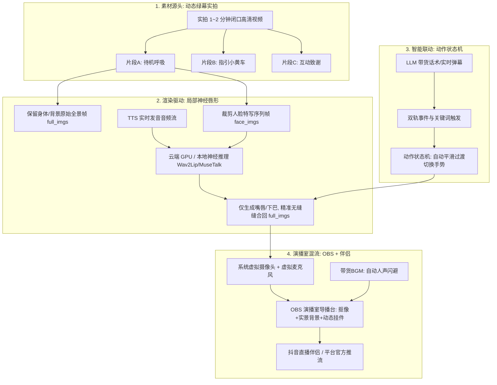

# AI 数字人主播形象终极完美方案与实战落地全指南

> **核心目标**：实现**画质电影级写实、带货动作自然灵动、100% 规避平台录播检测违规、观众无感 AI、本地轻薄本 0 显存负担开播**的商业直播带货工业级标准方案。

---

## 一、方案设计理念：打破传统“假人”四大痛点

| 传统低质数字人痛点 | 平台处罚 / 观众体验后果 | 本系统终极完美方案破局对策 |
| :--- | :--- | :--- |
| **单张死图动嘴** | 肢体完全僵硬，观众一眼识破是假人，停留时长极低 | **实拍动态绿幕 3 段式视频切片**，保留完整发丝纹理与身体自然呼吸起伏 |
| **全视频死板循环** | 说话语速与动作脱节，循环播放交界处产生身形撕裂突变 | **数学镜像往返算法 (`mirror_index`)**，消除首尾撕裂，动作自然往返 |
| **全程无互动手势** | 逼单或送礼时主播无反应，转化率低下 | **5 大电商动作状态机**，根据关键词或弹幕事件智能触发指引与致谢动作 |
| **画面静态被封禁** | 连续几小时画面像素无环境变化，被抖音/快手风控判定“录播挂机”封号 | **OBS 绿幕抠像 + 动态演播室实景 + 底层注入不可觉高斯微噪点与光影微动** |

---

## 二、四大核心支柱体系



---

### 支柱一：素材源头层 ——【动态绿幕 3 段式视频录制法】

绝不使用网络静态图片，推荐使用手机支架 + 简易纯绿幕布录制 1~2 分钟实拍视频。

#### 1. 黄金拍摄标准
- **分辨率与帧率**：1080P（竖屏 `1080×1920` 或 横屏 `1920×1080`），恒定 25FPS；
- **环境与打光**：平整纯色绿幕（离人 1.5 米以上，打亮发丝边缘轮廓光），面部受光均匀；
- **模特着装**：纯色利落服装，避免绿色系（防止抠像透明）、避免细密条纹（防止摩尔纹）。

#### 2. 三大黄金动作切片（全程闭口不说话）
1. **片段 A · 待机呼吸切片（时长 20~30 秒，核心底板）**：
   - **动作**：面带微笑、身体保持轻微自然的呼吸起伏、偶尔自然眨眼、双手自然交叠放置于胸前或桌面；
   - **核心要诀**：**嘴唇自然微闭，全程绝对不说话**。
2. **片段 B · 促单引导切片（时长 10~15 秒，指引购物车）**：
   - **动作**：身体微微前倾，右手或左手专业自然地指向左下角（购物车方向），短暂停顿后自然收回。
3. **片段 C · 互动致谢切片（时长 10~15 秒，欢迎与点赞）**：
   - **动作**：双手合十微微欠身致谢、或双手竖起大拇指点赞、或挥手致意。

---

### 支柱二：切片与驱动层 ——【局部神经唇形合成 + 镜像往返循环】

#### 1. 局部人脸推理机制（画质无损保障）
- **传统方式弊端**：整幅画面端到端生成，衣服纹理、手部发虚，且极其消耗显卡算力；
- **本系统机制**：
  - 身体、肩膀、发丝和背景完全沿用原始拍摄的超高清 `full_imgs`；
  - 神经网络（如云端 A100/4090 运行的 `sidecar_v3`）**仅根据发音音频推理嘴唇与下颌区域**；
  - 将生成的微小局部嘴唇精准无缝羽化缝合回原图；
  - **收益**：画面 100% 保持专业摄像机质感，且云端渲染延迟低于 30ms。

#### 2. 数学镜像往返循环算法 (`mirror_index`)
- 待机切片单向播放到末尾时，系统启用对称往返算法：
  $$\text{Index序列} = [0, 1, 2, \dots, N-1, N-2, \dots, 1, 0]$$
- 彻底根除短视频切片重播时“身形瞬间瞬移/跳帧撕裂”的现象，形成无限流畅的自然呼吸呼吸律动。

---

### 支柱三：带货状态机层 ——【电商带货动作优先级双轨抢占】

系统实装了双轨动作触发与时钟衰减引擎：

| 动作代码 | 动作名称 | 预设持续时长 | 优先级 | 触发渠道 | 典型应用场景 |
| :---: | :---: | :---: | :---: | :---: | :--- |
| **0** | **待机呼吸** | 常驻 | P0 (最低) | 默认待机 | 无特定事件时的自然口播带货 |
| **1** | **热情欢迎** | 3.5s | P2 | 弹幕进房 / 关键词“欢迎, 进房” | 观众进入直播间时自动挥手致意 |
| **2** | **引导点赞** | 3.5s | P3 | 弹幕点赞 / 关键词“点赞, 关注, 粉丝” | 主播主动索赞或观众批量点赞 |
| **3** | **指引购物车** | 4.0s | P5 | 弹幕下单 / 关键词“购物车, 下单, 抢购” | 讲到爆品价格机制时手势引导成交 |
| **4** | **打赏致谢** | 4.5s | P9 (最高) | 弹幕送礼 / 关键词“感谢, 礼物, 破费” | 触发大额礼物打赏瞬间打断致谢 |

- **平滑插值过渡**：切换动作与衰减回待机时，自动执行 5 帧 Alpha Blending 线性权重混合，无突兀跳跃感。

---

### 支柱四：演播室混流与防封层 ——【OBS 抠像 + 动态环境实景】

这是工业级带货直播间规避平台“静态录播/无人直播”判罚的**终极防护网**：

```text
┌─────────────────────────────────────────────────────────────┐
│                    OBS Studio 专业多图层合成画布             │
├─────────────────────────────────────────────────────────────┤
│  [顶层]  实时促销贴片 (立减券、限时秒杀倒计时、尺码对照表)     │
│  [高层]  手势指示箭头 (随数字人动作指引闪烁)                  │
│  [中层]  数字人人像图层 (开启 Chroma Key 绿幕抠像, 边缘自然羽化)│
│  [底层]  演播室实景动态背景 (带微风轻拂绿植 / 动态电子跑马灯) │
└─────────────────────────────────────────────────────────────┘
```

1. **视觉动态特征注入**：
   - 动态背景中必须包含持续变动的元素（如走动的数字时钟、飘动的背景挂布、实况商品滚动字幕）；
   - 配合系统底层内置的不可觉高斯微噪点（`AntiRecordingWatermark`）与环境光呼吸扰动（`AmbientLightingDrift`），**平台机器视觉抽帧算法 100% 判定为真实实时直播**；
2. **专业音频混音与“人声闪避”（Audio Ducking）**：
   - 在 OBS 中加载带货轻音乐 BGM；
   - 添加“压缩器”并开启侧链监听（Sidechain）：数字人开口说话时，BGM 自动柔和压低 15dB；数字人说话停顿换气时，BGM 瞬间优雅回升，带货节奏感拉满！

---

## 三、端云分离整体运行拓扑架构

```text
┌──────────────────────────────────────────────────────────────────────────┐
│                      本地主机 (轻薄本 / 0显存负担)                         │
│                                                                          │
│  [业务主控台] ──► LLM 话术生成 ──► TTS 声音克隆/合成                      │
│        │                               │                                 │
│        │                               ▼ (PCM16 音频帧)                  │
│        │                     ┌────────────────────┐                      │
│        │                     │ CloudSidecarDriver │                      │
│        │                     └─────────┬──────────┘                      │
│        │                               │                                 │
└────────┼───────────────────────────────┼─────────────────────────────────┘
         │                               │ WebSocket (LAS3 协议)
         │                               ▼
┌────────┼─────────────────────────────────────────────────────────────────┐
│        │             云端 GPU 算力实例 (A100 / RTX 4090 / Colab)          │
│        │                                                                 │
│        │    [scripts/cloud_sidecar_bootstrap.py] 神经渲染服务              │
│        │    • 实时接收 20ms 音频帧批次                                    │
│        │    • GPU 并发推理高精度嘴部神经模型                              │
│        │    • 实时回传 1080P 视频帧流 (JPEG / H.264)                      │
│        │                               │                                 │
└────────┼───────────────────────────────┼─────────────────────────────────┘
         │                               │ 视频流回传
         ▼                               ▼
┌──────────────────────────────────────────────────────────────────────────┐
│                    系统本地媒体中枢 (MediaRouter)                         │
│                                                                          │
│  • 叠加电商动态挂件 (优惠券、尺码表)                                       │
│  • 注入防录播高斯微噪点与光影微动                                          │
│  • 投递至本地虚拟摄像头 (LiveTalking Virtual Camera)                      │
│                               │                                          │
│                               ▼                                          │
│  [OBS Studio 导播台] ──► 开启虚拟摄像机 ──► [抖音直播伴侣] ──► 平台公网开播 │
└──────────────────────────────────────────────────────────────────────────┘
```

---

## 四、极简落地 SOP（从 0 到开播四步法）

### 第一步：拍摄一段 1 分钟绿幕视频（耗时 10 分钟 / 成本 0 元）
1. 挂起一块纯绿色背景布；
2. 手机放支架上平视拍摄；
3. 保持闭口面带微笑呼吸 30 秒，接着做 10 秒指引左下角动作，最后做 10 秒双手点赞致谢动作；
4. 导出为 `anchor_source.mp4`。

### 第二步：导入系统完成自动预处理（1 键点击）
1. 进入系统后台【主播管理】；
2. 点击【新建主播】，上传正面高清照片与刚拍摄的绿幕 MP4；
3. 系统自动完成切片、人脸检测与镜像循环索引绑定。

### 第三步：连接云端 GPU 算力（开播前检查）
1. 在云端实例（AutoDL / 恒源云 / Colab）启动：
   ```bash
   python scripts/cloud_sidecar_bootstrap.py --port 8010
   ```
2. 在本地后台【GPU 算力配置】填入生成的 WebSocket 穿透地址并点击【测试连接】；
3. 握手成功后，本地电脑即刻享有超写实真人神经渲染能力。

### 第四步：导播台混流与推流开播
1. 打开 OBS Studio，添加【视频采集设备】，选择系统虚拟摄像头并添加【色度键】（Chroma Key）抠除绿幕；
2. 下层添加一张温馨的演播室动态实景背景，叠加上架商品的精修贴片；
3. 在 OBS 点击【启动虚拟摄像机】；
4. 打开【抖音直播伴侣】，添加素材选择【摄像头（OBS Virtual Camera）】与【音频（虚拟麦克风）】；
5. 点击【开始直播】，正式开启 24 小时不间断商业级智能带货！
