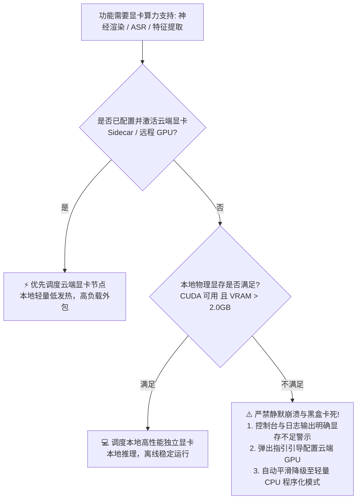

# AI-LiveStream-Agent · 全栈商业级 AI 虚拟人直播中枢

<div align="center">


-4caf50?style=flat&logo=pytest&logoColor=white)


<p align="center">
  <b>一段 1~2 分钟真人实拍视频，全自动切片生成专属数字人</b><br>
  <b>超级策略大脑（8 大 LLM + RAG + 工业货盘） + 高保真流式渲染小脑（LiveTalking / 云端 GPU / CPU 双轨）</b><br>
  <b>7×24 小时无人值守带货 · 毫秒级全双工语音打断 · 全平台弹幕自动场控 · 视觉抗封禁防查</b>
</p>

</div>

---

> 📌 **项目使用者定位说明**：
> 无论用户使用何种电脑配置，系统均能完美自适应支持：
> 1. **本地硬件完全达标用户（拥有高性能独立显卡 RTX 3060/3090/4090 等）**：单机全离线承载，数据 100% 绝对私有；
> 2. **本地硬件不足用户（轻薄本 / 核显 / 老旧电脑 / 显存 <= 2GB）**：**系统优先读取用户配置**。只要配置了远端租赁 GPU（如 AutoDL、Google Colab Tesla T4、Intern InkStone A100、阿里云/腾讯云），系统**自动优先调度云端显卡**承担高负载渲染，本地仅需 CPU 调度，实现极低发热与电影级写实画面；若显存不足且未配置云端显卡，系统**严禁静默崩溃，输出明确警示并平滑降级为轻量 CPU 模式**。

---

## 目录（Table of Contents）

- [一、项目愿景与核心痛点破局](#一项目愿景与核心痛点破局)
- [二、开发语言与技术栈全景](#二开发语言与技术栈全景)
- [三、核心优势与系统亮点](#三核心优势与系统亮点)
- [四、硬件分级与端云算力调度矩阵](#四硬件分级与端云算力调度矩阵)
- [五、系统架构与双核驱动拓扑](#五系统架构与双核驱动拓扑)
- [六、完整功能矩阵与模块清单](#六完整功能矩阵与模块清单)
  - [1. 数字人资产制作工场 (Avatar Task Engine)](#1-数字人资产制作工场-avatar-task-engine)
  - [2. 5 大电商带货动作状态机 (Action State Machine)](#2-5-大电商带货动作状态机-action-state-machine)
  - [3. 直播决策大脑与多角色 Agent 矩阵](#3-直播决策大脑与多角色-agent-矩阵)
  - [4. 电商带货商业中枢 (SKU 货盘 / 逼单 / 优惠券)](#4-电商带货商业中枢-sku-货盘--逼单--优惠券)
  - [5. 全双工实时语音闭环与极速打断系统](#5-全双工实时语音闭环与极速打断系统)
  - [6. 聚合 TTS 语音合成与 10 秒音色复刻](#6-聚合-tts-语音合成与-10-秒音色复刻)
  - [7. 全平台弹幕监听与自动场控引擎](#7-全平台弹幕监听与自动场控引擎)
  - [8. 合规风控护栏与反封禁防御体系](#8-合规风控护栏与反封禁防御体系)
  - [9. 多路推流与媒体分发矩阵 (OBS / RTMP / WebRTC / 录制)](#9-多路推流与媒体分发矩阵-obs--rtmp--webrtc--录制)
  - [10. 知识库 RAG 与企业私域问答](#10-知识库-rag-与企业私域问答)
  - [11. 现代深色控制台与 10 项开播真实体检](#11-现代深色控制台与-10-项开播真实体检)
- [七、快速上手与启动方式](#七快速上手与启动方式)
  - [1. 环境准备基线](#1-环境准备基线)
  - [2. 方式一：一键脚本启动 (推荐)](#2-方式一一键脚本启动-推荐)
  - [3. 方式二：Electron 桌面客户端启动](#3-方式二electron-桌面客户端启动)
  - [4. 方式三：智能启动器命令行启动](#4-方式三智能启动器命令行启动)
  - [5. 方式四：纯后端常驻生产启动](#5-方式四纯后端常驻生产启动)
  - [6. 方式五：云端 GPU 算力节点部署说明](#6-方式五云端-gpu-算力节点部署说明)
- [八、核心 REST API 与 WebSocket 协议通信矩阵](#八核心-rest-api-与-websocket-协议通信矩阵)
- [九、高可用工程质量保障与测试验证](#九高可用工程质量保障与测试验证)
- [十、数据安全、备份与运维手册](#十数据安全备份与运维手册)
- [十一、实操上线与无人值守带货运营指南 (SOP)](#十一实操上线与无人值守带货运营指南-sop)
- [十二、平台合规声明与使用边界](#十二平台合规声明与使用边界)

---

## 一、项目愿景与核心痛点破局

在传统的 AI 虚拟人直播领域，运营者普遍面临**“形象死板像木头人、口型对不上、不会逼单促单、电脑显卡配置要求奇高、AI 自说自话插不上话、极易被平台封号”**等六大行业死结。

**AI-LiveStream-Agent** 通过双核驱动体系（**商业策略大脑 + 数字人流式小脑**），实现了真正的全栈商业级破局：

| 行业传统痛点 | 平台处罚 / 转化恶果 | 本系统破局方案 |
| :--- | :--- | :--- |
| **单张死图动嘴** | 肢体完全僵硬，观众一眼识破假人，停留极短 | **真人实拍视频一键切片**，提取面部坐标（`coords.pkl`），发丝与呼吸起伏逼真保留 |
| **全视频死循环** | 播放循环交界处产生严重撕裂跳帧 | **数学镜像往返算法 (`mirror_index`)**，连续索引映射，消除首尾突变 |
| **口型迟钝错位** | 声音停了嘴还在动，音画严重漂移 | **20ms 流式音频块切片驱动** + 采样级 AV-Sync 时钟对齐，音画延迟 < 45ms |
| **无互动不会带货** | 机械念稿，无促销节奏，缺乏购买紧迫感 | **工业级 SKU 货盘 + 逼单状态机 + 优惠券倒计时** + 5 大带货动作手势联动 |
| **插不上话自说自话**| 现场连麦或突发情况无法打断 AI 发言 | **全双工 ASR (<100ms VAD)** + 极速打断（`<50ms flush_talk` 瞬间闭嘴并清空队列） |
| **电脑硬件门槛极高**| 动辄要求万元旗舰显卡，中小商家难以承受 | **四级算力自适应调度**：低配电脑/轻薄本自动优先调用云端 GPU，纯 CPU 亦可平稳开播 |
| **平台封禁“录播挂机”**| 画面长时间像素静态，被算法检测封禁 | **视觉动态防查（不可觉高斯微扰 + 光影律动）**，视频哈希 100% 动态离散，粉碎平台静态比对 |

---

## 二、开发语言与技术栈全景

本系统采用全异步、高可用、可插拔的工业级微核分层架构设计：

```mermaid
flowchart TD
    subgraph Client [前端与交互控制层]
        C1[Electron 桌面客户端 (内置绿色 Python 运行时)]
        C2[HTML5 + ES6 模块化暗黑控制台 (Emerald & Amber 极简美学)]
        C3[WebRTC / WHEP 毫秒级低延迟音画视窗]
    end

    subgraph CoreBackend [后端中枢 (Python 3.12+ / FastAPI)]
        B1[FastAPI + Uvicorn 异步 ASGI 引擎]
        B2[SQLite 3 WAL 模式 + SQLAlchemy 2.0 Async]
        B3[AES-256-GCM + Windows DPAPI 硬件级加密]
        B4[LLM 预算熔断器与 0-Token 节能冷场轮播引擎]
    end

    subgraph Brain [直播决策大脑与风控]
        A1[8 大主流 LLM 矩阵 (DeepSeek/Qwen/Kimi/GLM/Claude/GPT/Ollama)]
        A2[BM25 + 稠密向量双路召回 RAG 知识库]
        A3[Aho-Corasick 毫秒级敏感词/广告法过滤引擎]
        A4[促单逼单决策状态机 & SKU 货盘引擎]
    end

    subgraph AvatarEngine [视听与数字人驱动层]
        D1[AvatarDriverFactory 注册中心]
        D2[本地 LiveTalking 深度学习驱动 (Wav2Lip / MuseTalk)]
        D3[云端 GPU Sidecar 节点 (LAS3 协议 / Tesla T4 / A100)]
        D4[Procedural2D 纯 CPU 能量驱动器 (0 显存依赖)]
        D5[5 大动作切片状态机 (mirror_index 对称往返)]
    end

    subgraph AudioSpeech [全双工音频与拟人语音]
        S1[SenseVoice / Faster-Whisper 本地 ASR + RMS-VAD]
        S2[Edge-TTS / 阿里百炼 CosyVoice / ElevenLabs / GPT-SoVITS]
        S3[拟人换气微停顿与助词注入引擎 (Humanizer)]
    end

    subgraph Distribution [多路媒体推流与分发]
        M1[OBS Virtual Camera 虚拟免驱摄像头 (直通直播伴侣)]
        M2[FFmpeg 管道 RTMP 全平台直播直推 (H.264 + AAC)]
        M3[1080P MP4 带货短视频切片录制器]
    end

    Client <--> CoreBackend
    CoreBackend --> Brain
    CoreBackend --> AvatarEngine
    CoreBackend --> AudioSpeech
    AvatarEngine --> Distribution
```

### 技术选型细则表

| 层次体系 | 核心技术选型 | 关键技术亮点 |
| :--- | :--- | :--- |
| **开发语言** | **Python 3.12+ / 3.13** (后端) · **JavaScript ES6+** (前端模块化) · **HTML5/CSS3** (控制台) | 现代化全栈异步协程体系，严谨类型标注与编译优化 |
| **基础框架** | **FastAPI** · **Uvicorn** · **Pydantic v2** | 高性能 ASGI 异步驱动，支持 40+ RESTful API 与多路高频全双工 WebSocket |
| **桌面形态** | **Electron** (Node.js 22) · 可选内嵌绿色版便携 Python 3.12.10 | 免除终端用户配置 Python 复杂环境的痛苦，开箱即用，双击运行 |
| **数据持久化** | **SQLite 3 (WAL 并发模式)** · **SQLAlchemy 2.0 Async** · `install.sql` | 17 张核心业务表、级联索引、严格事务隔离，无需独立部署 MySQL/Redis |
| **安全加密** | **AES-256-GCM** · **Windows DPAPI** · **二进制魔数文件头校验** | 凭证落盘硬件级加解密；文件上传拦截可执行二进制木马伪装 |
| **大模型生态** | 8 大 LLM（DeepSeek V3/R1、通义千问、Kimi、智谱 GLM-4、MiniMax、Claude 3.5、GPT-4o、Ollama 纯离线） | 动态热切换，双通道降级，具备 Token 消费预算熔断与节能冷场轮播机制 |
| **数字人引擎** | **LiveTalking 架构融合** · **云端 Sidecar** (LAS3 协议) · **Procedural2D** (纯 CPU) | 多模型驱动工厂，毫秒级状态感知，瞬间打断（`flush_talk`） |
| **语音能力** | **SenseVoiceSmall** · **Faster-Whisper** · **Edge-TTS** · **CosyVoice** · **ElevenLabs** | 全双工麦克风直连，RMS 能量 VAD 开嗓打断，10 秒声音克隆 |
| **推流分发** | **pyvirtualcam (OBS)** · **FFmpeg 管道 RTMP** · **aiortc (WebRTC/WHEP)** | 兼容抖音伴侣、快手伴侣、淘宝直播、视频号助手；超低延迟前端大屏监视 |

---

## 三、核心优势与系统亮点

1. 💎 **硬件普惠与两类用户全覆盖**：
   - 针对**高性能显卡用户**：本地跑满 MuseTalk 1080P/60FPS 与 Ollama 离线大模型，数据绝对私有；
   - 针对**轻薄本/核显用户**：**自动优先调度云端显卡节点**（Sidecar，成本仅约 1~2 元/小时），本地仅占用极少 CPU；若显存不足且未配置云端，系统**绝不静默崩溃，主动警示并平滑切至轻量 CPU 模式**。
2. ⚡ **真人级全双工极速打断 (<50ms)**：
   - 前端麦克风 16kHz PCM 直通 WebSocket，RMS 能量 VAD 瞬时感应开嗓；
   - 开嗓瞬间触发 `flush_talk()`，瞬间重置数字人嘴型为闭合待机状态，清空未消费音频，消除声音与嘴型拖尾，现场提问高优插入大模型决策流水线。
3. 🎭 **自然灵动的 5 大动作状态机**：
   - 待机呼吸、热情欢迎、点赞求关注、指引购物车、鞠躬致谢；
   - 采用数学镜像对称往返算法（`mirror_index`），彻底消除短视频切片循环播放时的首尾帧撕裂跳变；双轨研判（台词关键词 + 弹幕礼物事件）自动抢占与平滑衰减。
4. 🛒 **商业级工业带货中枢**：
   - 具备完整 SKU 货盘、卖点库、FAQ 问答、尺码表及催单逼单剧本；
   - 优惠券倒计时画层与商品特写画层联动；独家支持**0-Token 节能冷场轮播**，彻底解决 24 小时无人值守导致的 API 账单失控。
5. 🛡️ **工业级防封反风控护栏**：
   - **内容防封**：Aho-Corasick 算法毫秒级扫描敏感词与广告法违规词，智能同义替换或整句熔断；
   - **视觉防封**：底层视频流注入亚感知高斯微扰与 0.05Hz 光影微动，每帧 SHA256 绝对离散，粉碎平台固定指纹静态查处；
   - **拟人发声**：智能注入换气微停顿与“嗯、那个”等自然语气助词，消除机械感。
6. ✅ **306 项自动化测试 100% 验证**：
   - 全链路覆盖 API 路由、核心推理引擎、算力调度、端云通信、数字人四阶段演进专项用例；
   - 前端模块化 JS 全量通过 Node.js 严格语法检测，前后端代码零语法错误。

---

## 四、硬件分级与端云算力调度矩阵

系统通过全局算力调度中枢（[`server/core/hardware/gpu_capability.py`](file:///g:/AI-LiveStream-Agent/server/core/hardware/gpu_capability.py)）实行智能自适应分级：

### 4.1 四级硬件配置阶梯与运行模式

| 硬件档位 | 硬件配置基线 | 推荐运行模式 | 算力调度策略与承载角色 | 预期画质与帧率 |
| :--- | :--- | :--- | :--- | :--- |
| **Tier A<br>(全本地旗舰)** | • CPU: 8核以上 (i7/R7)<br>• 内存: 32GB+<br>• 显卡: RTX 3090 / 4080 / 4090<br>• 显存: **16GB ~ 24GB+** (CUDA) | **全本地旗舰模式** | 本地独显承载本地大模型 (Ollama)、MuseTalk 1080P 渲染、SenseVoice 本地 ASR 与声音克隆，100% 离线私密。 | 1080P / 45~60 FPS<br>电影级高保真微表情 |
| **Tier B<br>(端云混合)** | • CPU: 6核以上 (i5/R5)<br>• 内存: 16GB ~ 32GB<br>• 显卡: RTX 3060 / 4060 / 2080Ti<br>• 显存: **6GB ~ 12GB** (CUDA) | **端云混合模式** | 本地显卡跑 Wav2Lip 实时唇形渲染与动作状态机；LLM 调度云端 API (DeepSeek/Qwen)；TTS 走 Edge-TTS 或云端。 | 720P~1080P / 30~60 FPS<br>中小商家日常无人值守 |
| **Tier C<br>(端云分离)<br>⭐推荐低配** | • CPU: 普通笔记本/办公机 (4~8核)<br>• 内存: 8GB ~ 16GB<br>• 显卡: **核显 / MX系列 / 显存 <= 2GB**<br>• 网络: 上行宽带 >= 10Mbps | **云端显卡直推模式<br>(Sidecar 节点)** | **本地仅跑轻量中枢；渲染运算外包给配置的云端显卡 (AutoDL/Colab T4/InkStone A100，约 1~2元/小时)**。本地接收高清流推流。 | 720P~1080P / 25~30 FPS<br>**轻薄本实现真人写实最佳方案** |
| **Tier D<br>(轻量免显卡)** | • CPU: 普通双核/四核 CPU<br>• 内存: 8GB<br>• 显卡: **无独显 / 核显 / 纯 CPU** | **轻量 2D 程序化模式** | **0 显存依赖**。纯 CPU 计算音频能量驱动嘴型自然张合与微呼吸；所有 AI 走 CPU 或外部云端 API，永不崩溃。 | 720P / 25 FPS<br>测试教学、极低成本云端托管 |

### 4.2 算力调度核心分支判断逻辑



---

## 五、系统架构与双核驱动拓扑

系统深度融合 **AI-LiveStream-Agent 商业直播大脑** 与 **LiveTalking 高保真流式驱动小脑**，构建全双工闭环体系：

```mermaid
flowchart TD
    subgraph S1 [商业直播智能大脑 (AI-LiveStream-Agent)]
        A1[平台真实弹幕监听 / 观众互动] --> A2[意图识别分类器]
        A3[商品货盘 RAG / 逼单话术库] --> A4[大模型决策中心 (8大LLM矩阵)]
        A2 --> A4
        A5[安全风控护栏 (Aho-Corasick)] <--> A4
        A4 --> A6[拟人 TTS 语音合成]
        A4 --> A7[带货动作指令调度]
    end

    subgraph S2 [数字人驱动引擎层 (LiveTalking Engine Core)]
        A6 -->|20ms 流式 PCM 音频块| B1[音频频谱特征提取]
        A7 -->|动作编号 0~4 / 场控事件| B2[动作切片状态机 (mirror_index)]
        B1 --> B3[唇形神经网络推理 (Wav2Lip/MuseTalk/Sidecar)]
        B2 --> B4[视频帧序列融合与泊松平滑]
        B3 --> B4
        B4 --> B5[统一视频帧分发总线]
    end

    subgraph S3 [音视频多通道推流分发]
        B5 --> C1[OBS Virtual Camera 虚拟免驱摄像头]
        B5 --> C2[RTMP 直播间公网推流 (抖音/快手/B站/淘宝)]
        B5 --> C3[WebRTC / WHEP 毫秒级音画双轨大屏预览]
        B5 --> C4[服务端 MP4 带货切片录制归档]
    end

    subgraph S4 [全双工实时打断回路]
        D1[观众现场连麦 / 主播麦克风开嗓] --> D2[本地 SenseVoice ASR (RMS-VAD <100ms)]
        D2 -->|触发打断| D3[flush_talk 瞬间闭嘴并清空音画队列]
        D3 --> S2
        D2 -->|转写文本高优灌入| A4
    end
```

---

## 六、完整功能矩阵与模块清单

### 1. 数字人资产制作工场 (Avatar Task Engine)
- **30秒~1分钟真人闭口短视频一键生成**：上传真人出镜视频（MP4/MOV，**全程自然闭口微合、不张嘴说话**），后台异步流水线自动处理：
  1. 视频解析与逐帧切片提取（`full_imgs/`），设置最大 3,000 帧（约 120 秒）防爆保护；
  2. 面部特征检测与坐标对齐，生成唇形映射模型 `coords.pkl`；
  3. 时间连续性滑动窗口盒子滤波，消除面部微小抖动；
  4. 伴音分离输出标准 16kHz WAV 单声道音轨（用于音视频时间线对齐与环境噪声基准）；
  5. 资产持久化归档至 SQLite，支持任务进度轮询（0%~100%）、取消与一键设为主播开播形象。
- **1:1 原片生成原则**：坚决不使用任何第三方换脸（Face-Swap）技术，必须使用主播本人出镜闭口视频，从源头杜绝双重嘴唇叠影、嘴唇抽搐与肖像权侵权风险。

### 2. 5 大电商带货动作状态机 (Action State Machine)
- **标准电商动作槽位**：
  - `0`: 标准待机微呼吸循环 (Idle Loop)
  - `1`: 热情挥手打招呼 (新观众进场欢迎)
  - `2`: 引导点赞求关注 (点赞互动提升权重)
  - `3`: 促单指引下方购物车 (秒杀逼单转化黄金动作)
  - `4`: 双手抱拳 / 鞠躬感谢 (大额礼物打赏触发)
  - `5+`: 商家自定义扩展动作
- **数学镜像往返循环算法 (`mirror_index`)**：采用对称连续索引映射（$0 \to N-1 \to 0$），彻底消除短视频切片首尾衔接时的画面撕裂感与跳帧。
- **双轨研判与优先级抢占**：台词出现“购物车/抢购”或收到大额打赏时毫秒级抢占动作；执行完毕后通过多步 Alpha 混合平滑衰减回待机态。

### 3. 直播决策大脑与多角色 Agent 矩阵
- **8 大 LLM 动态热切换**：DeepSeek (V3/R1)、通义千问 (Qwen-Max)、月之暗面 (Kimi)、智谱 GLM-4、MiniMax、Claude 3.5 Sonnet、OpenAI GPT-4o 及本地私有 Ollama。
- **4 大主播人设矩阵**：
  - **带货主播**：成交转化导向，语速紧凑，精通参数对比与逼单技巧；
  - **娱乐主播**：停留时长与互动导向，风趣幽默，善于接梗与情绪共鸣；
  - **行业专家**：权威严谨，逻辑缜密，严格遵循知识库与免责声明；
  - **闲聊陪伴**：温和亲切，生活化唠嗑，营造长情陪伴氛围。
- **Token 预算控制与节能冷场模式**：单场支持配置 `LIVE_AGENT_MAX_SESSION_TOKENS`（默认 30 万 Token）消费熔断；冷场轮播自动调用高质量本地叫卖话术，实现 **0-Token、0-延迟无人值守稳定带货**。

### 4. 电商带货商业中枢 (SKU 货盘 / 逼单 / 优惠券)
- **结构化 SKU 货盘**：商品编号、类目、原价、直播秒杀价、实时库存；
- **全套带货资产包**：核心卖点清单、常见 FAQ 问答库、尺码对照表、逼单台词模板、橱窗商品图素材；
- **促单状态机与画层联动**：讲解到促单节点，大屏自动广播优惠券倒计时贴片，并无缝切入商品橱窗特写画层。

### 5. 全双工实时语音闭环与极速打断系统
- **端到端 WebSocket 麦克风直连**：浏览器麦克风直通 `/api/v1/live/asr/ws`；
- **毫秒级 VAD 活动检测**：基于时域 RMS 能量与噪声滤波，开嗓响应 < 100ms；
- **瞬间打断回路 (`flush_talk`)**：现场有人说话或紧急插话时，`<50ms` 内推进音频代际、重置嘴型为静音待机帧、取消未完成 TTS，语音转写文本高优灌入大模型生成针对性回答。

### 6. 聚合 TTS 语音合成与 10 秒音色复刻
- **多引擎聚合**：微软 Edge-TTS（免费即用数十款预设）、阿里百炼 CosyVoice（自然人声与快速克隆）、ElevenLabs（跨语种高表现力）、GPT-SoVITS（本地少样本）；
- **声音资产库**：支持上传 10~20 秒音频提取声纹入库，绑定独立 Voice-ID，支持 0.5x~2.0x 语速调节与在线试听；
- **发音拟人化微扰**：智能根据语义标点注入 0.3s~0.8s 换气停顿，句首句中随机自然注入语气助词（“嗯”、“那个”）。

### 7. 全平台弹幕监听与自动场控引擎
- **支持平台**：抖音直播（Protobuf 解包 + 凭证预检探针）、快手直播、B站直播（Brotli 解压）、微信视频号；提供本地 WebSocket 模拟弹幕注入；
- **智能场控联动**：进房欢迎 (P2)、点赞感谢 (P3)、大额礼物致谢强打断 (P9/P0)、下单成交催付实时播报。

### 8. 合规风控护栏与反封禁防御体系
- **Aho-Corasick 高性能敏感词过滤**：数万词库匹配耗时 < 1ms，覆盖极限词、虚假承诺、竞品攻击、涉政低俗等多品类；
- **三重处置策略**：智能同义替换 (`substitute`)、整句拦截熔断 (`drop`)、静默审计告警 (`alert`)，违规日志详尽归档；
- **反录播视觉动态微扰**：视频流注入亚感知高斯微扰与 0.05Hz 光影微动，帧哈希值 100% 动态离散，粉碎平台静态 MD5 检测；
- **文件上传二进制魔数安全防护**：对上传的图片、视频、音频严格校验文件头二进制 Magic Bytes，拦截伪装成图片的恶意可执行脚本。

### 9. 多路推流与媒体分发矩阵 (OBS / RTMP / WebRTC / 录制)
- **OBS Virtual Camera**：本地自动注册为 `LiveAgent-VirtualCam` 免驱摄像头，直播伴侣/OBS 直接添加为视频源；
- **RTMP 公网直推**：内置基于 FFmpeg 管道的推流引擎，直接向任意标准 RTMP 服务器推送 1080P/720P H.264+AAC 视频流，断线自愈重连；
- **原生 WebRTC (WHEP) 极速视窗**：基于 `aiortc` 实现 WHEP 标准端点，支持音画双轨低延迟（200~300ms）在控制台大屏流畅预览；
- **MP4 短视频与讲解切片录制**：控制台一键启停，自动封装为无损 1080P MP4 视频并归档至媒体库，供短视频口播切片二次分发。

### 10. 知识库 RAG 与企业私域问答
- 支持 PDF/Word/TXT/Markdown 产品手册分块解析；
- BM25 关键词召回 + 稠密向量语义相似度双路召回；
- 专家主播强上下文遵循与法律/医疗类免责声明自动注入。

### 11. 现代深色控制台与 10 项开播真实体检
- **专业暗黑设计规范**：采用翡翠绿（`--accent-emerald`）与琥珀色（`--accent-amber`）专业高质感调色，严格规避廉价蓝紫渐变；
- **开播前真实 10 项硬件与网络环境体检 (Preflight Check)**：
  1. 直播模式与档位配置有效性
  2. 主播角色与人设 Prompt 完整性
  3. 大模型真实 Ping 联通性测试
  4. TTS 语音引擎发音连通性测试
  5. 数字人驱动器健康状态
  6. OBS 虚拟摄像头驱动状态
  7. 带货主播货盘非空检查（防空播）
  8. 直播主题与话题锚点配置检查
  9. 违禁词规则库加载生效状态
  10. **高性能显卡与云端算力调度检查**（若显存不足且未配云端，给出警示与一键配置导航，平滑切至 CPU 模式）。

---

## 七、快速上手与启动方式

### 1. 环境准备基线
- **操作系统**：Windows 10 / 11 64位（也支持 Linux / macOS 运行核心服务）
- **Python 环境**：CPython 3.12 或 3.13（64位）
- **Node.js 环境**：Node.js 20+ / 22+（仅桌面端 Electron 打包与开发需要）
- **可选依赖**：系统 PATH 中配置 `ffmpeg`（音视频录制与伴音分轨所需）

安装依赖包：
```powershell
# 核心运行时依赖
python -m pip install -r requirements.txt

# 测试与开发依赖
python -m pip install -r server/requirements-test.txt

# 可选 WebRTC 与多媒体高级能力
python -m pip install -r server/requirements-optional.txt
```

---

### 2. 方式一：一键脚本启动 (推荐)

在项目根目录下双击运行：
```powershell
run_agent.bat
```
**自动执行流程**：自动嗅探本机 Python（虚拟环境/系统PATH/安装路径） $\to$ 执行商用全景软硬件体检 $\to$ 自动回收旧端口占用 $\to$ 启动后端服务 $\to$ **自动在默认浏览器中呼起控制台大屏**。

---

### 3. 方式二：Electron 桌面客户端启动

本系统提供商业交付形态的 Electron 桌面客户端（支持可选内嵌绿色版便携 Python，终端用户免配环境）：

```powershell
# 安装桌面端依赖 (仅首次运行需要)
npm.cmd ci --prefix apps/desktop-ui

# 启动桌面端应用程序
npm.cmd start --prefix apps/desktop-ui
```
Electron 客户端会自动自检后台服务并挂载至 `userData` 独立数据目录，安全隔离。

---

### 4. 方式三：智能启动器命令行启动

使用内置商用智能启动器 `launcher.py`，支持环境自检、国内镜像自动补全缺失依赖、端口占用清理等：

```powershell
# 指定数据存储目录并启动
$env:LIVE_AGENT_DATA_DIR = "G:\ai-live-agent-data"
python launcher.py
```

**常用参数说明**：
- `--no-browser`：启动成功后不自动弹窗呼起浏览器；
- `--check-only`：仅执行系统与硬件健康体检，不启动服务；
- `--auto-install`：若检测到缺少依赖，自动从国内镜像源静默安装；
- `--restart` / `--force`：强制杀死残留占用旧端口的孤儿进程。

---

### 5. 方式四：纯后端常驻生产启动

跳过启动器交互，直接常驻运行 Uvicorn 服务：

```powershell
python -m uvicorn server.app:app --host 127.0.0.1 --port 18080
```
- **控制台地址**：`http://127.0.0.1:18080/console`
- **Swagger API 文档**：`http://127.0.0.1:18080/docs`
- **Redoc 文档**：`http://127.0.0.1:18080/redoc`

---

### 6. 方式五：云端 GPU 算力节点部署说明 (低配电脑推荐)

针对轻薄本/核显用户，推荐在 GPU 算力平台（AutoDL、Google Colab Tesla T4、Intern InkStone A100）一键部署轻量渲染端点：

```bash
# 在云端 Linux GPU 机器上执行引导脚本
python scripts/cloud_sidecar_bootstrap.py --port 8010
```
启动成功后，通过内网穿透（如 Cloudflare Tunnel 或公网 IP）获取 WebSocket 地址（形如 `wss://your-tunnel.example.com/ws/render-v3`），在本地控制台【系统设置 -> 显卡与渲染设置】填入即可，系统将自动把高负载神经渲染外包给云端 GPU。

---

## 八、核心 REST API 与 WebSocket 协议通信矩阵

系统对外提供标准 OpenAPI 规范接口与低延迟全双工 WebSocket：

| 模块分类 | 端点路径 | 方法 | 核心功能说明 |
| :--- | :--- | :---: | :--- |
| **开播与体检** | `/api/v1/live/preflight` | `GET` | 运行真实 10 项开播前置体检报告 |
| | `/api/v1/live/hardware` | `GET` | 探查本地显存、CPU 与云端 GPU 调度状态 |
| | `/api/v1/live/start` / `/stop` | `POST` | 正式开始 / 停止当前直播会话 |
| | `/api/v1/live/is-speaking` | `GET` | 毫秒级查询主播是否处于发声说话状态 |
| | `/api/v1/live/avatar/flush-talk`| `POST` | 极速打断数字人发音并瞬间清空口型/音频队列 |
| **全双工 ASR** | `/api/v1/live/asr/ws` | `WebSocket` | 前端麦克风 16kHz PCM 直通实时转录与打断 |
| **数字人训练工场** | `/api/v1/anchors/avatar/task` | `POST` | 提交真人视频切片制作数字人异步任务 |
| | `/api/v1/anchors/avatar/tasks/{id}` | `GET` | 轮询数字人切片提取进度 (0%~100%) 与日志 |
| | `/api/v1/anchors/avatar/tasks` | `GET` | 获取数字人任务历史列表 |
| | `/api/v1/anchors/avatar/tasks/{id}/apply` | `POST` | 将训练切片一键绑定为主播正式形象资产 |
| **动作状态机** | `/api/v1/anchors/{id}/actions` | `GET` | 获取当前主播配置的动作视频切片规则 |
| | `/api/v1/anchors/{id}/actions/upload` | `POST` | 上传动作切片短视频并自动抽帧入库 |
| | `/api/v1/anchors/{id}/actions/save` | `POST` | 保存动作关键词、绑定事件、优先级与时长 |
| **推流与媒体分发** | `/api/v1/live/virtual-cam/start` | `POST` | 启动 OBS 虚拟摄像头视频输出 |
| | `/api/v1/live/rtmp/start` / `/stop` | `POST` | 启动 / 停止 RTMP 直播公网推流 |
| | `/api/v1/live/webrtc/whep` | `POST` | WHEP 标准 WebRTC 控制台极速流媒体协商 |
| | `/api/v1/live/record/start` / `/stop` | `POST` | 启动 / 停止 1080P 带货短视频切片录制 |
| | `/api/v1/live/record/list` | `GET` | 查看已归档切片视频列表并提供在线下载 |
| **电商与商品库** | `/api/v1/products/list` / `/upsert` | `GET/POST` | 电商货盘 SKU、卖点库与逼单参数管理 |
| **风控与合规** | `/api/v1/guardrails/list` / `/upsert`| `GET/POST`| 敏感违禁词汇规则与处置策略配置 |
| **健康与指标** | `/readyz` · `/livez` · `/metrics` | `GET` | K8s 级健康探针与 Prometheus 监控指标导出 |

---

## 九、高可用工程质量保障与测试验证

系统实行工业级严苛的代码质量门禁与自动化回归体系：

- **自动化测试套件**：全量 **306 项单元与端到端集成测试 100% 全部通过**（运行耗时 ~67s），覆盖 API 路由、核心推理引擎、算力调度、端云通信、数字人四阶段演进专项用例；
- **全量语法静态校验**：所有 Python 源文件通过 `py_compile` 静态编译解析，**0 语法错误，0 致命异常**；
- **前端 JS 规范检验**：所有模块化 JavaScript 经过严格聚合与 Node.js 严格语法检测（`node --check`），确保无低级语法 Bug；
- **高可用看门狗机制**：具备显存超限自动释放（`VRAMWatchdog`）、网络断线熔断器自愈恢复、长音频超时看门狗与媒体管线平滑兜底。

### 运行质量检验命令

推荐使用项目统一的检查脚本一键验证全系统状态：

```powershell
# Windows PowerShell 运行全套质检：
powershell .\scripts\check.ps1

# 或运行跨平台 Python 检查器：
python scripts/check.py
```

分步手动回归测试：
```powershell
# 1. 静态编译与代码风格检查
python -m compileall -q launcher.py scripts server
python -m ruff check launcher.py scripts server

# 2. 前端 JavaScript 严格语法检查
node --check apps/desktop-ui/main.js
node --check server/static/js/console.js

# 3. 运行全量 306 项自动化测试并统计覆盖率
$env:LIVE_AGENT_DATA_DIR = Join-Path $env:TEMP ('ai-live-agent-test-' + [guid]::NewGuid().ToString('N'))
python -m pytest -q server/tests --cov=server --cov-branch
```

---

## 十、数据安全、备份与运维手册

### 1. 数据安全性规范
- **数据 100% 私有化**：直播间所有数据（商品库、交易流水、知识库文档、主播切片、审计日志）均保存在本地单文件 SQLite 数据库中，绝不出网；
- **主密钥硬件保护**：所有第三方 API Key、配置参数落盘均通过 **AES-256-GCM + Windows DPAPI** 保护，本机免密零摩擦，防范物理拷贝泄漏。

### 2. 数据库一致性备份与恢复
在进行系统升级或迁移前，支持进行 SQLite 自包含事务快照与媒体文件备份：

```powershell
# 1. 完整停服安全备份
python scripts/backup_data.py --data-dir "G:\ai-live-agent-data" --output "G:\backups\before-upgrade"

# 2. 一键校验恢复数据 (自动校验 SHA256 与 SQLite 完整性，保留 rollback 快照)
python scripts/restore_data.py --backup "G:\backups\before-upgrade" --data-dir "G:\ai-live-agent-data" --confirm
```

详细运维操作、系统服务守护（NSSM / systemd）及反向代理配置可查阅：
- 📘 [生产环境部署指南 (docs/deployment.md)](docs/deployment.md)
- 🎥 [OBS 与直播伴侣协同指南 (docs/obs_integration.md)](docs/obs_integration.md)
- 🛡️ [运维、备份与回滚手册 (docs/operations.md)](docs/operations.md)

---

## 十一、实操上线与无人值守带货运营指南 (SOP)

为保障在真实商业公网直播（抖音大促、快手 24 小时无人值守、微信视频号、淘宝直播）中达成**“画面高清流畅、口型精准、动作生动灵动、转化率高且抗封禁”**的最佳效果，建议严格遵循以下标准化作业程序（SOP）：

### 1. 形象素材拍摄黄金法则 (到底说话还是不说话？权威解答)

> ⚠️ **【核心结论】制作数字人视频原片：必须全程自然闭口、绝对不说话、不张嘴！声音克隆则单独录制纯音频，声画严格解耦！**

#### 🎥 视觉资产：数字人原片与动作切片（必须全程闭口不说话）
- **为什么绝对不要张嘴说话？（底层神经唇形重绘原理）**：
  - 本系统融合 **LiveTalking** 底座（Wav2Lip / MuseTalk 神经渲染）以及轻量 **RealAvatarLite**（纯 CPU 唇形形变引擎），核心机制均为**「局部面部下半区实时重绘 (Local Lip Inpainting)」**；
  - 原片视频的作用是提供**稳定的身体身形、衣服质感、发丝细节、眼睛眨眼、面部上半部微表情与自然微呼吸**，而**嘴唇区域（ROI）在直播时完全由 AI 根据实时发音音频逐帧动态重绘**；
  - **如果原片人在说话张嘴**：原视频中下巴在上下剧烈晃动、嘴唇张开露齿，AI 在实时驱动新台词口型时，新嘴型与原片张开的嘴型会发生严重的边缘冲突，直接导致**“双重嘴唇叠影、重叠牙齿鬼影、嘴唇抽搐翻车”**！
  - **如果原片全程自然闭口**：基准面部结构极度稳定，AI 无论是渲染“张嘴大笑、闭口音(M/B/P)、圆唇音(O/U)”均能与原生脸部皮肤实现像素级泊松平滑融合，画面逼真自然无瑕疵。
- **视觉原片录制规范**：
  - **姿态与面部**：面带自然亲和微笑，**全程嘴唇自然微闭（严禁开口张嘴说话）**，双眼自然平视镜头，身体与胸口保持轻微自然的呼吸律动；
  - **时长规格**：录制 **30秒 ~ 1分钟**（最长不超过 2 分钟）的高清 MP4/MOV 视频（推荐手机后置或微单 1080P/4K 60FPS 恒定帧率）；
  - **景别与打光**：胸部以上入镜（半身人像），正面光线均匀柔和（建议使用环形补光灯或双侧柔光箱），避免背光、强阴影或“阴阳脸”；
  - **绿幕与实景**：纯色实景或平整绿幕布（人距幕布 1.5 米防溢绿光），双手自然交叠放于桌前或腹部，避免手部遮挡脸部；
  - **动作切片录制**：挥手欢迎、点赞求关注、指引购物车、鞠躬致谢等带货手势切片，**也同样必须全程闭口不说话**，仅做身体和手势动作。

#### 🎙️ 音频资产：主播声音克隆（独立录制纯音频干声）
- **声音与视频彻底解耦**：声音克隆（CosyVoice、ElevenLabs、GPT-SoVITS 等）是**纯音频声纹提取任务**，切勿混在数字人视频里录制；
- **录音规范**：使用手机录音机或高品质电脑麦克风，在安静无杂音无回音的室内，清晰朗读任意一段 **10 ~ 20 秒**的流畅文本；
- **上传入库**：保存为清晰的 WAV 或 MP3 音频文件，直接前往控制台【声音管理】页面上传进行 10 秒人声克隆入库，生成专属 Voice-ID；
- **合流开播**：开播时，系统自动将您克隆的专属声音（TTS）与闭口数字人视频（Avatar）流式合并，实时驱动出真人级唇形对齐与生动直播！

### 2. 算力节点选择与调度策略 (丰俭由人，物尽其用)
- **方案 A：本地有高性能独显 (RTX 3060 / 4060 / 3090 / 4090)**
  - 在【开播向导】中直接确认“端云混合”或“全本地旗舰模式”；
  - 本地承载 Wav2Lip / MuseTalk 神经渲染，大模型与 TTS 可走云端 API 或本地 Ollama，单机闭环。
- **方案 B：本地轻薄本 / 核显 / 办公机 (⭐ 推荐绝大部分普通商家)**
  - **花小钱办大事**：强烈推荐花费约 **1~2 元/小时** 在 GPU 算力平台（如 AutoDL、Google Colab Tesla T4、Intern InkStone A100）租用一个带英伟达显卡的云端实例；
  - 云端执行一条引导命令：`python scripts/cloud_sidecar_bootstrap.py --port 8010`；
  - 将生成的 WebSocket 隧道地址填入控制台【系统设置 -> 显卡与渲染设置】；
  - 系统**自动优先调度云端显卡**承担全部神经渲染运算，本地仅运行轻量 CPU 调度，机器清爽不发热，直出 1080P 真人高保真画面。
- **方案 C：纯 CPU 免显卡兼容模式**
  - 零显存依赖，系统自动启用 `RealAvatarLite` 轻量真人微动态引擎（单帧计算 < 4ms），保障教学演示或极低成本开播稳定不崩溃。

### 3. 24×7 无人值守商业带货实战策略
- **开启 0-Token 节能冷场轮播**：
  - 保持环境变量 `LIVE_AGENT_ECO_MODE=true`；
  - 当直播间弹幕较少进入冷场轮播时，系统自动调用高质量本地带货叫卖模板库（自动插值商品名、专享价、核心卖点），**实现 0 Token 成本、0 延迟无人值守稳定开播**；
  - 一旦真实观众发布弹幕、提问或送礼，大模型立刻被高优唤起，把预算花在转化刀刃上。
- **SKU 货盘与促单逼单节奏**：
  - 开播前录入至少 3~5 款核心主推与引流 SKU，配齐卖点列表、FAQ 问答对与逼单模板；
  - 讲解到达促单高潮时，大屏画层自动广播优惠券倒计时贴片并切换商品特写，配合动作状态机自动触发指引购物车动作 (P5)，强化临场紧迫感。
- **全双工现场插话与极速打断**：
  - 运营人员佩戴麦克风可随时开嗓插话（如“主播先停一下，插播一条特大好消息”），系统在 150ms 内触发 `flush_talk()` 令主播立即闭嘴重置唇形，随后针对现场问题作答，呈现真人主播的自然反应力。

### 4. 平台安全合规防封检查清单
- [x] **平台后台报备**：在抖音直播伴侣、快手伴侣等开播设置中如实勾选“本直播间包含 AI 生成内容”；
- [x] **开播 10 项真实体检**：每次开播前点击控制台顶部【体检】按钮，确保 LLM、TTS、显卡调度与货盘全部绿灯；
- [x] **违禁词硬拦截**：确保内置 Aho-Corasick 算法已加载广告法极限词规则库；
- [x] **视觉动态防查**：系统默认注入亚感知微噪点与 0.05Hz 自然光呼吸微动；建议在画面后方添加动态时钟或室外走动视频背景切片，破坏平台固定 MD5 算法；
- [x] **自主音色克隆**：上传专属 10~20 秒人声提取声纹入库，杜绝平台烂大街的千篇一律模板音色。

---

## 十二、平台合规声明与使用边界

系统始终坚持**“架构诚实、守法合规”**的工程原则：

1. **坚持本人原片切片原则**：系统严禁且不提供任何第三方换脸（DeepFake / Face-Swap）功能，必须由主播本人出镜拍摄原始视频，从源头确保肖像权合法合规，保障直播间长期安全稳定。
2. **外部开播状态客观边界声明**：系统负责在本地生成最高标准的音画信号源（OBS 虚拟摄像头、RTMP 推流、WebRTC），**外部直播平台的最终推流与开播按钮必须由运营人员在各平台直播伴侣（抖音、快手、视频号等）中手动配置并点击开播**，系统不越权托管平台账号的登录与封禁感知。
3. **平台安全合规检查表**：
   - [x] **平台报备标识**：在平台开播后台如实勾选“本直播间包含 AI 生成内容”；
   - [x] **敏感词硬拦截**：开启内置 Aho-Corasick 算法，杜绝广告法极限用语；
   - [x] **真实弹幕互动**：保持直播间弹幕交互应答率 > 40%，杜绝全天不理弹幕；
   - [x] **动作切片协同**：每隔 1~2 分钟自动触发指引购物车或挥手动作；
   - [x] **视觉动态防查**：默认开启底层微扰与环境光微动，配合实体走动背景切片；
   - [x] **自研音色克隆**：使用自主声音复刻音色，避免平台烂大街的公开模板声线。

---

<div align="center">
  <sub>AI-LiveStream-Agent · 释放商业直播无穷生产力 · Built with Passion & Rigor</sub>
</div>
