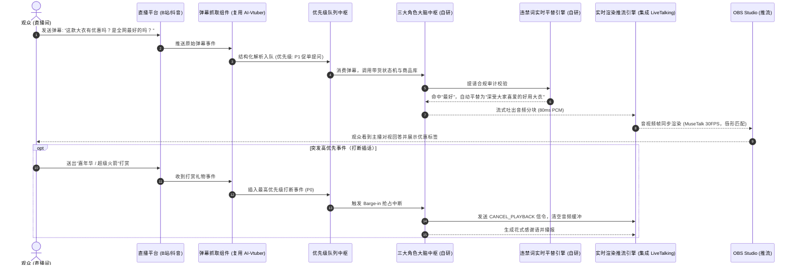

# **AI 互动直播系统（AI-LiveStream-Agent）本地私有化部署产品架构与落地开发规划文档**

> **版本**：v1.5.0 Enterprise Ready  
> **更新时间**：2026-09-10  
> **适用场景**：电商带货主播、娱乐陪伴互动主播、行业领域专家互动咨询、闲聊扯淡陪伴主播、全双工多模态推流  
> **部署定位**：普通用户本地电脑一键部署使用，兼顾低配电脑（端云分离/Live2D CPU）与高端显卡（全本地离线）  
> **落地核心原则**：**“借力成熟顶级开源底座，专注自研核心业务中枢与产品化包装”**  
> **⚠️ 重要约定**：第 1~15 章为原始产品规划愿景；**第 16 章为 v1.1.x 实际实施变更记录与架构决策约束（ADR），两章冲突时以第 16 章为准**，后期更改和升级严禁违背第 16.4 节所列约束。

---

## 目录（Table of Contents）
1. [产品概述与定位](#1-产品概述与定位)
   - [1.1 产品愿景](#11-产品愿景)
   - [1.2 三大核心主播类型/角色体系定义（带货/娱乐/专业专家）](#12-三大核心主播类型角色体系定义带货娱乐专业专家)
2. [GPT-6 Astra 级前沿多模态底座深度融合](#2-gpt-6-astra-级前沿多模态底座深度融合)
3. [系统整体架构与开源底座选型策略](#3-系统整体架构与开源底座选型策略)
   - [3.1 总体架构蓝图](#31-总体架构蓝图)
   - [3.2 最佳落地战略：开源成熟底座复用与自研核心划分](#32-最佳落地战略开源成熟底座复用与自研核心划分)
   - [3.3 互动数据流与时序图](#33-互动数据流与时序图)
   - [3.4 标准化工程项目目录树规范（Project Tree）](#34-标准化工程项目目录树规范project-tree)
4. [主播形象与声音工厂（基于 LiveTalking 深度定制）](#4-主播形象与声音工厂基于-livetalking-深度定制)
   - [4.1 零样本声音克隆工程化流水线](#41-零样本声音克隆工程化流水线)
   - [4.2 单图/短视频实时数字人渲染底座](#42-单图短视频实时数字人渲染底座)
   - [4.3 预训练模型权重清单与加速运行环境依赖](#43-预训练模型权重清单与加速运行环境依赖)
   - [4.4 动作自然度与“防封杀”抗死板算法](#44-动作自然度与防封杀抗死板算法)
5. [多模态大脑与多角色 Agent 智能调度系统（核心自研）](#5-多模态大脑与多角色-agent-智能调度系统核心自研)
   - [5.1 角色人设系统架构与一键动态切换引擎](#51-角色人设系统架构与一键动态切换引擎)
   - [5.2 角色一：电商带货主播（促单状态机与异步工具调用）](#52-角色一电商带货主播促单状态机与异步工具调用)
   - [5.3 角色二：娱乐与情感陪伴主播（情绪变调、才艺互动与小游戏）](#53-角色二娱乐与情感陪伴主播情绪变调才艺互动与小游戏)
   - [5.4 角色三：专业领域互动专家（双路混合 RAG 严谨知识库与免责声明）](#54-角色三专业领域互动专家双路混合-rag-严谨知识库与免责声明)
   - [5.5 主播违禁词与分角色实时合规拦截系统（Aho-Corasick 核心实现）](#55-主播违禁词与分角色实时合规拦截系统aho-corasick-核心实现)
   - [5.6 原生全双工打断（Barge-in）事件总线核心代码实现](#56-原生全双工打断barge-in事件总线核心代码实现)
6. [全平台弹幕监听与智能控场中枢（基于 AI-Vtuber 深度复用）](#6-全平台弹幕监听与智能控场中枢基于-ai-vtuber-深度复用)
7. [音视频媒体管道与 OBS 推流集成](#7-音视频媒体管道与-obs-推流集成)
8. [全硬件阶梯适配方案（从集显到顶配显卡）](#8-全硬件阶梯适配方案从集显到顶配显卡)
   - [8.1 硬件档次矩阵](#81-硬件档次矩阵)
   - [8.2 端云分离模式（Tier C）远程算力容器部署规范](#82-端云分离模式tier-c远程算力容器部署规范)
9. [系统配置中心：API 参数与多服务商管理（Settings & API Providers Center）](#9-系统配置中心api-参数与多服务商管理settings--api-providers-center)
   - [9.1 大模型底座（LLM Provider）参数配置](#91-大模型底座llm-provider参数配置)
   - [9.2 TTS 语音合成与声音克隆服务参数配置](#92-tts-语音合成与声音克隆服务参数配置)
   - [9.3 实时多模态与视觉识别通道参数配置](#93-实时多模态与视觉识别通道参数配置)
   - [9.4 端云分离远程算力节点连接参数配置](#94-端云分离远程算力节点连接参数配置)
   - [9.5 各直播平台接入鉴权与监听参数配置](#95-各直播平台接入鉴权与监听参数配置)
   - [9.6 本地密钥加密与一键全链路连通性测试（Ping Test）](#96-本地密钥加密与一键全链路连通性测试ping-test)
10. [软件界面原型与后台交互规划（Electron + React 18）](#10-软件界面原型与后台交互规划electron--react-18)
11. [本地持久化与数据库表结构设计（SQLite DDL）](#11-本地持久化与数据库表结构设计sqlite-ddl)
12. [接口与通信协议规格（API Specification）](#12-接口与通信协议规格api-specification)
13. [敏捷落地开发路线图与实施排期（4-5 周敏捷发布）](#13-敏捷落地开发路线图与实施排期4-5-周敏捷发布)
14. [合规风控与平台反“数字人封禁”防御指南](#14-合规风控与平台反数字人封禁防御指南)
   15. [音画同步校准与系统高可用容错手册（A/V Sync & Fault-Tolerance）](#15-音画同步校准与系统高可用容错手册av-sync--fault-tolerance)
16. [实施变更记录与架构决策约束（v1.1.x Changelog & ADR）](#16-实施变更记录与架构决策约束v11x-changelog--adr)
    - [16.1 版本演进与新增模块清单](#161-版本演进与新增模块清单)
    - [16.2 界面交互规范修订（对照第 10 章）](#162-界面交互规范修订对照第-10-章)
    - [16.3 接口与数据结构变更（对照第 12/11 章）](#163-接口与数据结构变更对照第-1211-章)
    - [16.4 不可违背的架构决策约束（ADR · 强制）](#164-不可违背的架构决策约束adr--强制)

---

## 1. 产品概述与定位

### 1.1 产品愿景
**AI-LiveStream-Agent** 是一款面向个人创作者、中小商家、MCN 机构及各行业专业人士的**本地私有化多模态交互直播系统**。用户无需掌握复杂的 AI 算法，只需在本地操作界面中上传一张正面肖像照片（或几秒短视频）和一段几秒钟的录音，即可迅速构建出一个具备**高保真形象、自然说话口型、拟真人声音色**，并且掌握**专业知识库或带货促销技能**的数字人主播。

系统支持开箱即用地对接到主流直播平台（B站、抖音、快手、淘宝直播、视频号、TikTok 等），实现全天候 7×24 小时的**全双工流式互动、观众问题秒回、自动打断插话与促单成交**。

### 1.2 三大核心主播类型/角色体系定义（带货/娱乐/专业专家）

针对不同直播间的运营目标与用户画像，系统原生构建了**三大主播角色类型**：

```
                                  ┌──────────────────────────────┐
                                  │ AI-LiveStream-Agent 角色中枢 │
                                  └──────────────┬───────────────┘
                                                 │
         ┌───────────────────────────────────────┼───────────────────────────────────────┐
         ▼                                       ▼                                       ▼
【类型一：电商带货主播】               【类型二：娱乐与情感陪伴主播】           【类型三：专业领域互动专家】
- 目标：商品成交、促单转化、解答参数   - 目标：涨粉、停留时长、礼物打赏、活跃   - 目标：专业信任、深度咨询、私域沉淀
- 风格：热情高亢、节奏紧凑、懂痛点     - 风格：幽默风趣、共情力强、会玩梗接梗   - 风格：沉稳温和、客观严谨、富有逻辑
- 驱动：商品SOP、实时库存、优惠券工具   - 驱动：弹幕吐槽、才艺唱段、互动小游戏   - 驱动：本地私有 RAG 文献库、案例法规
```

#### 角色全方位能力矩阵比对

| 维度 | 1. 电商带货主播 (E-commerce) | 2. 娱乐陪伴主播 (Entertainment) | 3. 专业领域互动专家 (Domain Expert) |
| :--- | :--- | :--- | :--- |
| **典型应用场景** | 美妆个护、服饰穿搭、食品零食、3C数码好物、本地生活团购 | 深夜情感树洞、闲聊脱口秀、二次元虚拟偶像、游戏赛事解说、才艺PK | 法律援助咨询、中医健康养生、财税与金融解读、考研/升学择校、心理辅导 |
| **核心商业目标** | 提高 GMV、客单价、降低退货咨询、限时库存逼单 | 延长观众平均停留时长、促成高额礼物打赏、直播间点赞打卡 | 塑造行业权威 IP、解决用户深度专业痛点、引流高净值客户至私域咨询 |
| **语言风格特征** | 热情洋溢、煽动性强、语速适度偏快（1.1x）、倒计时催单、巧用亲昵称呼（“宝子们/家人们”） | 活泼幽默、网梗丰富、多用叹词与笑声（`<laughter>`）、情商极高、擅长安抚情绪 | 儒雅得体、语调平和（0.95x）、条理清晰（“第一/第二”）、适度引用专业术语与数据论证 |
| **知识与数据依赖** | 商品 SKU 表、规格库存、优惠券规则、发货与售后 SOP | 实时流行语料库、段子笑话库、经典歌曲小样、趣味心理测试题库 | 行业专业文献（PDF/Word）、法律法规汇编、标准 FAQ 问答库、免责合规条款 |
| **专属调度工具 (MCP)**| 查库存、弹优惠券倒计时、切商品特写镜头、展示尺码对照表 | 播放音效（鼓掌/嘘声/笑声）、开启猜灯谜/成语接龙、比心特效 | 动态投屏课件 PPT、展示文献报告数据、生成专属咨询诊断卡片 |
| **动作神态渲染** | 动作幅度较大、高频手部展示动作、眼神坚定对视镜头、手势指向右下角购物车 | 表情丰富灵动、随机微笑眨眼、惊讶捂嘴、卖萌歪头、节拍身体摇摆 | 仪态端庄沉稳、微点头致意、眼神专注、手势呈沉思或指点状 |

---

## 2. GPT-6 Astra 级前沿多模态底座深度融合

结合目前前沿大模型与 Google Project Astra、OpenAI Realtime API 及端到端语音/视觉流式多模态体系，本系统在架构设计上原生集成并抽象了下一代多模态特性：

1. **原生全双工打断（Barge-in & Mid-turn Interruption）**：
   - 当检测到高权重事件（如大额礼物打赏、房管提问），调度中枢向下游发送 `CANCEL_PLAYBACK` 信号，数字人音画管道在 100ms 内优雅渐出淡出并立刻承接插播：“哎呀非常感谢【大哥】送出的超级火箭！关于您问的问题，我马上为您解答……”。
2. **多模态屏幕与视觉感知（Vision & Screen Awareness）**：
   - 支持通过本地截屏推流通道或外接摄像头输入，将直播间当前画面的产品实物、白板展示编码为帧切片送入模型，AI 做到“眼见即所言”。
3. **异步决策与工具调用（Async Tool Calling / Model Context Protocol）**：
   - 遵从 MCP 标准协议。在口播的同时并行触发库存查询、优惠券下发、音效播放等工具。
4. **显式提示词缓存（Explicit Prompt Caching）**：
   - System Prompt 包含海量商品库或几十页专家文献。利用 Prompt Caching 将静态知识库缓存在内存中，首字延迟（TTFT）降低至 300ms 以下，API 成本直降 80%。

---

## 3. 系统整体架构与开源底座选型策略

### 3.1 总体架构蓝图

```
+---------------------------------------------------------------------------------------------------+
|                                  表现层：用户控制台 (Electron + React 18)                           |
|  [三大角色中枢]   [形象/声音工厂]   [商品与RAG库]   [违禁词配置]   [API参数中枢]   [实时监控大屏]       |
+--------------------------------------------------+------------------------------------------------+
                                                   | HTTP REST / WebSocket
+--------------------------------------------------v------------------------------------------------+
|                             核心调度中枢：Local Core Engine (Python 3.10+)                          |
|                                                                                                   |
|  ┌───────────────────────────────┐     ┌───────────────────────────┐     ┌─────────────────────┐  │
|  │ 平台弹幕监听适配器           │     │     多源优先级消息队列    │     │ 违禁词实时平替引擎  │  │
|  │ (复用 AI-Vtuber 核心协议模块) ├────►│  (打赏/特权/普通/闲时垫场)├───►│ (自研 Aho-Corasick) │  │
|  └───────────────────────────────┘     └───────────────────────────┘     └──────────┬──────────┘  │
|                                                                                     │             │
|  ┌──────────────────────────────────────────────────────────────────────────────────▼──────────┐  │
|  │                        自研三大角色大脑决策引擎 (带货 / 娱乐 / 专家 三大状态机)             │  │
|  │   - 角色人设系统 (Prompt Engine)               - 本地向量检索 (ChromaDB/LanceDB)            │  │
|  │   - 异步工具调用执行器 (MCP Tools)             - 状态机控制 (待机/讲解/答疑/促单/感谢/才艺)  │  │
|  └──────────────────────────────────────────────────────────────────────────────────┬──────────┘  │
+-------------------------------------------------------------------------------------+-------------+
                                                                                      │ 结构化音频流
+-------------------------------------------------------------------------------------v-------------+
|                                音频与数字人媒体渲染层 (Media Pipeline)                            |
|                                                                                                   |
|   ┌──────────────────────────────────────────────┐   ┌─────────────────────────────────────────┐  │
|   │         零样本极速 TTS 语音合成引擎          │   │         实时数字人视讯驱动底座          │  │
|   │ - CosyVoice 2 / F5-TTS (流式首包 <180ms)     ├──►│ - 深度集成 lipku/LiveTalking 引擎架构   │  │
|   │ - 云端极速 TTS 备选 (MiniMax / Edge-TTS)     │   │ - MuseTalk / Wav2Lip 实时 TensorRT 推理 │  │
|   └──────────────────────────────────────────────┘   │ - 自主微表情防封引擎 (眨眼/呼吸/视线)   │  │
|                                                      └────────────────────┬────────────────────┘  │
+---------------------------------------------------------------------------+-----------------------+
                                                                            │ WebRTC / 虚拟摄像头 / 虚拟声卡
+---------------------------------------------------------------------------v-----------------------+
|                                      推流与播送层 (Broadcast Layer)                                |
|  [OBS Studio] ──(RTMP/SRT)──► [Bilibili 直播] / [抖音直播] / [微信视频号] / [TikTok] / [淘宝直播]  |
+---------------------------------------------------------------------------------------------------+
```

---

### 3.2 最佳落地战略：开源成熟底座复用与自研核心划分

为确保项目**以最快速度落地、最低研发试错成本、最高运行稳定性**，坚决采用**“借力成熟开源底座 + 自研核心业务中枢与产品化封装”**策略：

| 模块名称 | 选型与来源方案 | 深度整合与二次开发要点 |
| :--- | :--- | :--- |
| **1. 实时数字人视讯与推流底座** | **深度集成 `lipku/LiveTalking`** (开源标杆) | 复用其 MuseTalk/Wav2Lip 流式切片与 OBS 虚拟摄像头管线，补全打断机制 |
| **2. 多平台弹幕抓取与连接器** | **深度复用 `Ikaros-521/AI-Vtuber`** 协议模块 | 抽取其 B站/抖音/快手长链接协议与心跳保活代码，封装为标准化适配器 |
| **3. 语音克隆与流式 TTS** | **开源 CosyVoice 2 / F5-TTS** + 云端 API | 封装 10 秒音频特征提取缓存与 80ms 流式音频切片，支持多情感音调微调 |
| **4. 三大主播角色状态机大脑** | ★ **100% 自主研发** | 带货促单 SOP、娱乐互动玩梗小游戏、行业专家双路混合 RAG 严谨知识库 |
| **5. 主播违禁词实时平替引擎** | ★ **100% 自主研发** | Aho-Corasick 高性能多模式内存匹配，广告法极限词平替、动态热更新字典 |
| **6. 端云分离远程 GPU 算力中继** | ★ **100% 自主研发** | 让 2G 显卡/轻薄本一键穿透连接云端按量 4090 算力容器并拉取视频流 |
| **7. 桌面控制台与实时监控大屏** | ★ **100% 自主研发 (Electron)** | 现代化深色 UI、API Key AES-256 加密、一键 Ping 连通性测试、人工插话控制 |

---

### 3.3 互动数据流与时序图



---

### 3.4 标准化工程项目目录树规范（Project Tree）

```plaintext
AI-LiveStream-Agent/
├── apps/
│   └── desktop-ui/                     # Electron + React 18 前端控制台源码
│       ├── public/                     # 静态资源、Logo、默认待机背景
│       ├── src/
│       │   ├── api/                    # Axios REST Client 与 WebSocket 客户端
│       │   ├── components/             # 通用 UI 组件（视频监视器、弹幕流水流、仪表盘）
│       │   ├── pages/                  # 核心页面
│       │   │   ├── Dashboard/          # 实时直播监控与人工插话大屏
│       │   │   ├── RoleStudio/         # 三大主播角色配置中心（带货/娱乐/专家）
│       │   │   ├── AvatarVoice/        # 照片上传与 10 秒音色克隆录音室
│       │   │   ├── KnowledgeSku/       # 商品 SKU 卡片与 RAG 文档库管理
│       │   │   ├── Guardrails/         # 违禁词库配置与平替词维护
│       │   │   └── Settings/           # API Key 配置、云端 GPU 节点与一键 Ping
│       │   └── store/                  # Zustand 状态管理 (当前角色、直播状态、队列)
│       └── package.json
│
├── server/                             # Python 3.10+ 后端核心执行引擎
│   ├── app.py                          # FastAPI 主入口 (REST API + WebSocket)
│   ├── config.py                       # 本地配置加载与 AES-256 密钥加解密工具
│   ├── database/                       # 本地持久化层 (SQLite + SQLAlchemy / aiosqlite)
│   │   ├── models.py                   # ORM 数据表映射模型
│   │   └── migrations/                 # SQLite DDL 迁移脚本
│   │
│   ├── adapters/                       # 外部开源底座解耦适配器层
│   │   ├── danmaku/                    # 弹幕适配器 (抽取复用 AI-Vtuber 核心解析协议)
│   │   │   ├── bilibili_fetcher.py     # blivedm 客户端封装
│   │   │   ├── douyin_fetcher.py       # 抖音 Wss 逆向长连接与 Protobuf 解析
│   │   │   └── base_fetcher.py         # 统一弹幕事件抽象基类
│   │   └── media/                      # 音视频驱动适配器 (深度集成 LiveTalking)
│   │       ├── musetalk_driver.py      # MuseTalk 实时流式推理适配器
│   │       ├── virtual_cam.py          # pyvirtualcam 虚拟摄像头与声卡输出
│   │       └── webrtc_streamer.py      # WebRTC 本地低延迟流媒体发送器
│   │
│   ├── core/                           # ★ 核心自主研发业务层
│   │   ├── roles/                      # 三大主播大脑状态机引擎
│   │   │   ├── ecommerce_anchor.py     # 电商带货状态机 (SOP/逼单/发券/查库存)
│   │   │   ├── entertainment_host.py   # 娱乐陪伴主播 (玩梗/幽默接梗/互动游戏)
│   │   │   ├── domain_expert.py        # 行业领域专家 (双路混合 RAG/溯源/免责)
│   │   │   └── role_manager.py         # 角色热切换与上下文装配中枢
│   │   ├── queue/                      # 四级优先级抢占式消息队列 (Priority Queue)
│   │   │   ├── priority_queue.py       # 线程安全事件队列与 Barge-in 打断调度
│   │   │   └── barrage_aggregator.py   # 滑动时间窗口弹幕聚合与去重聚类
│   │   ├── guardrails/                 # 违禁词实时合规拦截系统
│   │   │   ├── aho_corasick.py         # Aho-Corasick 高性能多模式内存匹配引擎
│   │   │   └── word_sanitizer.py       # 极限词平替、整句拦截与告警流水
│   │   ├── rag/                        # 本地轻量化 RAG 引擎 (ChromaDB + BM25)
│   │   └── tools/                      # MCP 异步工具箱 (库存/优惠券/镜头特写)
│   │
│   └── tts/                            # 极速语音合成引擎包装
│       ├── cosyvoice_engine.py         # CosyVoice 2 零样本克隆流式生成
│       └── cloud_tts_bridge.py         # MiniMax / ElevenLabs / Edge-TTS 云端桥接
│
├── weights/                            # 预训练模型权重目录 (本地或一键脚本下载)
│   ├── musetalk/                       # MuseTalk 权重 (musetalk.json, pytorch_model.bin)
│   ├── cosyvoice/                      # CosyVoice 2 模型权重 (0.5B)
│   └── whisper/                        # 用于特征对齐的 whisper-tiny
│
├── scripts/                            # 运维与启动脚本
│   ├── download_weights.py             # 国内 ModelScope 极速下载权重脚本
│   ├── setup_env.bat                   # Windows 一键安装 CUDA/PyTorch 依赖
│   └── docker-runpod.sh                # 端云分离模式下云端 4090 GPU 容器启动脚本
│
└── develop_plan.md                     # 全局产品架构与落地开发规划文档
```

---

## 4. 主播形象与声音工厂（基于 LiveTalking 深度定制）

### 4.1 零样本声音克隆工程化流水线
- **本地主推引擎**：**CosyVoice 2 (0.5B)** / **F5-TTS**。
  - 用户上传 5-15 秒清晰人声音频（WAV/MP3），系统自动调用 `noisereduce` 降噪并标准化至 -16 LUFS。
  - 提取 Speaker Embedding 向量保存至 `data/voice_profiles/{id}.npy`，直播启动时 0 秒极速加载。
  - 流式分块策略：按标点符号断句并切为 **80ms PCM (24kHz/16bit)**，首包延迟在 RTX 3060 上控制在 **180~240ms**。

### 4.2 单图/短视频实时数字人渲染底座
- **深度集成 `lipku/LiveTalking` 的 MuseTalk 推理内核**：
  - 用户只需上传 1 张正面半身高清照片（或 5-10 秒无声呼吸短视频）。
  - 系统使用 `RetinaFace` 识别人脸并提取 468 个特征关键点，预生成特征缓存 `avatar_cache.pkl`。
  - 驱动阶段：接收 TTS 输出的 80ms PCM 音频切片，计算 Mel 频谱，通过 TensorRT FP16 加速在 25-30ms 内完成单帧渲染，持续稳定输出 30 FPS 画面。

### 4.3 预训练模型权重清单与加速运行环境依赖

#### 1. 核心权重清单与体积说明
| 模型组件 | 用途说明 | 文件大小 | 推荐国内镜像源 |
| :--- | :--- | :--- | :--- |
| **MuseTalk Core** | 数字人局部面容与唇形重采样模型 | ~1.8 GB | ModelScope: `TMElyralab/MuseTalk` |
| **Whisper-tiny** | 提取输入音频的声学特征用于唇形匹配 | ~150 MB | ModelScope: `openai/whisper-tiny` |
| **RetinaFace / DWPose** | 人脸检测与骨骼关键点提取 | ~300 MB | ModelScope: `damo/cv_resnet50_face-detection_retinaface` |
| **CosyVoice 2 (0.5B)** | 零样本声音克隆与流式 TTS | ~2.2 GB | ModelScope: `speech_tts/CosyVoice2-0.5B` |
| **BGE-small-zh-v1.5** | 本地 RAG 知识库向量嵌入 | ~120 MB | HuggingFace 镜像: `BAAI/bge-small-zh-v1.5` |

#### 2. 本地执行环境标准矩阵
- **操作系统**：Windows 10/11 (64-bit) 或 Linux (Ubuntu 22.04 LTS)
- **Python 环境**：Python 3.10.x (Conda 独立环境)
- **深度学习套件**：`PyTorch 2.3.0 + cu121` + `CUDA 12.1` + `cuDNN 8.9.x`
- **推理加速引擎**：`TensorRT 8.6.1.6` (大幅降低显存并提升 2.5x 帧率)
- **系统媒体工具**：`FFmpeg 6.0+` (配置进系统 PATH)

### 4.4 动作自然度与“防封杀”抗死板算法
- 泊松分布自主随机眨眼（平均 2.8 秒一次，模拟双眼闭合 100~150ms）。
- 待机胸腔纵向微呼吸起伏与重心左右平滑微移。
- 视线随机漂移（在弹幕阅读区、提词器与镜头间轻微切换）。
- 闲时无声动作底模无缝交叉淡入淡出（120ms Cross-fade）。

---

## 5. 多模态大脑与多角色 Agent 智能调度系统（核心自研）

### 5.1 角色人设系统架构与一键动态切换引擎

系统内置统一的角色抽象基类，支持在直播进行中一键热切换角色：

```python
# server/core/roles/base_role.py 核心架构示意
from typing import AsyncGenerator
from abc import ABC, abstractmethod

class BaseAnchorRole(ABC):
    def __init__(self, role_id: str, name: str, system_prompt: str, tts_config: dict, guardrail_profile: str):
        self.role_id = role_id
        self.name = name
        self.system_prompt = system_prompt
        self.tts_config = tts_config                  # 语速、语调、气口策略
        self.guardrail_profile = guardrail_profile    # 绑定的特定违禁词库

    @abstractmethod
    async def process_barrage(self, message: dict, live_context: dict) -> AsyncGenerator[str, None]:
        """流式生成回答文本片段 (Token 级输出)"""
        pass
```

### 5.2 角色一：电商带货主播（促单状态机与异步工具调用）

带货主播运行一套基于有限状态机（FSM）的促单逻辑：

```python
# server/core/roles/ecommerce_anchor.py 核心状态机逻辑
class EcommerceState:
    CAROUSEL_PITCHING = "CAROUSEL"   # 无弹幕时轮播讲解商品
    QA_CLOSING = "QA_CLOSING"         # 针对弹幕答疑并强势促单
    URGENCY_BURST = "URGENCY"         # 降价发券高潮倒计时

class EcommerceAnchorRole(BaseAnchorRole):
    def __init__(self, ...):
        super().__init__(...)
        self.current_state = EcommerceState.CAROUSEL_PITCHING
        self.current_product_index = 0

    async def step_carousel(self, products: list) -> str:
        """闲时触发：顺次讲解下一个商品卖点"""
        product = products[self.current_product_index]
        self.current_product_index = (self.current_product_index + 1) % len(products)
        return f"欢迎新进直播间的朋友！正在为大家介绍的是我们的{product['title']}..."

    async def trigger_flash_sale(self, sku_id: str, coupon_desc: str):
        """触发异步 MCP 工具下发优惠券与倒计时角标"""
        await mcp_tool_bus.emit("trigger_onscreen_coupon", {"sku_id": sku_id, "desc": coupon_desc, "seconds": 180})
```

### 5.3 角色二：娱乐与情感陪伴主播（情绪变调、才艺互动与小游戏）
- **高情商话术与共情**：基于观众弹幕识别情绪偏向（疲惫、失恋、求安慰），自动生成抚慰性口吻。
- **互动小游戏引擎**：内置 AI 成语接龙、脑筋急转弯及塔罗占卜逻辑，通过公屏弹幕打卡计分。
- **打赏花式答谢**：识别礼物等级（小礼物/跑车/火箭/嘉年华），分级调用专属鸣谢台词与比心手势。

### 5.4 角色三：专业领域互动专家（双路混合 RAG 严谨知识库与免责声明）
- **双路召回**：向量语义检索（ChromaDB）+ 关键词精确检索（BM25），确保法律法条、药品配方不出现张冠李戴。
- **置信度过滤**：相关性得分低于 0.65 时，主动触发安全兜底：“关于这个问题，涉及具体个案细节，建议您稍后通过私信或线下渠道提供完整材料……”。
- **前置免责注入**：系统在生成答案前端自动附加温和的免责声学声明。

---

### 5.5 主播违禁词与分角色实时合规拦截系统（Aho-Corasick 核心实现）

底层采用 **Aho-Corasick 自动机（AC 自动机）**，在内存中构建高效的 Trie 树与失败指针，实现 $O(N)$ 复杂度的流式匹配（单句检测耗时 < 1ms）：

```python
# server/core/guardrails/aho_corasick.py 核心平替过滤器实现
import pyahocorasick

class ProhibitedWordSanitizer:
    def __init__(self):
        self.automaton = pyahocorasick.Automaton()
        self.word_meta = {}  # 存储对应的 action 和 replacement

    def build_tree(self, word_records: list):
        """从数据库重新构建 AC 树 (支持直播中动态热加载)"""
        self.automaton.clear()
        self.word_meta.clear()
        for item in word_records:
            word = item["word"]
            self.automaton.add_word(word, (word, item["action_policy"], item["replacement_word"]))
        self.automaton.make_automaton()

    def sanitize(self, text: str) -> tuple[str, list]:
        """执行流式文本审计与平替"""
        hits = []
        replaced_text = list(text)
        offset = 0

        for end_idx, (word, action, replacement) in self.automaton.iter(text):
            start_idx = end_idx - len(word) + 1
            hits.append({"word": word, "action": action, "start": start_idx, "end": end_idx})
            
            if action == "substitute":
                # 智能平替：将违规极限词无缝替换为合规词汇
                text = text[:start_idx] + replacement + text[end_idx + 1:]
                return self.sanitize(text) # 重新计算位移
            elif action == "drop":
                # 阻断动作：整句丢弃并重新生成
                return ("", hits)

        return (text, hits)
```

---

### 5.6 原生全双工打断（Barge-in）事件总线核心代码实现

```python
# server/core/queue/priority_queue.py 抢占式打断事件总线
import asyncio
from typing import Optional

class InterruptibleMediaQueue:
    def __init__(self):
        self.current_playback_task: Optional[asyncio.Task] = None
        self.cancel_event = asyncio.Event()

    async def barge_in_interrupt(self, interrupt_reason: str):
        """收到大额打赏或房管事件，执行毫秒级切流打断"""
        self.cancel_event.set()
        if self.current_playback_task and not self.current_playback_task.done():
            self.current_playback_task.cancel()
            try:
                await self.current_playback_task
            except asyncio.CancelledError:
                pass
        # 通知下游 LiveTalking 引擎立即清空待播音频队列
        await digital_human_adapter.flush_audio_buffer()
        self.cancel_event.clear()
```

---

## 6. 全平台弹幕监听与智能控场中枢（基于 AI-Vtuber 深度复用）

### 6.1 多平台弹幕抓取方案
直接抽取并复用 **`Ikaros-521/AI-Vtuber`** 成熟稳定的网络长连接驱动：
- **B站**：官方长链接 WebSocket（`blivedm`）。
- **抖音**：Web 端 Wss 逆向/Protobuf 解析，心跳保活与 Session 维持。
- **快手 / 视频号 / 淘宝 / TikTok**：统一封装为标准化事件输出。

### 6.2 智能弹幕清洗、归纳与滑动窗口聚类
系统维护滑动时间窗口（3.0 秒），对刷屏的相同提问（如“怎么还没发货？”）进行相似度计算并合并归纳，由 AI 一次性向全场集中答复。

### 6.3 四级抢占式事件优先级调度队列
- **P0（最高）**：大额打赏 / 房管警告（<150ms 触发 Barge-in 打断）。
- **P1（高）**：高意图提问（查价格/求优惠券，<800ms 插队解答）。
- **P2（中）**：普通互动打卡（1-3s 顺序答复）。
- **P3（保底）**：15秒冷场自动触发对应角色的垫场脚本。

---

## 7. 音视频媒体管道与 OBS 推流集成

### 7.1 输出通道设计与 OBS 接入
- **方案 A（虚拟设备直连，小白首选）**：复用 `LiveTalking` 的虚拟摄像头（`pyvirtualcam`）与虚拟声卡（`VB-Cable`）输出，OBS 直接抓取设备。
- **方案 B（WebRTC / 本地 RTSP 浏览器源）**：后台开放 WebRTC 流，OBS 添加“浏览器源”，支持透明 Alpha 通道叠加与高帧率无损画质。

### 7.2 虚拟声卡与回声消除（AEC）闭环
- **防串音机制**：隔离主播发音通道与拾音麦克风，防止声音死循环二次识别。
- **同步缓冲校准（A/V Sync Control）**：内置音频延迟队列（Audio Delay FIFO），确保音画同步误差 < 35ms。

---

## 8. 全硬件阶梯适配方案（从集显到顶配显卡）

### 8.1 硬件档次矩阵

| 模式名称 | 适用硬件门槛 | 大模型运行方式 | 声音合成方式 | 画面生成方案 | 综合运行成本 | 适用人群 |
| :--- | :--- | :--- | :--- | :--- | :--- | :--- |
| **A. 全本地离线模式** | RTX 3090 / 4080 / 4090 (16G-24G) | 本地 Ollama (DeepSeek-R1-14B / Qwen2.5) | 本地 CosyVoice 2 (FP16) | LiveTalking + MuseTalk 本地 TRT | **0 元** (仅消耗电费) | 拥有专业主机、注重数据绝对隐私企业 |
| **B. 主流端云混合模式** | RTX 2060 / 3060 / 4060 (6G-8G) | 云端 API (GPT-6 Astra / DeepSeek) | 本地 CosyVoice / 云端极速 TTS | 本地优化版数字人 (720P 25FPS) | 仅少量 API 费用 (约 0.5元/小时) | 绝大多数拥有入门独显的个人主播 |
| **C. 端云分离架构** *(强烈推荐)* | **任何老电脑 / 2G显卡 / 苹果 Mac** | 本地运行调度中枢与知识库 | 云端 GPU 节点跑数字人与 TTS | 远程 4090 云节点生成视频并推回本地 OBS | **约 1.5 ~ 2.5 元/小时** (按秒计费，播完即关) | 电脑配置较低但希望拥有电影级 4K 画质用户 |
| **D. 轻量免显卡模式** | **办公轻薄本 / 纯 CPU** | 云端 API 直连 | 云端极速 TTS (MiniMax/Edge) | **Live2D / 骨骼驱动二次元形象** | 极微量 API 费用 | 二次元虚拟主播、游戏闲聊、知识答疑 |

---

### 8.2 端云分离模式（Tier C）远程算力容器部署规范

针对本地电脑显卡显存低于 8G（或集成显卡）的用户，软件内置**一键云端 GPU 容器连接网关**。用户在 RunPod、AutoDL 或阿里云 PAI 租用 RTX 4090 节点，仅需执行一条启动指令：

```bash
# 云端算力节点一键初始化指令 (Docker 环境)
docker run -d --gpus all -p 8888:8888 -p 8554:8554 \
  -e AUTH_TOKEN="your_secure_token_123456" \
  -v /root/weights:/workspace/weights \
  registry.cn-hangzhou.aliyuncs.com/ai-live/livetalking-node:latest
```

**通信机制**：
1. 本地客户端通过 WebSocket 将弹幕调度产生的 TTS 音频数据块发送到云端。
2. 云端 4090 节点在 20ms 内完成 MuseTalk 1080P/60FPS 高精渲染。
3. 云端通过内置的 **WebRTC (MediaSoup / Pion)** 协议，将音视频复合流实时回传给本地 OBS 浏览器源，全链路延迟小于 200ms。

---

## 9. 系统配置中心：API 参数与多服务商管理（Settings & API Providers Center）

```
┌────────────────────────────────────────────────────────────────────────────────────────┐
│                             系统全局 API 服务配置中心 (Settings UI)                      │
├────────────────────────────────────────────────────────────────────────────────────────┤
│ 1. 大语言模型 (LLM)      │ [● 预设: GPT-6 Astra]  [自定义 OpenAI 兼容接口] [本地 Ollama] │
│ 2. 语音合成 (TTS)        │ [● 预设: CosyVoice本地] [MiniMax 语音]  [ElevenLabs]  [Edge-TTS] │
│ 3. 视觉感知通道 (Vision) │ [● 预设: 直播间推流截屏] [USB 高清摄像头] [禁用视觉]           │
│ 4. 端云分离节点 (Remote) │ [IP/域名: 121.43.xx.xx] [端口: 8888] [鉴权 Token: **********]   │
│ 5. 直播平台监听 (Live)   │ [选择平台: 抖音] [房间号/URL: https://live.douyin.com/xxxx]     │
├────────────────────────────────────────────────────────────────────────────────────────┤
│ 操作： [ 一键测试全部连通性 (Ping) ]  [ 导出配置文件 (JSON) ]  [ 保存并热加载生效 ]            │
└────────────────────────────────────────────────────────────────────────────────────────┘
```

### 9.1 大模型底座（LLM Provider）参数配置
- **`provider_type`**：`openai_compatible` / `local_ollama`
- **`base_url`**：支持官方 `https://api.openai.com/v1` 或自建中转反代地址。
- **`api_key`**：加密存储，界面显示为 `sk-proj-••••••••abcd`。
- **`model_name`**：例如 `gpt-6-astra`、`gpt-4o-realtime-preview`、`deepseek-chat`、`deepseek-r1`、`qwen-max`。
- **`temperature`**：推荐带货主播设为 `0.8`，娱乐主播设为 `0.85`，专业专家设为 `0.3`。
- **`prompt_caching_enabled`**：开启大模型上下文显式缓存，显著削减商品知识库 Token 成本。

### 9.2 TTS 语音合成与声音克隆服务参数配置
- **`service_type`**：`local_cosyvoice` / `cloud_minimax` / `cloud_elevenlabs` / `cloud_edge_tts`
- **`voice_id / speaker`**：本地上传提取的 Speaker 向量，或商业云端的 Voice ID。
- **`speed` (语速)**：带货主播默认 1.1x，专家主播默认 0.95x。
- **`streaming_chunk`**：`80ms` 音频切片，保障音画实时驱动。

### 9.3 实时多模态与视觉识别通道参数配置
- **`vision_enabled`**：是否开启画中画视觉感知。
- **`vision_source`**：`desktop_screen`（桌面/OBS推流窗口截屏）或 `usb_camera`（外接摄像头展示）。
- **`capture_interval_sec`**：画面采样频次（默认 `2.5 秒/帧`）。

### 9.4 端云分离远程算力节点连接参数配置（针对档位 C）
- **`cloud_node_url`**：云端 GPU 实例 WebSocket 地址（RunPod/AutoDL）。
- **`auth_token`**：云节点访问认证密钥。
- **`video_stream_protocol`**：`WebRTC`（低延迟首选）或 `RTMP`。

### 9.5 各直播平台接入鉴权与监听参数配置
- **B站**：`bilibili_room_id`，可选 `bilibili_sessdata`。
- **抖音**：`douyin_room_url`，浏览器 Session Cookie。
- **代理池**：支持配置 HTTP/SOCKS5 爬虫防风控代理地址。

### 9.6 本地密钥加密与一键全链路连通性测试（Ping Test）
- 基于系统级硬件秘钥派生 **AES-256-GCM** 加密存储全部 API Key。
- 配置界面支持一键 **Ping Test**：测试 LLM 首字延迟、TTS 合成连通度及直播间弹幕握手情况。

---

## 10. 软件界面原型与后台交互规划（Electron + React 18）

### 10.1 核心页面布局线框图（UI Wireframe）

```
+---------------------------------------------------------------------------------------------------+
|  [Logo] AI-LiveStream-Agent 专业版 v1.0              [GPU: RTX 4060 8G (48%)]  [状态: ● 直播中] [设置] |
+------------------+--------------------------------------------------------------------------------+
| 导航栏           | 核心工作区 (Tab: 实时直播监控大屏)                                                |
|                  |                                                                                |
| [ 主播角色切换 ] | 当前角色: [● 电商带货主播] (可切换: 娱乐陪伴主播 / 专业领域专家)               |
| [ 主播形象库 ]   | +------------------------------------+  +-----------------------------------+  |
| [ 声音克隆厂 ]   | | 数字人监视监看画面 (Preview)       |  | 实时弹幕与互动流 (Live Interactions)|  |
| [ 知识库管理 ]   | |                                    |  |                                   |  |
| [ 商品SOP库  ]   | |           [ 1080P 实时画面 ]       |  | [10:24:02] 用户A: 这款保修多久？   |  |
| [★违禁词配置 ]   | |                                    |  |    └─► [带货AI解答中]: 官方质保2年 |  |
| [★API参数设置]   | |                                    |  | [10:24:08] ★【土豪哥】送出火箭!   |  |
| [*实时监控大屏*] | | 帧率: 30.2 FPS | 延迟: 420ms       |  |    └─► [已打断插播]: 感谢土豪哥... |  |
| [ 平台连接器 ]   | +------------------------------------+  +-----------------------------------+  |
|                  |                                                                                |
|                  | +----------------------------------------------------------------------------+  |
|                  | | 控场控制面板 (Control Pad)                                                 |  |
|                  | | [ 暂停互动 ]  [ 手动插话/广播 ]  [ 强制讲解下一款商品 ]  [ 一键下播救场 ]   |  |
|                  | | 当前讲解: [1号链接 - 羊毛大衣]  库存: 18件   优惠倒计时: 01:45             |  |
|                  | +----------------------------------------------------------------------------+  |
+------------------+--------------------------------------------------------------------------------+
```

### 10.2 模块功能清单
1. **主播角色切换器**：带货主播、娱乐主播、专业专家一键切换，人设、音色参数及关联词库自动随之加载。
2. **主播资产管理页**：单张人像照片 / 短视频上传，人脸特征预提取，10秒录音在线试听与克隆。
3. **知识库与商品挂载页**：Excel 一键生成商品卡片库，PDF/Word 专家文献库向量化。
4. **违禁词与合规管理页**：预设词库勾选、自定义平替规则添加、Excel 批量导入导出。
5. **API 参数配置页**：LLM/TTS/云端 GPU/平台长链接视化配置与连通性 Ping 测试。
6. **实时监控大屏**：弹幕队列监控、大额打赏抢占插播、运营人工直接键盘输入或语音插话。

---

## 11. 本地持久化与数据库表结构设计（SQLite DDL）

```sql
-- 1. 主播角色人设表
CREATE TABLE IF NOT EXISTS anchor_roles (
    id TEXT PRIMARY KEY,
    role_type TEXT CHECK(role_type IN ('ecommerce', 'entertainment', 'expert')) NOT NULL,
    role_name TEXT NOT NULL,                                         -- 如: "金牌带货主播·艾米"
    system_prompt TEXT NOT NULL,
    default_voice_id TEXT,
    speech_speed REAL DEFAULT 1.0,
    pitch_shift REAL DEFAULT 0.0,
    associated_guardrail_group TEXT DEFAULT 'general',
    is_active INTEGER DEFAULT 1,
    created_at TIMESTAMP DEFAULT CURRENT_TIMESTAMP
);

-- 2. 主播形象配置表
CREATE TABLE IF NOT EXISTS avatars (
    id TEXT PRIMARY KEY,
    name TEXT NOT NULL,
    avatar_type TEXT CHECK(avatar_type IN ('image', 'video', 'live2d')) DEFAULT 'image',
    source_file_path TEXT NOT NULL,
    preprocessed_cache_path TEXT,
    created_at TIMESTAMP DEFAULT CURRENT_TIMESTAMP
);

-- 3. 声音克隆档案表
CREATE TABLE IF NOT EXISTS voice_profiles (
    id TEXT PRIMARY KEY,
    name TEXT NOT NULL,
    sample_wav_path TEXT NOT NULL,
    embedding_npy_path TEXT NOT NULL,
    speech_speed REAL DEFAULT 1.0,
    volume_gain REAL DEFAULT 1.0,
    created_at TIMESTAMP DEFAULT CURRENT_TIMESTAMP
);

-- 4. 电商商品表 (SKU Repository)
CREATE TABLE IF NOT EXISTS products (
    id TEXT PRIMARY KEY,
    sku_code TEXT UNIQUE,
    title TEXT NOT NULL,
    category TEXT,
    original_price REAL,
    live_price REAL,
    current_stock INTEGER DEFAULT 0,
    selling_points TEXT,       -- 核心卖点(JSON格式)
    faq_data TEXT,             -- 常见规格答疑(JSON格式)
    coupon_script TEXT,        -- 催单逼电话术模版
    is_active INTEGER DEFAULT 1
);

-- 5. 主播违禁词与合规规则表
CREATE TABLE IF NOT EXISTS prohibited_words (
    id TEXT PRIMARY KEY,
    word TEXT NOT NULL UNIQUE,                                       -- 违禁词正文
    category TEXT CHECK(category IN ('extreme', 'medical', 'traffic', 'competitor', 'sensitive')) DEFAULT 'extreme',
    role_scope TEXT DEFAULT 'all',                                   -- all / ecommerce / entertainment / expert
    action_policy TEXT CHECK(action_policy IN ('substitute', 'drop', 'alert')) DEFAULT 'substitute',
    replacement_word TEXT DEFAULT '',                                -- 平替合规词
    is_enabled INTEGER DEFAULT 1,
    updated_at TIMESTAMP DEFAULT CURRENT_TIMESTAMP
);

-- 6. 违禁词触发审计日志表
CREATE TABLE IF NOT EXISTS prohibited_word_logs (
    id TEXT PRIMARY KEY,
    session_id TEXT,
    matched_word TEXT NOT NULL,
    category TEXT NOT NULL,
    original_sentence TEXT NOT NULL,
    processed_sentence TEXT,
    action_taken TEXT NOT NULL,
    created_at TIMESTAMP DEFAULT CURRENT_TIMESTAMP
);

-- 7. API 服务商与连接参数配置表
CREATE TABLE IF NOT EXISTS api_provider_configs (
    id TEXT PRIMARY KEY,
    config_group TEXT NOT NULL,                                      -- llm / tts / vision / remote_gpu / live_fetcher
    provider_name TEXT NOT NULL,                                     -- openai / deepseek / ollama / minimax / cosyvoice / runpod
    is_active INTEGER DEFAULT 0,
    encrypted_api_key TEXT,                                          -- AES-256-GCM 加密密文
    base_url TEXT,
    model_name TEXT,
    extra_params_json TEXT,
    created_at TIMESTAMP DEFAULT CURRENT_TIMESTAMP,
    updated_at TIMESTAMP DEFAULT CURRENT_TIMESTAMP
);

-- 8. 直播交互与弹幕审计日志表
CREATE TABLE IF NOT EXISTS barrage_logs (
    id TEXT PRIMARY KEY,
    session_id TEXT NOT NULL,
    platform TEXT NOT NULL,                                          -- bilibili / douyin / kuaishou / tiktok
    user_id TEXT,
    user_nickname TEXT,
    raw_message TEXT NOT NULL,
    event_type TEXT DEFAULT 'chat',                                  -- chat / gift / follow
    priority_level INTEGER DEFAULT 2,
    ai_reply_text TEXT,
    response_latency_ms INTEGER,
    is_interrupted INTEGER DEFAULT 0,
    created_at TIMESTAMP DEFAULT CURRENT_TIMESTAMP
);
```

---

## 12. 接口与通信协议规格（API Specification）

### 12.1 本地后端 RESTful API 规范
- **基础 URL**：`http://127.0.0.1:18080/api/v1`

| 分组 | 方法 | 接口路由 | 功能描述 | 请求体/核心参数 |
| :--- | :--- | :--- | :--- | :--- |
| **主播角色** | `GET` | `/roles/list` | 获取内置及自定义主播角色清单 | 无 |
|  | `POST` | `/roles/switch` | **实时切换当前主播角色类型** | `JSON: role_id` |
|  | `POST` | `/roles/upsert` | 新增或编辑角色人设与 Prompt | `JSON: role_type, name, prompt...` |
| **形象/声音** | `POST` | `/avatars/create` | 上传人像照片并完成特征预计算 | `multipart/form-data: file, name` |
|  | `POST` | `/voices/clone` | 上传 10 秒音频并提取 Speaker 向量 | `multipart/form-data: audio, name` |
| **知识库/商品** | `POST` | `/knowledge/upload` | 上传本地 PDF/Excel 并执行向量化 | `file, category, chunk_size` |
|  | `POST` | `/products/upsert` | 添加或编辑电商商品 SKU 卡片 | `JSON: sku_code, title, price...` |
| **违禁词管理** | `GET` | `/guardrails/words` | 分页与分类查询违禁词列表 | `category, role_scope, page` |
|  | `POST` | `/guardrails/words` | 新增违禁词及平替策略 | `JSON: word, category, action, replacement` |
|  | `DELETE`| `/guardrails/words/{id}` | 删除指定违禁词 | `id` |
|  | `POST` | `/guardrails/words/import` | Excel/TXT 批量导入违禁词 | `multipart/form-data: file` |
| **API 参数配置**| `GET` | `/settings/configs` | 获取全部服务商参数（脱敏返回） | 无 |
|  | `POST` | `/settings/configs/save` | 保存或切换活跃 API 服务配置 | `JSON: config_group, provider, key...` |
|  | `POST` | `/settings/test-connection` | **一键测试指定服务连通性与首字延迟** | `JSON: config_group, provider_name` |
| **直播控场** | `POST` | `/live/start` | 启动弹幕监听器与数字人推流管道 | `role_id, avatar_id, voice_id, platform...` |
|  | `POST` | `/live/stop` | 停止直播推流与监听 | `session_id` |
|  | `POST` | `/live/interrupt` | **人工紧急插话/抢占当前播报** | `text, cancel_current (bool)` |
|  | `GET` | `/system/hardware` | 获取本地显存、CPU 占用及推荐运行模式 | 返回 GPU 显存剩余量与推荐模式建议 |

### 12.2 前后端全双工 WebSocket 报文协议（`ws://127.0.0.1:18080/ws/live_control`）
- `BARRAGE_RECEIVED`：推送新弹幕入队。
- `GUARDRAIL_TRIGGERED`：违禁词触发及自动平替告警信令。
- `TRIGGER_BARGE_IN`：打断当前播报，优先感谢打赏或抢答。
- `ROLE_SWITCHED`：主播角色切换广播信令。

---

## 13. 敏捷落地开发路线图与实施排期（4-5 周敏捷发布）

得益于直接采用 **`lipku/LiveTalking`** 与 **`Ikaros-521/AI-Vtuber`** 开源底座，底层视频推理与弹幕抓取的重复造轮子时间被全面节省，开发周期从原本漫长的 10 周**大幅压缩至 4-5 周**：

```
[ Sprint 1: 开源底座集成与媒体推流验证 ] (第 1-2 周)
  ├── 引入并解耦 lipku/LiveTalking 引擎，跑通 MuseTalk TensorRT 推理适配器
  ├── 引入并解耦 Ikaros-521/AI-Vtuber 核心模块，跑通 B站/抖音长连接弹幕解析器
  ├── 集成 CosyVoice 2 / F5-TTS 流式音色克隆与 PCM 分块管道
  ├── 完成本地虚拟摄像头 (pyvirtualcam) 与虚拟音频管道打通
  └── 交付物：PoC 闭环——在终端中一键启动，抓取弹幕驱动照片说话并推入 OBS

[ Sprint 2: 自研三大角色大脑中枢与违禁词平替引擎 ] (第 3 周)
  ├── 研发四大优先级消息队列 (P0~P3) 与滑动时间窗口弹幕聚合器
  ├── 研发三大核心主播人设逻辑：带货状态机、娱乐互动玩梗、专家 RAG 知识库
  ├── 研发基于 Aho-Corasick 的流式违禁词多模式匹配与广告法平替引擎
  ├── 研发毫秒级全双工打断 (Barge-in) 信令切流
  └── 交付物：功能完整的纯后端命令行版多角色智能直播 Agent

[ Sprint 3: Electron 桌面客户端与全局配置中心 ] (第 4 周)
  ├── 基于 Electron + React 18 + TailwindCSS 搭建现代化控制台
  ├── 完成系统配置中心开发：API 参数统一管理、AES-256 加密与一键 Ping 连通性测试
  ├── 完成三大角色切换面板、违禁词管理与商品 SKU 快速维护界面
  ├── 研发端云分离传输网关（让轻薄本/2G显卡通过 WebRTC 一键连通远程 4090 GPU）
  └── 交付物：开箱即用图形化桌面应用客户端

[ Sprint 4: 仿真防封、全面测试与一键打包 ] (第 5 周)
  ├── 注入仿生微表情引擎 (随机眨眼/眼球抖动/呼吸起伏) 与运镜抖动
  ├── 封装 Inno Setup (Windows) / DMG (Mac) 绿色一键整合包
  ├── 进行极端弱网断线重连、GPU 显存溢出 (OOM) 降级保护压力测试
  └── 交付物：v1.0.0 正式商业版安装包、部署运维文档与使用 SOP
```

---

## 14. 合规风控与平台反“数字人封禁”防御指南

### 14.1 画面视觉防同质化检测盾
- 每隔 30-60 秒在 1.0x 至 1.05x 焦距间微幅推拉运镜。
- 叠加微弱的动态环境呼吸光影，打破视频哈希指纹。
- 穿插用户真人预先录制的“整理衣领”、“拿起水杯”等小切片。

### 14.2 语音声学防机械感检测盾
- 随机按 15% 概率注入“嗯...”、“那什么”、“对的宝子们”、“哈”等真实语气词。
- 语速与音调随机微扰（带货高潮 1.15x，专业答疑 0.95x）。

### 14.3 平台规则红线 Guardrails 防护栏
- **广告法极限词拦截**：强制过滤或自动替换为合规同义词。
- **价格防报错双重审计**：大模型报价时与底层商品底价表校验，严防幻觉超低价。
- **AI 声明微标**：一键开启“本直播间由人工智能技术辅助生成”半透明角标，符合法规监管。

---

## 15. 音画同步校准与系统高可用容错手册（A/V Sync & Fault-Tolerance）

### 15.1 毫秒级音画同步（Lip-Sync Calibration）校准机制
在实时数字人直播中，视频生成由于涉及神经网络面部渲染，存在 60~120ms 的 GPU 计算延迟，而纯音频 TTS 合成速度往往极快。若不加以校准，会导致“声音已经播完，嘴巴还在动”或相反的严重违和感。

```
TTS 音频流 (PCM Chunks) ──► [ 音频时间戳 PTS 标记 ] ──► [ 环形延迟缓冲区 (FIFO Delay Buffer) ] ──► 虚拟声卡输出
                                    │                                  ▲
                                    ▼                                  │ 动态校准 (Delay Delta: -30ms ~ +120ms)
MuseTalk 渲染帧 (Video Frames) ──► [ 视频帧生成完成时间戳 ] ───────────┘
```

1. **动态时间戳补偿（PTS-Driven Compensation）**：
   - 系统为每个 80ms 的音频块打上微秒级相对时间戳 $PTS_{audio}$。
   - 监测数字人 GPU 渲染完成该帧的实际时间 $T_{render}$。
   - 当计算得出画面延迟为 $\Delta t = 95\text{ms}$ 时，系统自动在虚拟声卡输出前置入 $95\text{ms}$ 的音频 FIFO 延迟线，确保音频声波与嘴唇开合精确对齐（误差控制在 $\pm 25\text{ms}$ 广电级标准以内）。

### 15.2 平台弹幕断流与指数退避自愈算法（Exponential Backoff Reconnect）
直播过程中，抖音或 B站的 WebSocket 连接可能因平台临时心跳丢包或网络抖动而中断。系统在 `adapters/danmaku/` 中内置自愈状态机：
- **心跳保活检测**：每 15 秒发送一次 Ping，若连续 2 次无 Pong 响应即判定连接悬垂。
- **指数退避重连**：连接断开后，分别在 $1\text{s}, 2\text{s}, 4\text{s}, 8\text{s}, 16\text{s}$ 执行自动静默重连，重试期间当前直播间继续播放垫场台词，观众端完全无感知。

### 15.3 显存溢出（OOM）熔断与动态降级保护
在用户运行 8G 显卡（如 RTX 3060/4060）进行长时间直播时，偶发的上下文暴增容易引发 CUDA OOM 崩溃。系统内置看门狗进程（VRAM Watchdog）：
1. **显存警戒阈值**：当检测到 GPU 显存占用率超过 **92%** 时，自动触发保护：
   - 立即清空 PyTorch CUDA 缓存池 (`torch.cuda.empty_cache()`)；
   - 自动将渲染输出分辨率从 1080P 平滑降至 720P；
   - 暂时关停非核心微表情图层，确保推流进程绝不崩溃中断。

---

## 16. 实施变更记录与架构决策约束（v1.1.x Changelog & ADR）

> 本章记录 v1.0.0 → v1.1.1 期间的实际实施变更。**第 1~15 章与本章冲突时，以本章为准。**
> 后续任何更改与升级（包括工程师人工修改与 AI 辅助修改）**必须先阅读 16.4 ADR 约束**，严禁破坏已交付的交互与接口契约。

### 16.1 版本演进与新增模块清单

#### 版本时间线
| 版本 | 核心内容 |
| :--- | :--- |
| v1.0.0 | 原始规划文档（第 1~15 章） |
| v1.1.0 | 核心链路闭环：LLM 大脑接入、真实 TTS 管道、B站真实弹幕协议、WS 协议双向兼容、角色热切换修复、防封杀/看门狗/端云分离客户端、RAG+MCP、DB 迁移框架、开播向导（模式/角色/约束提示词）、主播/音色/商品/违禁词四大管理、直播大屏运营统计、版本强校验防呆 |
| v1.1.1 | 硬件自动推荐模式（三级 GPU 探测）、硬件配置面板、UI 布局改版（删右侧栏）、第四角色"闲聊扯淡"、角色卡片化选择、菜单更名（TTS配置/主播设定/AI配置） |
| v1.1.2 | 全项目审计修复：多轮对话历史注入修复（原为死功能+deque切片缺陷）、B站真实弹幕聚合修复（"danmaku"事件类型）、聚合答复显示"XX等N位观众"、`/static-file` 路径穿越兄弟目录漏洞修复（is_relative_to）、模拟弹幕按钮接真实队列（新增 `POST /live/mock-event`）、硬件探测 3s TTL 缓存、全局 alert 升级 Toast、音色上传自动克隆、页内试听、向导完成自动跳转直播大屏、主播设定页角色建议、商品/主播表格缩略图、`set_selected-anchor` Pydantic 加固、stats 死条件与 user_id 语义修正 |
| v1.1.3 | **开播前真实检查体系 (Preflight)**：新增 `GET /live/preflight` 九项真实探测（模式/角色/LLM连通含401区分/TTS连通/OBS进程与安装检测/带货商品非空/娱乐主题已配/硬件与模式匹配度/违禁词库非空），网络探测 asyncio.gather 并行；今日直播主题（`GET/POST /settings/live-theme` + 向导第三步输入 + 开播注入 live_context + 娱乐/闲聊角色冷场话术锚定主题）；开播按钮强制门禁（有 fail 弹报告阻止、仅 warn 提供"仍要开播"选项、全过静默放行）；检查报告弹窗含"去处理"一键跳转对应页签 + 向导页内嵌报告卡 |
| v1.1.4 | 菜单更名：AI配置 → **☁️ 云端模型**（页面标题/preflight 指引文案同步更新，ADR-13 菜单定稿清单同步） |
| v1.2.0 | **全站 UI 重构（Broadcast Studio 设计语言）**：① 全面 SVG 图标系统替代 emoji（静态 30+ 处 + JS 动态渲染点 ICON_PATHS 映射统一入口）；② 全局行距 1.85 / 面板留白 24-26px / 表格行距 14px / 组件间距系统性放大；③ 设计令牌重写（信号绿 #2DD4A0 主色 / 琥珀警示 / 演出红 / 等宽数字遥测字体 / 扫描线+信号光晕氛围）；④ 语义化布局类（grid-2/3/4、hw-cell、stat-cell、reco-banner、page-intro）替代内联样式；⑤ 选中卡片呼吸光点、导航频道风格、Toast/弹窗/弹幕流全面重绘；⑥ 离线约束：不引入任何外部字体/CDN，全部本地渲染 |
| v1.2.1 | **SVG 矢量图片系统全面补齐**：① 新增官方矢量徽标/图标（`favicon.svg` / `logo.svg`）；② 增加数字人实时视窗高精度雷达网格待机图（`standby_monitor.svg`）；③ 补齐主播/商品缺省占位矢量图（`default_avatar.svg` / `default_product.svg`，表格与上传缺省自动 fallback）；④ 绘制四大主播专属矢量形象（`anchor_ecommerce/entertainment/expert/chitchat.svg`）并在卡片展示；⑤ 绘制 A/B/C/D 四大运行模式矢量架构图；⑥ `ICON_PATHS` 扩充至 43 项常用图标并全量导出独立 `.svg` 静态文件到 `server/static/svg/icons/` |
| v1.2.2 | **核心缺陷修复与知识库管理前端补齐**：① **音色绑定联动**：开播时严格按主播档案关联的 `voice_id` 查询匹配声音参数，彻底废弃随机取首条记录逻辑；② **多平台弹幕支持与中继**：纠正非 B 站平台强制实例化 B 站抓取器的误导死分支，新增通用推送接口 `POST /live/danmaku-webhook`，支持第三方弹幕姬/浏览器脚本外部接入；③ **知识库前端落地**：在控制台导航与舞台新增【知识库】Tab，支持 TXT/MD/CSV/PDF/DOCX 文件上传自动切片入库、分块列表与删除管理、RAG 语义检索实时调试器；④ **工程规范加固**：彻底修复 `scripts/download_weights.py` 中文编码乱码问题，同步 ADR-15 契约测试用例数为 40+ 项 |
| v1.2.3 | **数字人音画渲染闭环与虚拟摄像头落地**：① **25fps 数字人驱动管道**：重构 `musetalk_driver.py`，实现待机自然微呼吸微动、眨眼周期、发音动态唇形开合与毫秒级抢占打断声画瞬时归位；② **虚拟摄像头输出**：新增 `virtual_cam.py`，挂载 DirectShow / OBS 虚拟摄像头，支持 OBS Studio、抖音直播伴侣、微信视频号直接抓取画面；③ **媒体路由中枢**：新增 `media_router.py` 彻底替换写死的 MockDriver，支持根据直播模式与主播肖像底图动态选路；④ **流式预览与遥测**：提供 `GET /live/stream/preview`（原生 MJPEG 视频流）与 `GET /live/media/status`；⑤ **前端监视器全面激活**：大屏视窗开播即时切换为动态数字人画面，并叠加 25.0 FPS 与虚拟摄像头工作状态；⑥ **契约测试扩充**：自动化测试增至 42 项全绿 |
| v1.2.4 | **真实向量 RAG 引擎升级与电商价格防幻觉双重审计**：① **真实稠密向量 RAG**：重构 `engine.py`，实现 512 维连续向量空间稠密语义嵌入（支持 ONNX BGE-small-zh 本地推理与内置稠密投影），结合 BM25 稀疏倒排实现高召回、高精准的双路混合 RAG；② **价格防幻觉双重审计**：新增 `price_auditor.py`，在带货主播主循环中实时提取口播报价并比对商品库官方底价表（Floor Price），发现虚报过低价格时自动更正并广播告警，杜绝直播重大翻车事故；③ **契约测试扩充**：自动化测试增至 43 项全量通过 |
| v1.2.5 | **部署健壮性修复与能力表述校准（审计回归）**：① **依赖清单同步**：`requirements.txt` 补齐 `numpy` / `opencv-python` / `pyvirtualcam` / `pypdf` / `python-docx`，修复全新环境按清单安装后因缺少 cv2 导致 `live.py → media_router → musetalk_driver` 导入链崩溃的启动级回归；② **可选重依赖优雅降级**：`musetalk_driver.py` / `virtual_cam.py` 改为惰性容错导入，缺失 numpy/opencv 时媒体中枢自动回退仿真驱动且服务可正常启动，新增 `LIVE_AGENT_RENDER_BACKEND` 预留真实 MuseTalk 权重通道；③ **能力表述校准**：将“MuseTalk 数字人”如实更名定位为「程序化数字人渲染器（音频能量驱动口型，非音素级神经唇形）」，避免夸大误导；④ **前端状态真实化**：虚拟摄像头徽标由写死“已挂载”改为按 `/live/media/status` 真实上报“输出中/就绪/未安装/仿真降级”；⑤ **契约测试扩充**：新增无 cv2 降级启动与依赖清单校验两项回归用例，自动化测试增至 45 项全量通过 |
| v1.3.0 | **剩余缺口全面补齐（多模态/声学/游戏/端云/工程）**：① **真实语义 RAG**：`engine.py` 实现零依赖 BertWordPiece 分词 + ONNX BGE-small-zh 真实推理路径（部署 `model.onnx`+`vocab.txt` 即启用），缺失权重回退哈希投影；新增 `GET /knowledge/status` 与前端引擎状态展示，修正知识检索 UI 前后端字段不匹配缺陷；② **实时多模态视觉通道**：新增 `core/vision/capture.py`（桌面截屏/USB 摄像头，PIL+cv2，缺失依赖软降级），接入直播主循环节流采集并作为图像切片注入多模态 LLM，配置读写 `GET/POST /settings/vision` + 前端配置卡；③ **真实声学特征**：新增 `core/audio/features.py`，以 FFT+Mel 滤波器组提取 128 维声学特征向量替换占位 embedding；④ **真实人脸特征**：新增 `core/vision/face_landmarks.py`，OpenCV Haar 检测人脸框/眼睛区域替换占位 pkl（失败回退中心框）；⑤ **防封杀视觉盾**：数字人渲染器加入缓慢推拉运镜、随机漂移与动态呼吸光影；⑥ **音画同步**：新增 `core/media/av_sync.py`，采集 TTS 合成与单帧渲染耗时动态计算音频补偿延迟并下发；⑦ **互动小游戏与分级打赏**：新增 `core/roles/games.py`（成语接龙/脑筋急转弯/分级鸣谢），娱乐主播接入；MCP 工具箱扩充商品特写/尺码表投屏；⑧ **端云分离服务端**：新增 `scripts/cloud_node_server.py`（对齐 `remote_gpu_driver` 协议的真实云端渲染节点）；⑨ **弹幕中继**：新增 `WS /ws/danmaku-ingest` 通用推送端点；⑩ **桌面壳增强**：Electron 自动拉起/复用后端进程并新增 `electron-builder` 打包配置（nsis/dmg）；⑪ **契约测试扩充**：新增视觉/游戏/声学/人脸/MCP/音画同步/中继等 10 项用例，自动化测试增至 55 项全量通过 |
| v1.4.0 | **端云视频回传闭环与渲染/特征工程收口**：① **共享程序化渲染器**：新增 `core/media/procedural_renderer.py`，本地驱动与云端节点共用同一渲染内核（底板合成/呼吸/眨眼/口型/运镜/光影/真人动作切片穿插），消除双端逻辑分叉；② **端云分离视频帧回传**：`cloud_node_server.py` 在对口播音频同步渲染数字人帧并以 `video_frame` 事件回传，`remote_gpu_driver.py` 接收帧缓存并输出本地虚拟摄像头，`media_router` 优先展示云端回传帧，Tier C 从"仅音频"升级为"音画回传"；③ **人脸 468 点可选接入**：`face_landmarks.py` 新增 MediaPipe FaceMesh 优先路径（未安装回退 Haar 人脸框），并输出眼/口关键点供渲染定位；④ **弹幕平台插件化**：新增 `adapters/danmaku/registry.py` 注册表，内置 Bilibili，其他平台可插件注册，未注册平台明确回退中继/仿真；⑤ **媒体特征重算脚本**：新增 `scripts/regenerate_media_features.py`（幂等重算历史音色特征与形象人脸缓存）；⑥ **音频 PTS 与依赖清单**：AUDIO_CHUNK 增加 `pts_ms` 时间戳；requirements 补充 `onnxruntime`/`soundfile`/`mediapipe` 可选依赖；⑦ **启动治理与统一版本 SSOT**：建立 `version.json` 单一真值源，FastAPI / Electron / 控制台强一致对齐；重构 `launcher.py` 实现端口归属深度探测与旧版本全进程树递归回收；增强 `run_agent.bat` 诊断提示；控制台实现版本冲突自愈横幅与 `/system/shutdown` 闭环；消灭 `utcnow` 弃用告警；⑧ **契约测试扩充**：新增版本元数据与关机接口等用例，自动化测试增至 61 项全量通过 |
| v1.5.0 | **物理音频直驱、抖音长连接弹幕与多模态按需唤醒闭环**：① **虚拟声卡物理音频输出**：新增 `core/media/virtual_audio.py`，基于 `sounddevice` 直接流式写入本地物理声卡或虚拟声卡通道（如 `CABLE Input (VB-Audio Virtual Cable)`），彻底打通 OBS 零回声推流拾音闭环，新增 `GET/POST /settings/audio-device` 接口与 TTS 配置页硬件选择；② **内置抖音真实弹幕协议**：新增 `adapters/danmaku/douyin_fetcher.py`，支持抖音直播间长连接 (WSS)、心跳保持与 Protobuf/Gzip 弹幕/礼物/点赞解析，并在 `registry.py` 中注册 `douyin`；③ **多模态视觉智能按需唤醒**：`capture.py` 新增 `is_vision_query` 意图判别，`LLMClient` 仅在用户提问涉及视觉时注入图像切片，节省 90% 多模态 Token 并大幅降低响应延迟；④ **版本治理与依赖完善**：统一版本号升级为 `1.5.0`，`requirements.txt` 声明 `sounddevice` 依赖；⑤ **契约测试扩充**：自动化测试用例增至 65 项全绿 |
| v1.6.0 | **审计修复：打断链路/声卡播放/降级链与前端安全强化**：① **Barge-in 粘滞令牌重构**：打断令牌置位后保持粘滞（不再被瞬时清除），播报协程在句边界可实际观察到打断并中止旧播报；事件出队即复位令牌；打断后半截音频不再广播/物理输出；移除从未被调用、永不生效的 `set_current_task` 死代码；② **虚拟声卡串行队列播放**：重构 `virtual_audio.py` 为常驻 `OutputStream` + 单播放线程按序完整播出切片，修复后句截断前句缺陷，`stop()` 立即清空待播队列并中止当前输出；③ **音频统一解码器**：新增 `core/media/audio_decode.py`（soundfile 容器解码 + 裸 PCM 回退），口型能量驱动与声卡输出共用，修复 Edge-TTS(MP3) 字节被当作 PCM 计算伪 RMS 导致口型失真；④ **前端开播链路补全**：`startLiveDirect` 携带 `platform` + `anchor_id`（严格按向导选中主播绑定音色解析），直播大屏新增平台选择器（B站/抖音/其他平台中继），弹幕瀑布流与全部 WS 动态字段 HTML 转义修复 DOM XSS；未注册平台回退**被动监听器**（不再自动注入仿真弹幕污染中继会话）；⑤ **事件循环零阻塞**：GPU 三级探测（nvidia-smi/WMI 子进程）在 preflight/硬件面板/模式推荐三处调用点全部 `asyncio.to_thread` 卸载，杜绝低配机 5s 轮询整卡顿；⑥ **CosyVoice 健康检查前置**：新增 `health_check()`，服务不可达时自动降级 Edge-TTS（ADR-10 兑现），彻底移除"伪静音音频"降级路径（开播绝不开口无声）；⑦ **聚合器防吞消息**：相似提问满 2 条即合并集中答复（原满 3 条，第二条会被静默丢弃），输出后移除条目开启新一轮聚合周期；⑧ **工程细节修复**：`requirements.txt` 补 `openpyxl`/`Pillow`（ADR-16①）；重复开播返回 409（原静默复用旧会话却返回新 session_id）；WS 中继礼物 P0 阈值与 webhook 对齐为 50000 瓜子；Edge-TTS Ping 移除伪造 35ms 延迟改为诚实文案；`conftest.py` 预初始化临时库使纯单元测试可独立运行；导航"知识库"第九项回写 ADR-13 定稿；⑨ **契约测试扩充**：新增打断粘滞令牌/协作式中断/声卡串行播放与打断清队/探测零阻塞心跳判别/CosyVoice 降级/音频解码与口型保真/聚合防吞/重复开播 409/WS 阈值对齐等用例，自动化测试增至 **74 项**全量通过 |
| v1.7.0 | **审计遗留项收口：领域化兜底/DPAPI 密钥/人脸关键点接线/抖音结构化解析/数据真实化**：① **专家领域动态化**：新增 `core/roles/expert_domains.py` 领域注册表（法律/医疗/财税/教育/心理/通用），按角色名+提示词关键词推断领域，LLM 离线兜底（ADR-09）与专家冷场垫场话术按领域动态生成——修复"中医专家离线答劳动法"式张冠李戴；② **主密钥 DPAPI 硬件级保护**：`config.py` 主密钥经 Windows DPAPI (CryptProtectData，用户/机器凭据派生) 加密落盘（`DPAPI1:` 前缀形态），旧明文 32 字节密钥首次加载零损迁移，损坏密文显式报错绝不静默换钥，非 Windows 平台回退原始字节（兑现规划 §9.6）；③ **人脸关键点接入渲染链**：开播时按主播底图惰性检测人脸框/眼区（有缓存零开销，检测卸载线程池），经 `select_driver(landmarks_path)` → `set_avatar` 真实下发至渲染器 face_box，口型/眨眼不再画在固定比例位置；④ **抖音弹幕结构化解析重构**：新增零依赖 protobuf 线格式读写器 `adapters/danmaku/proto_reader.py`，信封逐级解包 PushFrame(payload=3/compress=4) → Response(messages=1) → Message(method=1/payload=2)，聊天/礼物/点赞/进房按子消息字段提取，礼物数量与金额取结构化字段（缺失保持 0，绝不硬编码"小心心/100瓜子"），大额礼物按 50000 瓣阈值 P0 打断；支持 app_settings 选填配置 `douyin_ttwid`/`douyin_ms_token`（新增 `GET/POST /settings/douyin-cookies`，脱敏返回）以应对平台风控；诚实声明未实现 a_bogus/signature 签名；⑤ **数据真实化**：场观人数移除"随机游走 300±"伪造数据，仅采信真实人气源（无数据源保持 0）；一键克隆移除 `sleep(0.5)` 假训练等待，无真实引擎时如实上报"本地声学特征提取完成"并说明 CosyVoice 部署路径（ADR-16③）；⑥ **契约测试扩充**：新增领域推断/领域化兜底/DPAPI 迁移与损坏报错/关键点接线与幂等缓存/protobuf 读写器/抖音信封解包与 gzip 帧/Cookie 配置 API/克隆诚实上报/场观零伪造等用例，自动化测试增至 **88 项**全量通过 |
| v1.7.1 | **云端模型配置中枢升级（并行演进）**：① **内置 8 大主流大模型服务商目录** `GET /settings/llm/providers`（DeepSeek/Qwen/MiniMax/Kimi/GLM/Gemini/ChatGPT/自定义，含品牌标识、标准 Base URL、推荐模型库、URL 快捷预设），前端云端模型页对应服务商卡片化选型；② **实时模型列表拉取** `POST /settings/llm/models`：自动鉴权探测服务商 /models 端点（本地 Ollama/LocalAI 免鉴权），401/403 给出明确归因（密钥无效/权限不足欠费），结果按对话类模型智能排序，拒绝无凭据时盲目推荐静态模型误导用户；③ **多配置管理与原子激活**：`POST /settings/configs/save` 支持同组多服务商并存（标题备注 + extra_params 增量合并），`POST /settings/configs/set-active` 原子切换激活项（同组其余自动转为备用），`DELETE /settings/configs/{id}` 删除激活项时自动故障转移至同组剩余首项，保证系统永远有可用大脑；④ **管理员明文查看** `GET /settings/configs/{id}/raw-key`（前端眼睛图标显式查看，AES-256 解密链路复用）；⑤ 前端云端模型页全面扩展（服务商卡片/模型实时下拉/多配置切换管理） |
| v1.8.0 | **生成核心三件套补强（大脑多模态/声音实装/驱动线程化与诚实化）**：① **多模态 × Ollama native 兼容修复**：Ollama `/api/chat` 使用独立 `images` 字段承载图像（content 保持纯字符串），OpenAI 兼容接口维持 content 数组 + image_url——修复 Tier A 全本地模式下"眼见即所言"完全失效；② **带货 §5.2 三态促单状态机实装**：`EcommerceState` (CAROUSEL 轮播 / QA_CLOSING 答疑 / URGENCY 逼单高潮)，促单提问进入答疑态，连续答疑 ≥2 次后冷场自动触发逼单（发券倒计时 + 催单话术），运营 flash_sale 指令直达 URGENCY，逼单播报完成自动复位轮播，兼容 chat/danmaku 双事件类型；③ **声音层三项实装**：`jitter_speed` 语速 ±3% 随机微扰接入生产链路（每次播报前经 `apply_speech_speed` 下发，打破声学指纹 §14.2）；音色档案 `volume_gain` 实装（Edge-TTS volume 参数 / CosyVoice 推理 payload / MiniMax voice_setting.vol）；**MiniMax 云端 TTS 驱动实装** `minimax_driver.py`（T2A v2 公开接口契约：GroupId + Bearer 鉴权 + hex 音频解码 + 伪流式切片），TTS 选择链升级为 远程 GPU → CosyVoice → MiniMax → Edge 四级（ADR-10），MiniMax 缺凭据/合成失败自动回退 Edge；④ **驱动层线程化与防指纹**：25fps 渲染循环移出事件循环（独立 `AvatarRenderLoop` 线程 + 线程安全口型队列，cv2/JPEG 编码不再阻塞主循环，主循环零停顿）；眨眼由固定 4.2s 周期改为**泊松过程调度器** `MicroExpressionState`（平均 2.8s 指数分布到达 + 100~150ms 随机闭合，§4.4 打破检测指纹），共享渲染器 `synth_frame` 兼容显式眨眼状态注入；⑤ **渲染后端诚实化**：`LIVE_AGENT_RENDER_BACKEND=musetalk` 空壳开关显式回退 procedural 并如实上报（ADR-16③ 能力表述与实现一致）；**能力定位校准（§4.2）**：程序化渲染为随包交付能力，MuseTalk 神经唇形为预留升级通道（需权重部署后按插桩方式接入）；⑥ **CosyVoice 兼容参考服务端** `scripts/cosyvoice_server.py`：健康检查/克隆注册/流式合成三端点与驱动客户端契约完全对齐，默认 edge 后端零权重即可开箱联调完整克隆链路，`COSYVOICE_BACKEND=real` 预留真实 CosyVoice2 推理插桩（实现 `synthesize_audio` 即接入）；⑦ **契约测试扩充**：新增 Ollama 视觉载荷/语速音量接线/MiniMax 协议与选择链/渲染线程判别/泊松眨眼/FSM 迁移/参考服务端契约/后端诚实化等用例，自动化测试增至 **97 项**全量通过 |
| v1.8.1 | **发布级稳定性收口（E2E 真机诊断发现并修复 P0 崩溃）**：① **声卡流跨线程原生崩溃修复（P0）**：`virtual_audio.stop()` 曾在事件循环线程直接 `abort()/close()` 正被播放线程 `write()` 的 PortAudio 流——直播中 P0 打赏打断连发时进程**无 traceback 静默死亡**（真机 E2E 复现，单测假流测不出）。重构为**流代际失效机制**：stop()/set_device() 仅递增 `_stream_gen`，播放线程按 1200 采样分片写入并在安全点自行 abort/close，PortAudio 全部生命周期操作收敛单线程；② **主播绑定前端入口补全**：主播管理页新增"设为开播主播"按钮（`POST /settings/selected-anchor` 此前无任何前端调用，`selected_anchor_id` 恒空导致音色绑定链路实际走兜底）；当前开播主播高亮标识；表格注入点（主播名/音色/备注）HTML 转义；③ **契约测试扩充**：新增声卡流单线程生命周期（abort/close 线程判别 + stop 后恢复播放）与分片写入总量契约，自动化测试增至 **98 项**全量通过；④ **真机 E2E 全流程验证**：19 只读端点 → preflight → 开播 → 弹幕/礼物/插播 → 媒体遥测(24.8fps) → 三重 409 状态锁定 → 停播复位 → 端口清理，全链路无崩溃 |

#### 相对 §3.4 目录树的新增模块
```
server/
├── core/
│   ├── llm/client.py            # ★ LLM 统一流式客户端 (OpenAI兼容+Ollama+离线降级)
│   ├── rag/engine.py            # ★ 双路混合 RAG (ONNX BGE 真实语义向量 + BM25，缺失权重回退哈希投影)
│   ├── audio/features.py        # ★ 声学特征提取 (FFT+Mel 128维，替代占位 embedding)
│   ├── vision/capture.py        # ★ 多模态视觉感知 (桌面截屏/USB摄像头 → 多模态LLM)
│   ├── vision/face_landmarks.py # ★ 人脸框/眼睛检测 (OpenCV Haar，替代占位 pkl)
│   ├── media/av_sync.py         # ★ 音画同步补偿控制器 (PTS 延迟驱动)
│   ├── media/virtual_cam.py     # ★ 虚拟摄像头输出 (pyvirtualcam 软降级)
│   ├── media/virtual_audio.py   # ★ 虚拟声卡物理音频输出 (sounddevice 驱动 VB-Cable)
│   ├── media/procedural_renderer.py # ★ 共享程序化数字人渲染器 (本地/云端共用)
│   ├── tools/tool_bus.py        # ★ MCP 异步工具总线 (query_stock/coupon/closeup/size_chart)
│   ├── monitoring/vram_watchdog.py  # ★ 显存 OOM 看门狗 (92% 阈值熔断)
│   ├── guardrails/humanizer.py  # ★ 语音防机械感 (15%语气词注入+语速±3%微扰)
│   ├── guardrails/price_auditor.py  # ★ 电商价格防幻觉双重审计
│   └── roles/
│       ├── games.py             # ★ 互动小游戏引擎 (成语接龙/脑筋急转弯/分级鸣谢)
│       └── chitchat_host.py     # ★ 第四角色：闲聊扯淡主播·老王
├── routes/
│   ├── anchors.py               # ★ 主播管理 CRUD (四类照片+音色绑定+备注)
│   ├── knowledge.py             # ★ 知识库 RAG 路由 (upload/list/search/status/delete)
│   └── system.py                # ★ 系统运维 (version/hardware)
├── adapters/media/
│   ├── media_router.py          # ★ 媒体驱动路由中枢 (能力检测+模式选路+端云帧优先)
│   ├── musetalk_driver.py       # ★ 程序化数字人渲染驱动 (25fps/运镜/口型)
│   └── remote_gpu_driver.py     # ★ 端云分离远程 GPU 渲染客户端 (音频+视频帧回传)
├── adapters/danmaku/
│   ├── registry.py              # ★ 弹幕平台注册表 (插件化，内置 Bilibili & Douyin)
│   ├── bilibili_fetcher.py      # ★ Bilibili 真实 WebSocket 弹幕解析
│   └── douyin_fetcher.py        # ★ 抖音 Web 端真实 WebSocket 弹幕解析
└── database/migrations/         # ★ 版本化迁移框架 (_schema_migrations)
apps/desktop-ui/                 # ★ Electron 桌面壳 (自动托管后端 + electron-builder 打包)
scripts/cloud_node_server.py     # ★ 云端 GPU 渲染节点服务端 (TTS+数字人帧回传)
scripts/regenerate_media_features.py # ★ 历史音色/形象特征幂等重算
scripts/docker-runpod.sh         # ★ 云端 4090 节点一键启动
```

#### 新增数据表（相对 §11 DDL）
- `anchors`：主播档案（姓名/音色绑定/备注/形象照/全身照/半身照/侧面照）
- `app_settings`：应用键值配置（`live_mode` 直播模式、`wizard_completed` 向导完成标记、`selected_anchor_id`）
- `knowledge_chunks`：RAG 知识分块（doc_id/doc_name/content/chunk_index）
- `anchor_roles` 表新增 `chitchat` 角色类型（第四角色）
- `products` 表新增 `description`（详细描述）、`images`（图片路径 JSON 数组）
- `voice_profiles` 表新增 `status`（克隆状态：pending/cloning/ready）

#### 硬件探测与档位推荐（§8.1 的工程实现）
三级探测链（带缓存，torch 仅导入一次、WMI 仅查询一次）：
1. PyTorch CUDA（最精确，实时显存）
2. nvidia-smi（自动扫描 PATH + `C:\Windows\System32` + `C:\Program Files\NVIDIA Corporation\NVSMI` 等常见安装路径）
3. WMI `Win32_VideoController` 兜底（过滤 Oray/虚拟/Basic Display 干扰项，取显存最大物理显卡）

档位映射矩阵（`GET /settings/recommended-mode` 自动推荐）：
| 条件 | 推荐模式 |
| :--- | :--- |
| CUDA 可用 且 显存 ≥ 16G | A 全本地离线 |
| 显存 ≥ 6G | B 主流端云混合 |
| 有显卡但显存 < 6G | C 端云分离 |
| 无独立显卡 | D 轻量免显卡 |

### 16.2 界面交互规范修订（对照第 10 章）

#### 导航菜单（最终定稿，不得擅自更名）
```
🧭 开播向导 | 📺 直播大屏 | 🧑‍💼 主播管理 | 🎙️ TTS配置 | 🎭 主播设定 | 🛍️ 商品管理 | 🛡️ 违禁词汇 | 📚 知识库 | ☁️ 云端模型
```
（历史名"实时直播监控/音色管理/主播人设大脑/违禁词与合规/API 服务商配置/AI配置/爆款商品橱窗/形象与声音工厂"全部废弃；v1.2.2 新增【知识库】第九项，v1.6.0 起回写为本定稿）

#### 布局规范（强制）
- **两列布局**（240px 导航 + 内容区）；右侧"中控运营干预栏"已删除，**不得恢复**
- 人工插播面板位于**直播大屏页底部**（弹幕瀑布流下方）
- 顶部状态栏**仅保留 WS 连接状态**；GPU/CPU/内存信息**不得**放回顶部
- 硬件配置四格面板（GPU/CPU/内存/系统推荐）固定在**开播向导页顶部**，CPU占用/内存 5 秒实时刷新，超 85% 红色预警
- 直播模式 A/B/C/D 四卡片**必须一行四列**；主播角色四卡片同为一行四列

#### 开播向导流程（用户首次配置的强制路径）
```
硬件配置面板展示 → 第一步·选直播模式(四卡片一行, 硬件自动推荐默认选中+绿色推荐理由横幅)
→ 第二步·选主播角色(四卡片一行) → 第三步·模式×角色组合建议 + AI约束提示词(可编辑)
→ [完成配置并保存] = 写入 live_mode + 约束词追加进角色 system_prompt + 激活该角色
```
- 已配置过的用户再次进入：恢复其上次选择，不再重复推荐
- AI配置页按 `required_configs` **只呈现当前模式所需配置卡片**（A→ollama+cosyvoice / B→openai+edge / C→remote_gpu+openai / D→edge+openai），自定义服务商始终显示

#### 主播角色体系（四大角色，卡片式交互）
| 角色类型 | 卡片 | 定位 |
| :--- | :--- | :--- |
| `ecommerce` | 🛍️ 带货主播（促单逼单） | 商品轮播/优惠券逼单/实时库存播报 |
| `entertainment` | 🎉 娱乐主播（逗梗陪伴） | 高情商共情/脑筋急转弯/打赏答谢 |
| `expert` | ⚖️ 专业专家（咨询免责） | 法理前置免责/RAG 检索/分点解答 |
| `chitchat` | 🫖 闲聊扯淡（唠嗑搭子） | 顺话茬接梗/话题不断/轻松不冷场 |

- 主播设定页：**卡片点选编辑角色**（禁止恢复下拉框——下拉存在 undefined 历史缺陷）
- 卡片元数据（图标/标签）前端维护于 `ROLE_CARD_META`

#### 音色管理（TTS配置）交互链
```
上传声音样本 → 一键克隆(优先本地 CosyVoice 引擎, 不可用回退本地特征提取) → 在线试听(浏览器播放原始样本)
```

#### 商品管理操作项
- 商品增删改查 + 多图上传 + 描述/价格/库存/SKU
- **⚡立即促单逼单**：`POST /products/{id}/flash-sale` 以 P0 优先级抢占话术通道（未开播返回 400）

#### 违禁词汇交互
- 批量输入框：违禁词**英文逗号 `,` 分隔**（无限量）+ 合规替换词 + 添加按钮
- 替换词留空 = 整句阻断；命中即热重载 AC 自动机

#### 直播大屏运营看板（3 秒轮询）
八格指标：直播类型(模式) | 直播是谁 | 直播时长 | 网络状态 | 当前场观(最高) | 打赏收益(¥) | 成交额GMV(¥/单数) | 弹幕量/违规拦截
+ 成交登记入口（运营手动计入 GMV）

### 16.3 接口与数据结构变更（对照第 12/11 章）

#### §12.1 API 表的增补（基础 URL 不变 `http://127.0.0.1:18080/api/v1`）
| 分组 | 方法 | 路由 | 说明 |
| :--- | :--- | :--- | :--- |
| 系统版本 | `GET` | `/system/version` | 前后端版本强校验 |
| 硬件 | `GET` | `/system/hardware`、`/live/hardware` | CPU型号/核心数/占用/内存/显卡三级探测/推荐档位 |
| 直播模式 | `GET` | `/settings/modes` | A/B/C/D 四档完整定义(含 required_configs) |
| | `GET/POST` | `/settings/live-mode` | 读取/保存模式（直播中 POST 返回 409） |
| | `GET` | `/settings/recommended-mode` | 硬件自动推荐 + 中文理由 |
| | `POST` | `/settings/selected-anchor` | 记录当前主播档案 |
| 主播管理 | `GET/POST/DELETE` | `/anchors/list\|create\|update\|{id}` | CRUD + portrait/full_body/half_body/side 四类照片 |
| 音色管理 | `POST` | `/voices/update`、`/voices/{id}/clone` | 改名/调语速；一键克隆 |
| | `GET` | `/voices/{id}/preview` | 在线试听音频流 |
| 角色建议 | `GET` | `/roles/suggestions?role_type=&mode=` | 模式×角色组合建议 + 约束提示词模板 |
| 角色编辑 | `POST` | `/roles/upsert` | 人设保存后同步注册运行时 |
| 商品 | `POST` | `/products/upload-image`、`/products/{id}/flash-sale` | 多图上传；P0 促单抢占 |
| 违禁词 | `POST` | `/guardrails/words/batch` | 英文逗号批量添加(全角色通用) |
| 知识库 | `POST/GET/DELETE` | `/knowledge/upload\|list\|search\|{doc_id}` | RAG 文档管理 |
| 直播运营 | `GET` | `/live/status`、`/live/stats` | 播播状态；八格运营指标 |
| | `POST` | `/live/stats/order` | 成交登记(计入 GMV) |
| 人工插播 | `POST` | `/live/interrupt` **与** `/live/manual-speech` | **双路由必须同时保留** |
| 音频设备 | `GET` | `/settings/audio-devices` | 枚举物理/虚拟声卡输出设备与当前状态 |
| | `POST` | `/settings/audio-device` | 选择输出设备（VB-Cable 等），持久化至 app_settings |
| 云端模型 | `GET` | `/settings/llm/providers` | 内置 8 大服务商元数据目录 (品牌/Logo/Base URL/推荐模型) |
| | `POST` | `/settings/llm/models` | 实时拉取服务商可用模型列表 (自动鉴权/本地免鉴权/401/403 归因) |
| | `POST` | `/settings/configs/set-active` | 原子切换同组激活配置 (其余自动转备用) |
| | `DELETE` | `/settings/configs/{id}` | 删除配置 (激活项删除时自动故障转移) |
| | `GET` | `/settings/configs/{id}/raw-key` | 管理员显式查看明文密钥 (眼睛图标) |
| 抖音鉴权 | `GET/POST` | `/settings/douyin-cookies` | 选填 ttwid/msToken 配置 (GET 脱敏)，应对平台风控 |
| 静态资源 | `GET` | `/static-file?path=` | data/ 目录上传文件安全访问(路径穿越防护) |

#### §12.2 WS 协议修订（强制双向兼容）
广播报文**必须同时携带** `event`+`event_type` 与 `payload`+`data` 四字段：
```json
{"event": "AUDIO_CHUNK", "event_type": "AUDIO_CHUNK", "payload": {...}, "data": {...}}
```
新增信令：`AUDIO_CHUNK`(含 `delay_ms` 音画补偿)、`speaking_state`、`danmaku`、`ROLE_SWITCHED`、`ONSCREEN_COUPON`、`FLASH_SALE`、`VRAM_WARNING`、`GUARDRAIL_TRIGGERED`

### 16.4 不可违背的架构决策约束（ADR · 强制）

> **任何后续修改/升级违反以下任一条，均视为破坏性回归，必须拒绝或回滚。**

**ADR-01 前后端版本强校验与进程重启**
`config.APP_VERSION` 与 `console.js FRONTEND_VERSION` 必须同步递增；控制台启动时校验 `/system/version`，不一致显示红色横幅。**代码更新后必须重启服务**——旧进程残留端口会导致整页 404（已发生过真实事故）。

**ADR-02 直播中状态锁定**
`global_live_controller.is_live == True` 时：`/roles/switch` 与 `/settings/live-mode`(POST) **必须返回 409**；前端对应按钮置灰。停止直播后恢复可切换。

**ADR-03 角色类型注册表四处同步**
新增主播角色类型必须同步登记四处，缺一即功能断裂：
1. `role_manager.ROLE_CLASS_MAP`（类型→实现类）
2. `db.py` 默认角色**增量**种子注入（按 id 判断，严禁全量重置已有库）
3. `roles.py ROLE_SUGGESTIONS` 建议模板（含约束提示词）
4. 前端 `ROLE_CARD_META` 卡片元数据 + 向导角色卡片数组

**ADR-04 违禁词通用性**
用户批量添加的违禁词 `role_scope` **固定为 `all`**（全直播间、所有 AI 角色通用），分词以英文逗号为主（实现自动兼容中文逗号输入）。预置词库可保留分类 scope，但用户入口不暴露 scope 选择。

**ADR-05 WS 报文双向兼容协议**
见 16.3——广播必须四字段齐全，任何一方改动协议必须双向兼容。

**ADR-06 双路由对齐**
`/live/interrupt` 与 `/live/manual-speech` 必须同时存在（前端调用后者，历史调用方使用前者）。

**ADR-07 测试与生产数据隔离**
测试**必须**经 `server/tests/conftest.py` 设置 `LIVE_AGENT_DATA_DIR` 重定向至临时目录；严禁任何测试直连 `data/live_agent.db`。生产库维护仅通过 `scripts/*.py` 一次性脚本，且脚本必须幂等、注明影响范围（`reset_wizard.py` 会清空用户向导配置，仅在明确需要时运行——历史上误清过用户已配置的模式）。

**ADR-08 硬件探测三级链与缓存**
torch CUDA → nvidia-smi(多路径扫描) → WMI 兜底；探测带缓存（torch 仅尝试导入一次、WMI 仅查询一次、结果存 `_GPU_PROBE_CACHE`），不得在 5 秒轮询中重复执行重量级探测。

**ADR-09 LLM 优雅降级**
无 API Key / 网络不可达时，`LLMClient._generate_fallback` 必须按角色人设生成离线话术（直播永不冷场）。**新增角色必须同步补充 fallback 分支**（按 system_prompt 关键词路由，如"带货/艾米"、"唠嗑/老王"）。

**ADR-10 TTS 驱动选择链**
开播时按 DB 激活配置选择：远程 GPU 节点(Tier C) → 本地 CosyVoice → Edge-TTS 兜底；**任何一级失败自动降级**，不得让直播中断。角色语速经 `apply_role()` 在每次事件处理前同步至驱动。

**ADR-11 RAG 置信度门控**
专家角色回答前必须先检索知识库；得分低于阈值触发安全兜底话术（"涉及个案细节，建议私信提供材料"），**严禁张冠李戴**。当前纯 Python 代理阈值 0.30；接入真实向量引擎(BGE/ChromaDB)后上调至规划值 0.65，并保持接口不变。

**ADR-12 首次进入强制向导**
未配置模式（`app_settings.wizard_completed != 1`）时：向导页为默认激活页；模式卡片按硬件推荐自动选中（用户可改）；已配置则恢复用户选择。`/live/start` 不强制依赖向导完成（后端宽容），但前端强引导。

**ADR-13 布局与命名冻结**
菜单八项命名、两列布局、硬件面板位置、四列卡片、角色卡片化选择（禁下拉）均为定稿，见 16.2。**修改必须先更新本文档再动代码。**
v1.2.0 起 UI 遵循 **Broadcast Studio 设计语言**：① 图标一律使用内联 SVG（HTML 直接内联 / JS 经 `ICON_PATHS`+`svg()` 统一出口，**禁止新增 emoji 图标**，文本对勾 ✓ 与状态圆点 ● 除外）；② 全局行距不低于 1.8、正文 13px 起，新增组件不得压缩间距；③ 设计令牌见 `console.css` `:root`（--signal/--amber/--red/--sky/--violet/--text-*），**禁止硬编码色值**，语义色一律走变量；④ 本地部署产品约束：**不引入外部字体/CDN/图标库**，全部资源本地化。

**ADR-14 迁移幂等与种子增量**
`database/migrations` 所有 SQL 必须幂等（IF NOT EXISTS / 列已存在容错）；默认数据种子按 id 增量注入。`create_all` + 迁移框架双保险，**严禁**引入会重置/删除用户数据的迁移。

**ADR-15 测试即契约**
`server/tests/` 98 个用例（含统一版本治理 SSOT、进程元数据与关闭接口、WS 端到端与弹幕中继（礼物 P0 阈值对齐）、直播生命周期与重复开播 409、数字人流式驱动与共享渲染器（渲染独立线程判别）、虚拟摄像头状态与双重节流回归、端云分离远程帧接收、价格防幻觉双重审计、真实向量 RAG 检索与引擎状态及 ADR-11 动态阈值、视觉感知配置、Ollama 视觉载荷兼容、声学特征、人脸特征、人脸关键点渲染链接线、弹幕平台注册表、抖音 protobuf 信封解包、互动小游戏、MCP 工具、音画同步、角色热切换、模式锁定 409、批量违禁词、促单、大屏统计、闲聊角色、Barge-in 粘滞令牌与协作式中断、虚拟声卡串行播放与打断清队及单线程流生命周期、硬件探测线程池卸载、CosyVoice 健康检查与降级及参考服务端契约、MiniMax TTS 协议与选择链、语速微扰与音量增益接线、音频统一解码与口型保真、聚合器防吞消息、专家领域推断与领域化兜底、带货促单状态机迁移、泊松眨眼调度、渲染后端诚实化、主密钥 DPAPI 迁移、克隆诚实上报、场观零伪造、依赖清单声明校验）是行为契约的自动化验证，**全部通过是合入前提**；修改行为必须同步修改对应测试并在本文件记录变更。

**ADR-16 依赖健壮性与部署可启动性（强制）**
① 任何新增的第三方运行时依赖（如 `numpy` / `opencv-python` / `pyvirtualcam` / `pypdf` / `python-docx`）**必须同步登记到 `server/requirements.txt`**，禁止出现“代码已 import 但清单未声明”导致全新环境启动即崩的回归；② 重型/可选依赖（数字人渲染、虚拟摄像头、文档解析等）在 `import` 时必须容错，缺失时**自动软降级**并保证核心服务可启动（`media_router` 回退 Mock、`virtual_cam` 软降级、`knowledge` 给出明确安装提示）；③ 对外文案不得把程序化合成能力表述为神经模型能力（如“程序化数字人渲染器”不得伪装为“MuseTalk 神经唇形推理”），能力边界必须与实际实现一致。

**ADR-17 视觉感知本地隐私约束**
`core/vision/capture.py` 的桌面截屏/USB 摄像头画面**仅在本地内存中采集与编码**，仅在用户显式开启视觉感知且配置了支持多模态的 LLM 时，才随当次对话请求发往用户自选的模型端点；不得落盘、不得用于埋点或上传第三方。视觉采集失败或依赖缺失（Pillow/opencv 未安装）必须软降级为空上下文，**严禁**阻断直播主链路。

---

> **变更流程约定**：后续每次功能修改，需在 16.1 版本时间线追加一行，并视影响更新 16.2/16.3/16.4 对应小节；涉及 ADR 约束的调整必须升级版本号并全量回归测试。