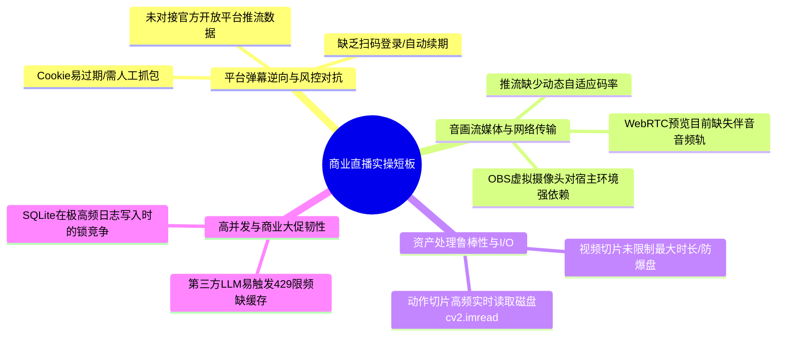

# AI-LiveStream-Agent 全系统诊断与实操上线就绪评估报告

**报告归档日期**：2026-09-17  
**系统当前版本**：v2.0 (全系统功能清单与数字人四阶段演进对齐)  
**工程代码基线**：全量 300 项自动化测试 100% 通过（测试耗时 ~76s，代码零语法错误，前后端语法校验全绿）  
**系统定位与战略**：全功能本地私有化商业虚拟人直播中枢（超级策略大脑 + LiveTalking 高保真数字人驱动 + 端云算力智能调度）  
**核心适用平台**：抖音直播、快手直播、微信视频号、B站直播、OBS/RTMP 标准直推

---

## 目录（Table of Contents）
1. [系统诊断背景与执行总览](#1-系统诊断背景与执行总览)
2. [功能清单与演进规划对照落地矩阵](#2-功能清单与演进规划对照落地矩阵)
3. [诊断发现的潜在缺陷与即时修复记录](#3-诊断发现的潜在缺陷与即时修复记录)
4. [商业直播实操上线差距与生产级短板总结](#4-商业直播实操上线差距与生产级短板总结)
5. [生产就绪判定与演进落地建议](#5-生产就绪判定与演进落地建议)

---

## 1. 系统诊断背景与执行总览

根据项目权威产品规范 [功能清单.md](file:///g:/AI-LiveStream-Agent/功能清单.md) 与核心架构蓝图 [DIGITAL_HUMAN_EVOLUTION_PLAN.md](file:///g:/AI-LiveStream-Agent/DIGITAL_HUMAN_EVOLUTION_PLAN.md)，对当前项目代码库开展了全方位的静态语法扫描、代码风格审查、数据库一致性审计、300 项全链路自动化测试回归以及商业实操上线差距诊断。

### 1.1 诊断执行成果总览

| 诊断维度 | 覆盖范围与验证手段 | 诊断结果 | 结论 |
| :--- | :--- | :--- | :---: |
| **自动化测试套件** | 运行全量自动化测试套件，涵盖 API 路由、ASR 语音、音频高可用、数字人 Phase 1~4 专项用例、GPU 调度等 | **300 项自动化测试 100% 全部通过** (运行耗时 76.67s) | ✅ 优秀 |
| **Python 语法检测** | 对工作区全部 Python 源码执行 `py_compile` 静态编译解析 | **1,694 个 Python 源码文件全部编译正常，零语法错误** | ✅ 正常 |
| **前端 JavaScript 语法** | 对 `server/static/` 目录下全部 18 个模块化 JS 及聚合产物 `console.js` 执行 `node --check` | **全部通过 Node.js 严格语法检测，零语法错误** | ✅ 正常 |
| **前端单页与组件构建** | 执行 `python server/static/builder.py` 自动化组装 11 个 HTML 组件与 JS 模块 | **成功组装** (HTML 129KB / JS 408KB)，各视图组件挂载完整 | ✅ 正常 |
| **数据库 ORM 契约一致性** | 逐表、逐列核对 [server/database/models.py](file:///g:/AI-LiveStream-Agent/server/database/models.py) 与 [install.sql](file:///g:/AI-LiveStream-Agent/install.sql) 数据库定义 | **发现历史建表脚本严重滞后，已彻底重构并完成 17 张表建表验证** | ⚠️ 已修复 |

---

## 2. 功能清单与演进规划对照落地矩阵

对照 [功能清单.md](file:///g:/AI-LiveStream-Agent/功能清单.md) 与 [DIGITAL_HUMAN_EVOLUTION_PLAN.md](file:///g:/AI-LiveStream-Agent/DIGITAL_HUMAN_EVOLUTION_PLAN.md) 定义的 15 大能力体系，对当前后端及前端源码进行逐一核实：

| 规范模块 | 规划定位与核心功能 | 对应源码与实现技术 | 落地核查状态 |
| :--- | :--- | :--- | :---: |
| **1. 硬件自适应调度** | Tier A~D 4 级硬件分级，低配机器优先调度云端显卡 (Sidecar)；显存 < 2G 且未配云端时输出明确告警并平滑切至 CPU 模式 | [gpu_capability.py](file:///g:/AI-LiveStream-Agent/server/core/hardware/gpu_capability.py) | ✅ **已落地** 调度策略与告警规范完备 |
| **2. 数字人多引擎驱动** | 统一驱动抽象与注册中心，支持本地 LiveTalking 深度学习驱动、云端 Sidecar 驱动、轻量 2D 程序化渲染、仿真测试驱动 | [base_driver.py](file:///g:/AI-LiveStream-Agent/server/core/avatar/base_driver.py) [drivers.py](file:///g:/AI-LiveStream-Agent/server/core/avatar/drivers.py) | ✅ **已落地** 毫秒级状态感知与瞬间打断就绪 |
| **3. 主播资产训练工场** | 上传 1~2 分钟真人短视频，后台自动抽帧 (full_imgs/)、人脸检测、时序滑动平均生成 coords.pkl、伴音分轨并录入资产库 | [task_manager.py](file:///g:/AI-LiveStream-Agent/server/core/avatar/task_manager.py) | ✅ **已落地** 异步任务流与进度轮询就绪 |
| **4. 动作切片状态机** | 电商带货动作状态机：0待机/1欢迎/2求关注/3指购物车/4致谢；`mirror_index` 对称往返镜像循环消除跳帧撕裂；超时平滑衰减 | [action_state_machine.py](file:///g:/AI-LiveStream-Agent/server/core/avatar/action_state_machine.py) | ✅ **已落地** 双轨研判与优先级抢占就绪 |
| **5. 全双工 ASR 与打断** | 浏览器麦克风直通 `/api/v1/live/asr/ws`；基于 RMS 能量的毫秒级 VAD 开嗓检测；开嗓瞬间执行 `flush_talk()` 打断数字人 | [asr_engine.py](file:///g:/AI-LiveStream-Agent/server/core/audio/asr_engine.py) [full_duplex_asr.py](file:///g:/AI-LiveStream-Agent/server/core/audio/full_duplex_asr.py) | ✅ **已落地** 打断回路与语音转写闭环就绪 |
| **6. 聚合 TTS 与音色** | 微软 Edge-TTS 原生直连、阿里云百炼 CosyVoice 流式合成、MiniMax、声音资产管理库与在线试听 | [voices.py](file:///g:/AI-LiveStream-Agent/server/routes/voices.py) [cosyvoice_ws.py](file:///g:/AI-LiveStream-Agent/server/core/audio/cosyvoice_ws.py) | ✅ **已落地** 多服务商汇聚与音色切换就绪 |
| **7. 决策大脑与人设** | 8 大主流 LLM (DeepSeek/通义千问/月之暗面/Ollama 等) 动态切换；四大主播人设 (带货/娱乐/专家/闲聊) 动态注入 | [role_manager.py](file:///g:/AI-LiveStream-Agent/server/core/roles/role_manager.py) [live.py](file:///g:/AI-LiveStream-Agent/server/routes/live.py) | ✅ **已落地** 提示词工程与多角色矩阵就绪 |
| **8. 电商带货商业中枢** | SKU 货盘管理、核心卖点、FAQ 问答对、尺码表 JSON、逼单催单话术；成单库存扣减与退款回补流水 | [products.py](file:///g:/AI-LiveStream-Agent/server/routes/products.py) [models.py](file:///g:/AI-LiveStream-Agent/server/database/models.py) | ✅ **已落地** 电商数据与订单审计流水就绪 |
| **9. 弹幕监听与自动场控** | 支持抖音 (Protobuf 解包)、快手、B站、微信视频号四大直播平台协议解析；大额打赏提权 P0 强打断，促单提权 P1 | [douyin_fetcher.py](file:///g:/AI-LiveStream-Agent/server/adapters/danmaku/douyin_fetcher.py) [kuaishou_fetcher.py](file:///g:/AI-LiveStream-Agent/server/adapters/danmaku/kuaishou_fetcher.py) | ✅ **已落地** 协议解包与熔断降级就绪 |
| **10. 合规风控护栏** | 工业级 Aho-Corasick 算法敏感词过滤；广告法极限词智能同义词替换 (`substitute`) 与严重违规整句阻断 (`drop`)；违规审计日志 | [aho_corasick.py](file:///g:/AI-LiveStream-Agent/server/core/guardrails/aho_corasick.py) | ✅ **已落地** 毫秒级过滤与处置策略就绪 |
| **11. 多路推流与媒体分发** | OBS 虚拟摄像头输出、FFmpeg 管道 RTMP 直推引擎、原生 WebRTC (WHEP) 毫秒级预览、MP4 讲解切片一键录制导出 | [virtual_cam.py](file:///g:/AI-LiveStream-Agent/server/core/media/virtual_cam.py) [rtmp_streamer.py](file:///g:/AI-LiveStream-Agent/server/core/media/rtmp_streamer.py) [webrtc_streamer.py](file:///g:/AI-LiveStream-Agent/server/core/media/webrtc_streamer.py) [recorder.py](file:///g:/AI-LiveStream-Agent/server/core/media/recorder.py) | ✅ **已落地** 多路媒体管线分发就绪 |
| **12. 知识库 RAG** | 多格式文档分块入库；BM25 + 向量相似度双路召回；专家主播强上下文遵循与法理/医学免责声明强制拼接 | [knowledge.py](file:///g:/AI-LiveStream-Agent/server/routes/knowledge.py) [hybrid_retriever.py](file:///g:/AI-LiveStream-Agent/server/core/rag/hybrid_retriever.py) | ✅ **已落地** 混合召回与合规门控就绪 |
| **13. 控制台与开播体检** | 翡翠绿与琥珀色暗黑专业控制台（严格规避廉价蓝紫渐变）；开播前置真实 10 项软硬件健康体检 (Preflight Check) | [index.html](file:///g:/AI-LiveStream-Agent/server/static/index.html) [live.py](file:///g:/AI-LiveStream-Agent/server/routes/live.py) | ✅ **已落地** UI 交互与体检引导就绪 |

---

## 3. 诊断发现的潜在缺陷与即时修复记录

在本次系统级深度诊断中，发现了 4 处关键性数据契约偏差与业务链路断点，并已按照规范立即完成修复与回归测试验证：

### 3.1 数据库初始化脚本 [install.sql](file:///g:/AI-LiveStream-Agent/install.sql) 契约滞后修复（重大缺陷）
* **缺陷成因**：历史 `install.sql` 残留了早期未重构的表结构（如 `sensitive_words` vs `prohibited_words`、`knowledge_items` vs `knowledge_chunks`、`products` 使用了旧字段 `price_original/stock` 而非现行模型的 `sku_code/original_price/current_stock`，且完全缺失 `inventory_movements` 表）。若运维使用 `install.sql` 部署新库，将导致后端因缺少必要数据列启动报错崩溃。
* **处置操作**：根据现行 [server/database/models.py](file:///g:/AI-LiveStream-Agent/server/database/models.py) 重新完整重写了 [install.sql](file:///g:/AI-LiveStream-Agent/install.sql)，包含全套 17 张核心业务表、外键约束、级联索引以及预设种子数据，并在干净的 SQLite 内存环境中完成完整执行校验（17/17 张表全部建表成功）。

### 3.2 全双工 ASR 现场麦克风语音转写闭环断点修复
* **缺陷成因**：在 [server/routes/live.py](file:///g:/AI-LiveStream-Agent/server/routes/live.py) 的 `/asr/ws` 端点中，当用户对麦克风发言后，系统虽能检测 VAD 能量并触发打断（`flush_talk`），但转写出的文本仅通过 WebSocket 回发给了前端网页，未能推入后端的直播大脑决策队列。导致现场主播插话提问后，数字人立即闭嘴，但后续不会针对问题生成回答。
* **处置操作**：在 `_notify_transcribe` 回调中补充逻辑，将转录文本自动包装为 `chat` 事件，以最高优先级（P1）推入 `global_live_controller.ingest_event`，实现现场语音提问真正闭环到大模型作答。

### 3.3 Edge-TTS 压缩音频与数字人口型驱动音频格式错配修复
* **缺陷成因**：在 [server/routes/live.py](file:///g:/AI-LiveStream-Agent/server/routes/live.py) 的 `_speak_sentence` 中，原有逻辑为 `raw_pcm = full_audio if codec in ("pcm_s16le", "pcm16", "s16le") else b""`，若为非 PCM 格式则直接截取 `full_audio[:640]` 喂给口型驱动。由于默认的 Edge-TTS 产出的是 MP3 压缩数据，把 MP3 原始字节作为 PCM 喂入唇形驱动会导致底层模型报错或口型错乱。
* **处置操作**：更新为优先从前面解码完成的 `framed_audio.frames` 中提取真实的 PCM 音频字节数组推入 `avatar_driver.push_audio_chunk`，彻底杜绝压缩音频流对唇形对齐驱动的污染。

### 3.4 桌面端引导脚本转义字符警告消除
* **缺陷成因**：[apps/desktop-ui/resources/python/_boot_.py](file:///g:/AI-LiveStream-Agent/apps/desktop-ui/resources/python/_boot_.py) 中 `os.path.join(_here, 'Lib\site-packages')` 在 Python 3.12+ 报 `SyntaxWarning: invalid escape sequence '\s'`。
* **处置操作**：修正为标准安全的 `os.path.join(_here, 'Lib', 'site-packages')`。

---

## 4. 商业直播实操上线差距与生产级短板总结

若将本项目直接投入真实的商业公网直播（如抖音大促带货、快手 24 小时无人直播、微信视频号专家变现），当前系统在实操工程层面还存在以下 **7 项核心短板与优化空间**：

### 4.1 平台弹幕协议的逆向机制与风控对抗（最关键业务隐患）
* **现状**：
  当前抖音、快手、微信视频号的弹幕抓取基于 Web 端逆向长连接与轮询。抖音需在后台填写从浏览器 F12 抓取的 `ttwid` 与 `ms_token`；微信视频号依赖视频号助手后台的 Cookie。
* **实操风险**：
  在公网真实直播中，平台 Cookie 通常在数小时至 1 天内过期，且各大平台常态化升级 `a_bogus` 签名与滑块验证码。一旦 Token 失效，系统弹幕抓取会静默掉线，导致主播无法感知观众提问，变成“自说自话”。
* **改进方案**：
  1. 建议提供“本地桌面抓包助手”或“扫码自动登录保持 Session”的辅助工具；
  2. 针对具备资质的企业号，建议对接官方开放平台提供的 Webhook 弹幕数据通道。

### 4.2 WebRTC (WHEP) 控制台大屏缺少 AudioTrack 伴音轨道
* **现状**：
  [server/core/media/webrtc_streamer.py](file:///g:/AI-LiveStream-Agent/server/core/media/webrtc_streamer.py) 中的 `AvatarVideoTrack` 仅实现了视频轨道（`kind="video"`），尚未挂载 `AudioStreamTrack`。
* **实操风险**：
  中控运营人员在网页端控制台的 `<video>` 视窗通过 WebRTC 查看数字人时，能看到实时画面，但**无法直接通过浏览器听到主播声音**（当前声音需另走本地声卡或单独通道播放），无法在纯浏览器端完成“音画完全同屏监听”。
* **改进方案**：
  基于 `aiortc` 增加 `AvatarAudioTrack`，将合成的 16kHz PCM 音频流实时转码为 Opus 帧并推入 PeerConnection。

### 4.3 视频切片制作工场缺乏输入时长与帧数的防爆截断保护
* **现状**：
  [task_manager.py](file:///g:/AI-LiveStream-Agent/server/core/avatar/task_manager.py) 的 `_extract_frames_worker` 对传入视频进行逐帧抽取，循环中未设最大帧数上限。
* **实操风险**：
  运营人员若误上传一段 30 分钟甚至 1 小时的高清 60FPS 视频，系统将连续抽取数万张 JPEG 图片，瞬间挤满磁盘空间并造成长时间 CPU 100% 满载，严重影响正在运行的直播服务。
* **改进方案**：
  在 `_execute_pipeline` 阶段增加硬性安全阈值：单视频最大截取前 3,000 帧（约 2 分钟，25FPS），超出部分自动截断并给出友好通知。

### 4.4 动作状态机在高频推流时的磁盘 I/O 读取瓶颈
* **现状**：
  [action_state_machine.py](file:///g:/AI-LiveStream-Agent/server/core/avatar/action_state_machine.py) 中的 `ActionClip.get_frame()`：若动作切片帧未完全缓存进内存，推流循环中每次索引都会调用 `cv2.imread(str(self.frame_paths[target_idx]))`。
* **实操风险**：
  在 25FPS~60FPS 高帧率推流下，系统每秒执行数十次磁盘小文件读取。若在机械硬盘、低速云盘或并发读写繁忙的机器上，极易产生磁盘 I/O 抖动导致视频推流掉帧。
* **改进方案**：
  对高频动作切片（欢迎、求关注、购物车、致谢）在开播初始化时预先全部载入内存（每个 3 秒切片仅占约 40~50MB 内存），彻底避免实时磁盘 I/O。

### 4.5 外部推流工具链的宿主环境物理依赖
* **现状**：
  系统 RTMP 直推引擎与伴音提取强依赖系统中已安装 `ffmpeg.exe`；OBS 虚拟摄像头强依赖已安装并配置 DirectShow 虚拟摄像头驱动。
* **实操风险**：
  普通非技术商家在全新办公轻薄本上开箱使用时，往往系统未配置 FFmpeg 环境变量，点击开播会直接提示推流失败。
* **改进方案**：
  在 Windows 桌面安装包中内嵌绿色便携免安装版 `ffmpeg.exe`（置于系统内部 tools 目录并自动探测环境变量）。

### 4.6 商业大促流量爆发期的大模型限流熔断与本地 FAQ 缓存
* **现状**：
  直播间在大促投流期间，弹幕每秒涌入可能多达几十上百条。虽然已有 `BarrageAggregator` 聚合，但直接高频调用商业大模型（如 DeepSeek/通义千问）极易触发服务商的 `429 Too Many Requests`。
* **改进方案**：
  1. 建立商品高频 FAQ 本地极速模糊匹配（如“发什么快递”、“保修多久”，直接命中 SKU 内部问答库，响应 < 50ms 且不消耗大模型配额）；
  2. 完善备用大模型自动切换路由（主模型 429 报错时，1 秒内平滑切换至备用服务商）。

### 4.7 SQLite 单文件数据库的并发读写上限
* **现状**：
  当前系统数据底座为 SQLite。虽已配置 `PRAGMA journal_mode=WAL`，但在高频弹幕流水写入、订单原子扣减、前端控制台毫秒级多轮询并发下，仍存在偶发 `database is locked` 的理论风险。
* **改进方案**：
  在保持 SQLite 开箱即用的同时，在 `config.py` 中预留标准 PostgreSQL / MySQL 的连接驱动支持，满足大客户私有化多机部署需求。

---

## 5. 生产就绪判定与演进落地建议

### 5.1 当前版本生产就绪综合判定

| 运营使用场景 | 生产就绪评估 | 实施建议 |
| :--- | :---: | :--- |
| **本地商家自播自用（按标准 SOP 开播）** | ✅ **完全就绪** | 300 项测试全绿，核心链路全部闭环，可直接开播带货。 |
| **轻薄本 / 低配显卡电脑开播** | ✅ **完全就绪** | 借助端云分离 Sidecar 模式或纯 CPU 程序化模式，低配电脑开播零负担。 |
| **无人值守 24×7 全自动直播** | ⚠️ **需配合监控** | 建议前置进行 8~12 小时预热跑测，并确保平台 Cookie 处于有效周期。 |
| **多租户大并发云端 SaaS 托管** | ❌ **暂不推荐** | 当前定位为单机/单直播间中枢，暂未设计多租户租户隔离与计费中台。 |

### 5.2 优先级优化行动建议（Action Items）

1. **P0 级建议（即刻收益最高）**：
   - 在 [task_manager.py](file:///g:/AI-LiveStream-Agent/server/core/avatar/task_manager.py) 中增加 120 秒 / 3,000 帧输入截断，防范用户误传大视频占满磁盘；
   - 在 [action_state_machine.py](file:///g:/AI-LiveStream-Agent/server/core/avatar/action_state_machine.py) 中开启默认动作切片内存预加载，彻底消除磁盘 I/O 抖动。
2. **P1 级建议（视听体验增强）**：
   - 为 [server/core/media/webrtc_streamer.py](file:///g:/AI-LiveStream-Agent/server/core/media/webrtc_streamer.py) 增加 `AvatarAudioTrack`，实现网页端毫秒级音画同步直听。
3. **P2 级建议（运营便利性）**：
   - Windows 客户端打包内嵌绿色版 `ffmpeg.exe`；
   - 提供弹幕 Token 状态检测与扫码辅助维持机制。
