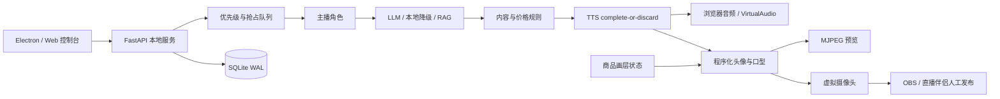

# AI-LiveStream-Agent 最终整改与验收报告

**报告日期：2026-09-11**  
**项目目录：`g:\AI-LiveStream-Agent`**  
**应用版本：`1.8.0`**

## 1. 最终结论

本轮确认的非安全类工程、业务、媒体、发布与运维问题已经完成修复，最终语义审查结论为 **PASS**，未发现仍达到阻断级别的已确认非安全问题。

当前交付已具备以下可验证能力：

- FastAPI 本地服务、Web/Electron 控制台和 WebSocket/MJPEG 链路可运行；
- 直播场次、角色、商品、订单、库存、退款、统计均有持久化闭环；
- 并发开播与并发退款收敛为单赢家，不产生幽灵场次或重复库存回补；
- TTS 采用 complete-or-discard，打断代际贯穿媒体口型、VirtualAudio 和浏览器音频；
- 本地程序化头像可输出 MJPEG 与虚拟摄像头帧，商品画层进入两路真实发布帧；
- 竖屏画面进入横屏虚拟摄像头时采用 letterbox，保持原始宽高比；
- 上传、解析、向量化、声学特征和人脸处理具备资源预算与有界 CPU worker；
- SQLite 迁移、外键、停服一致备份、原子恢复、探针和轮转日志形成运维闭环；
- Electron Windows x64 目录产物已实际构建成功。

当前仍不是“平台一键发布、安装包完全自包含”的最终形态：外部直播平台发布由 OBS/直播伴侣等外部工作台管理，桌面包也不内置 Python。二者均已在界面、API 和文档中如实标记，不再以本地源启动成功替代外部平台验收。

## 2. 当前系统边界



能力边界如下：

- 当前数字人后端是 **procedural avatar renderer**，不是已交付的 MuseTalk 神经唇形推理；请求未交付后端时会明确回退并如实上报。
- 本程序负责本地音视频源、控制台和业务状态，不管理外部平台发布；API 固定返回 `external_publish.status = not_managed` 与 `validation = pending_external_acceptance`。
- 声音上传可生成本地声学特征；没有可用 CosyVoice 服务时，不宣称已经得到可合成的克隆音色。
- 本轮验收未调用收费 API、真实 LLM/TTS 服务或真实直播平台，相关链路使用 mock、本地降级和故障注入。

## 3. 已完成整改

### 3.1 工程质量与依赖

- Python 核心、测试和可选媒体依赖已拆分为：
  - `server/requirements.txt`
  - `server/requirements-test.txt`
  - `server/requirements-optional.txt`
- 直接依赖均使用精确版本；Electron 与 electron-builder 固定为 `44.3.0` 和 `26.15.3`，并使用 lockfile v3。
- `pyproject.toml` 启用 branch coverage，发布门槛为 35%。
- `.github/workflows/quality.yml` 覆盖 Windows/Linux Python 3.12 与 Node 22 安装、测试和 lock 校验。

### 3.2 数据库与业务闭环

- 迁移失败不再被记录为成功，异常事务可回滚。
- SQLite 统一启用外键与 `busy_timeout`，历史引用支持限制删除、软下架或显式解绑。
- 直播场次持久化 `starting/live/stopped/interrupted/failed` 状态及最终统计。
- 订单使用全局唯一 `external_id` 幂等，条件扣库存和库存流水与订单在同一事务提交。
- 取消、整单退款正确回补库存；GMV 和订单数仅统计 `completed` 订单。
- `/live/start` 与 `/live/stop` 共享生命周期锁，完整状态转换串行执行。
- 退款通过 `UPDATE ... WHERE status='completed'` compare-and-set 决定唯一赢家；只有赢家回补库存并写退款流水。
- 历史 `external_id` 重放返回历史订单聚合，但不会改写当前场运行统计。

### 3.3 直播、角色和媒体生命周期

- 角色 upsert 不隐式激活，显式 switch 会持久化激活状态。
- 每场直播重建队列、历史和上下文；停播清理任务、事件、视觉、TTS、媒体和虚拟设备。
- 重复 start/stop 可幂等收敛，五轮连续开停测试通过。
- 本地媒体能力、外部发布状态和声音能力均按真实实现上报。

### 3.4 商品上下文与发布画层

- 商品卖点、FAQ、尺码表、优惠话术、描述、图片、价格和库存进入受长度限制的 LLM 上下文。
- 优惠券、商品特写和尺码表写入线程安全 `SceneOverlayState`，使用单调时钟过期。
- MuseTalk 命名的程序化驱动在最终帧分叉前只合成一次商品画层，同一发布帧进入：
  - VirtualCamera；
  - MJPEG `latest_jpeg_frame`。
- 画层状态、过期、并发快照、像素变化和双路扇出均有测试。
- `VirtualCameraService` 使用 `letterbox_frame` 等比缩放并居中补边，不再把 `720x960` 直接拉伸为 `1280x720`。

### 3.5 TTS、打断与音频解码

- 每句 TTS 必须完整合成成功后才提交；partial bytes 会被丢弃。
- 音频协议包含 codec、MIME、采样率、声道、audio ID、audio generation、session generation 和时间戳。
- `_speak_sentence` 在 TTS 收集、驱动切换和媒体 feed 等关键 await 后复核 audio/session generation。
- 打断先推进 VirtualAudio generation fence，再分别中断媒体和 TTS；单个 sink 失败不会阻止其他 sink 与浏览器信令。
- VirtualAudio 队列携带格式和双代际，在入队、出队、解码后和每个 write slice 前拒绝陈旧 packet。
- 容器解码失败直接返回 `(None, 0)`；只有显式 `pcm_s16le` 或 `allow_raw_pcm=True` 才允许裸 PCM。
- MuseTalk 口型队列携带代际，打断后迟到的旧口型不会复活。
- `stop()` 可清队列并重启，`shutdown()` 终止 worker；PortAudio stream 只在播放线程内关闭。

### 3.6 上传预算与 CPU 隔离

- 上传统一采用 64 KiB 分块暂存、大小预算、失败清理和原子发布。
- 图片像素/帧、音频时长、ZIP 展开、文档字符/PDF 页数/分块数均有限制。
- 新增共享 `server/core/cpu_worker.py`：
  - 固定 2 个 worker thread；
  - 全进程最多接纳 4 个任务；
  - worker 运行、排队和峰值可观测；
  - 请求取消后等待已接纳任务结束，避免提前删除仍在使用的临时文件。
- 文档解析、RAG 分块/向量/索引、知识检索、音频探测/特征、人脸校验/关键点检测均移出事件循环。
- RAG 可变状态由异步锁串行保护，失败时恢复内存快照并补偿数据库。

### 3.7 Electron 与发布链

- Electron 使用 `app.getPath('userData')\data` 作为活动数据目录，不写安装资源目录。
- host、port、URL、子进程环境和服务复用判定来自统一 runtime 配置。
- 只在版本与数据目录都匹配时复用已有服务。
- 启动前严格检查外部 64 位 CPython 3.12/3.13、核心依赖精确版本和 `server.app` 导入。
- 预检失败不会创建正常控制台窗口，会显示诊断并允许重试或退出。
- Windows x64 目录产物：`apps/desktop-ui/release/win-unpacked/AI-LiveStream-Agent.exe`。
- 发布资源已确认包含：
  - `README.md`、`.env.example`、`version.json`；
  - `launcher.py`、`server/run.py`、`server/requirements*.txt`；
  - `scripts/runtime_preflight.py`；
  - `scripts/backup_data.py`、`scripts/restore_data.py`；
  - `docs/operations.md`。

### 3.8 日志、探针、备份与启动清理

- `DATA_DIR/logs/server.log` 使用 JSON Lines 轮转日志，默认单文件 5 MiB、保留 5 个轮转文件。
- 提供 `/livez`、`/startupz`、`/readyz`；readiness 会检查启动阶段、SQLite 与数据目录。
- lifespan 从服务锁写入和初始化开始即进入统一 `try/finally`。
- 初始化失败或正常关闭都会分别尝试清理直播控制器、VirtualAudio、SQLAlchemy engine、自身 PID 服务锁和日志缓冲；单项失败不阻止后续清理。
- 停服备份使用 SQLite Backup API，包含 WAL 已提交内容、主密钥、持久资产、manifest、文件大小、SHA-256 和 `integrity_check`。
- 恢复先校验，再通过同卷 staging 原子切换；失败时恢复旧目录，并保留 rollback 目录。
- Windows DPAPI 主密钥的自动恢复范围明确为原机器、原 Windows 用户。

## 4. 最终验收证据

### 4.1 全量自动化测试

在新的隔离数据目录中执行：

```powershell
$env:LIVE_AGENT_DATA_DIR = Join-Path $env:TEMP ('ai-live-agent-final-' + [guid]::NewGuid().ToString('N'))
python -m pytest -q server/tests --cov=server --cov-branch --cov-report=term-missing --cov-report=xml
```

结果：

- **152 passed in 24.76s**；
- **Total coverage: 64.72%**；
- branch coverage 已启用；
- 35% coverage 门槛通过；
- `coverage.xml` 已生成。

最终语义审查独立复跑结果为 **152 passed，64.73%**，差异来自报告显示精度；结论为 **PASS，Issues (0)**。审查报告位于：

```text
semantic-review/2026-09-11-172914-pr-0.md
```

### 4.2 专项可靠性测试

执行五轮开停与三个并发/跨场专项：

```powershell
python -m pytest -q `
  server/tests/test_operations.py::test_repeated_local_source_start_stop_cycles `
  server/tests/test_business_reliability.py::test_concurrent_live_start_has_one_winner_and_no_ghost_session `
  server/tests/test_business_reliability.py::test_concurrent_completed_order_refund_has_one_winner_and_one_restock `
  server/tests/test_business_reliability.py::test_historical_external_id_replay_does_not_pollute_current_session_stats
```

结果：**4 passed in 3.72s**。

专项修复阶段还得到：

- 商品画层与画幅：`10 passed`；
- 业务可靠性：`8 passed`；
- 音频可靠性：`9 passed`；
- core engine：`50 passed`；
- CPU worker、资源预算、运维和 core 合跑：`66 passed`。

### 4.3 静态与运行时检查

以下检查均 exit code 0：

```powershell
python -m compileall -q launcher.py scripts server
node --check "apps/desktop-ui/main.js"
node --check "server/static/js/console.js"
python scripts/runtime_preflight.py
```

runtime preflight 输出：

```json
{"ok": true, "message": "外部 Python 运行时预检通过", "python": "D:\\python\\python.exe", "version": "3.13.7", "architecture": "64bit"}
```

### 4.4 Node 安装与 Windows 构建

```powershell
$env:ELECTRON_MIRROR = 'https://npmmirror.com/mirrors/electron/'
npm.cmd ci
npm.cmd run dist:dir -- --win
```

结果：

- `npm ci` 成功，安装 284 个包；
- electron-builder `26.15.3`；
- Electron `44.3.0`；
- win32 x64 打包成功；
- 产物 `apps/desktop-ui/release/win-unpacked/AI-LiveStream-Agent.exe` 存在；
- 使用 Electron 默认图标，`package.json` 当前未填写 author；这两项不影响本轮目录构建与运行时完整性判断。

## 5. 外部待验收项

以下项目因本轮禁止调用收费 API 或真实直播平台，未作通过声明：

1. 真实 LLM 服务的质量、限额、延迟和长期可用性；
2. 真实 Edge-TTS、CosyVoice、MiniMax 或远程 GPU 节点的端到端声音质量；
3. OBS/直播伴侣对虚拟摄像头和虚拟音频设备的实际捕获；
4. 抖音、快手、视频号、B 站等真实平台的弹幕协议长期稳定性；
5. 外部平台预览、正式开播、断线恢复和回看中的音画同步；
6. 真实神经唇形后端，因为当前交付只有程序化头像；
7. 8～24 小时长时稳定性与目标硬件兼容矩阵；
8. 干净 Windows 虚拟机上的完整安装、升级、卸载与恢复演练。

## 6. 部署与上线门槛

进入真实业务环境前，应至少完成以下验收：

- 在目标 Windows x64 机器安装 CPython 3.12/3.13，并让 `runtime_preflight.py` 全部通过；
- 在干净机器验证 Electron 首次启动、重复启动、异常退出和数据目录一致性；
- 安装并选择目标虚拟摄像头/虚拟音频设备，验证 OBS 或直播伴侣确实收到商品画层与声音；
- 在目标平台完成预览、正式开播、断网重连、回看和音画同步验收；
- 使用平台测试账号或沙箱验证真实弹幕和订单事件映射，不把人工订单误认作平台订单；
- 对计划使用的 LLM/TTS 服务执行超时、限流、故障降级和费用上限测试；
- 执行至少一次 8 小时稳定性测试，观察帧率、音频打断、线程、内存、数据库和磁盘；
- 停服创建完整备份，在同一 Windows 用户环境执行恢复演练并核对商品、订单、角色、知识库与资产；
- 先保存升级前备份，再执行版本升级；回滚时同时恢复旧应用包和升级前完整数据备份。

## 7. 已知交付限制

- 桌面包支持**可选内置便携版 Python (3.12.10)**（由 `scripts/build_portable_python.py` 构建至 `apps/desktop-ui/resources/python/`）；未打包内置环境时，回退要求外部 64 位 CPython 3.12/3.13。
- 本轮生成的是 `dist:dir` 的 Windows 解包目录，不是已完成签发和干净机器验收的最终安装器。
- 外部平台发布不由本程序管理，`/live/start` 成功只代表本地直播源启动成功。
- 当前程序化头像不等同于 MuseTalk 神经口型；相关能力必须单独部署和验收后才能改变状态描述。
- 项目已纳入 Git 版本控制（远程 https://github.com/winclubs/AI-LiveStream-Agent ），可提供 Git diff、commit 历史与基于版本控制的回滚证据。

## 8. 验收结论

本轮目标——修复全部已确认的非安全问题、隔离本机验收、全量回归、查漏补缺并重写最终报告——已经完成。

当前代码在本机隔离环境中通过 **152 项全量测试、64.72% branch coverage、Python/JavaScript 静态检查、runtime preflight、五轮开停、并发业务专项和 Windows x64 Electron 目录构建**。最终语义审查确认前一轮 9 个遗留缺口全部关闭，结论为 **PASS**。

交付可进入下一阶段的干净机器、真实设备和外部平台验收；在这些外部验收完成前，不应把本地源成功等同于外部平台正式直播成功。