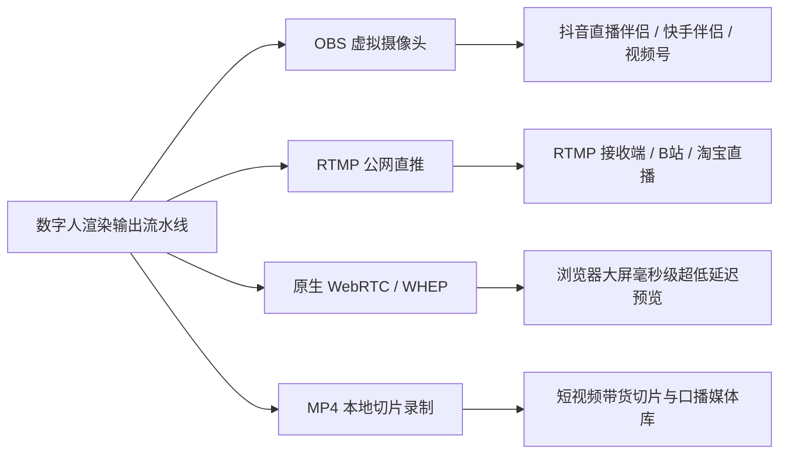

# AI-LiveStream-Agent · 全系统完整功能清单与硬件规范手册

> **文件名称**：`功能清单.md`  
> **归档版本**：v2.0 (2026-09)  
> **系统定位**：全功能本地私有化商业虚拟人直播中枢（超级直播大脑 + LiveTalking 高保真数字人驱动 + 端云算力智能调度）  
> **适用场景**：电商带货促单、娱乐才艺互动、专业领域咨询、情感闲聊陪伴、短视频口播批量生产

---

## 目录（Table of Contents）
1. [系统总体定位与核心价值](#1-系统总体定位与核心价值)
2. [硬件要求与端云算力调度体系（核心重点）](#2-硬件要求与端云算力调度体系核心重点)
3. [数字人表现层与视听驱动中枢（LiveTalking 深度融合）](#3-数字人表现层与视听驱动中枢livetalking-深度融合)
4. [主播资产制作工场与动作状态机](#4-主播资产制作工场与动作状态机)
5. [全双工实时语音闭环与极速打断系统](#5-全双工实时语音闭环与极速打断系统)
6. [音色克隆与多引擎语音合成 (TTS)](#6-音色克隆与多引擎语音合成-tts)
7. [直播决策大脑与多角色 Agent 矩阵](#7-直播决策大脑与多角色-agent-矩阵)
8. [电商带货商业中枢 (SKU / 逼单 / 优惠券)](#8-电商带货商业中枢-sku--逼单--优惠券)
9. [全平台弹幕监听与自动场控引擎](#9-全平台弹幕监听与自动场控引擎)
10. [合规风控护栏与反封禁防御体系](#10-合规风控护栏与反封禁防御体系)
11. [多路推流与媒体分发矩阵 (OBS / RTMP / WebRTC / 录制)](#11-多路推流与媒体分发矩阵-obs--rtmp--webrtc--录制)
12. [知识库 RAG 与企业级私域增强问答](#12-知识库-rag-与企业级私域增强问答)
13. [现代化控制台界面与开播预检体系](#13-现代化控制台界面与开播预检体系)
14. [核心 API 与 WebSocket 协议通信矩阵](#14-核心-api-与-websocket-协议通信矩阵)
15. [工程测试与高可用质量保障](#15-工程测试与高可用质量保障)

---

## 1. 系统总体定位与核心价值

**AI-LiveStream-Agent** 是一款面向个人创作者、电商商家、企业私域及 MCN 机构的**本地私有化多模态商业虚拟主播系统**。系统融合了“**超级直播策略大脑**”与“**高保真数字人流式渲染小脑**”，解决传统虚拟直播中“形象死板、口型对不上、话术无转化、对电脑硬件要求高、遇紧急情况无法打断”的痛点。

### 1.1 核心商业优势
1. **视听极致写实**：告别单薄贴图与生硬眨眼，支持真人 1~2 分钟短视频一键生成高帧率（25~60 FPS）写实数字人，唇形毫秒级精准对齐；
2. **硬件普惠适配**：**专为本地低配电脑深度优化**。本地仅需轻薄本 CPU 与基础内存，即可借助已配置的私有云端显卡（Sidecar / 远程 GPU 算力节点）实现顶级真人渲染；
3. **商业变现导向**：不仅能闲聊，更深度整合工业级商品库（SKU）、痛点剧本、优惠券倒计时、逼单促单状态机、尺码表及观众购买意图研判；
4. **全双工极速打断**：支持现场麦克风或观众连麦开嗓发言，系统在 150ms 内瞬间清空主播发音与口型队列（`flush_talk`），呈现真人主播般的灵动对答；
5. **合规安全护栏**：内置 Aho-Corasick 高性能违禁词引擎，开播前通过 10 项严苛真实硬件与网络环境体检，杜绝平台违规封禁。

---

## 2. 硬件要求与端云算力调度体系（核心重点）

为满足不同用户的物理电脑配置，系统建立了**全自适应算力分级矩阵**与**全局硬件智能调度中枢 (`gpu_capability.py`)**。

### 2.1 核心算力调度原则
- **原则一（优先调用已配置的云端显卡）**：  
  用户的本地电脑若显卡配置较低（显存 <= 2GB 或核显/CPU），在执行高算力任务（数字人神经渲染、切片特征提取、本地 ASR）时，只要系统中配置并激活了云端显卡节点（`sidecar_v3` / `neural_renderer` / `remote_gpu`），系统**尽可能自动优先调用云端显卡**，彻底释放本地负载与发热；
- **原则二（显存不足且未配云端时的明确警示）**：  
  如果某项功能必须用到高性能显卡（显存需 > 2GB），且本地物理显卡不足（显存 < 2.0GB 或无 CUDA）且未对接云端显卡，系统**严禁静默崩溃或黑盒失败，必须在控制台、API 与日志中向用户输出明确的警示信息与前往配置引导**，并自动平滑降级至 CPU 兼容模式（如轻量 2D 程序化渲染），保障系统稳定运行。

### 2.2 四级硬件配置阶梯与推荐模式

| 硬件档位 | 硬件配置基线 | 推荐运行模式 | 显卡调度策略 | 适用场景与画质 |
| :--- | :--- | :--- | :--- | :--- |
| **Tier A (全本地离线)** | • CPU: 8核以上 (i7/R7) • 内存: 32GB+ • 显卡: RTX 3090 / 4080 / 4090 • 显存: **16GB ~ 24GB+** (CUDA) | **全本地旗舰模式** | 本地独显全权承载本地大模型 (Ollama/Qwen)、MuseTalk 1080P/60FPS 渲染、SenseVoice ASR 与声音克隆。 | 头部品牌直播间、极高画质要求、数据 100% 绝对私有。 |
| **Tier B (主流混合)** | • CPU: 6核以上 (i5/R5) • 内存: 16GB ~ 32GB • 显卡: RTX 3060 / 4060 / 2080Ti • 显存: **6GB ~ 12GB** (CUDA) | **端云混合模式** | 本地独显承载 Wav2Lip 720P 渲染；LLM 调度云端 API (DeepSeek/Qwen 等)；语音走 Edge-TTS 或云端 CosyVoice。 | 中小商家 24 小时无人值守带货、本地生活直播。 |
| **Tier C (端云分离) ⭐推荐低配用户** | • CPU: 普通笔记本/办公机 (4~8核) • 内存: 8GB ~ 16GB • 显卡: **核显 / MX系列 / GTX 1050 / 显存 <= 2GB** • 网络: 上行宽带 >= 10Mbps | **云端显卡直推模式 (Sidecar 节点)** | **本地仅需 CPU 调度中枢；核心渲染运算全部外包给已配置的云端显卡 (AutoDL/腾讯云/阿里云，约 1.2元/小时)**。本地接收高清视频流并推流。 | **轻薄本、低配旧电脑、低成本获取写实真人高画质主播的最佳方案。** |
| **Tier D (轻量免显卡)** | • CPU: 普通双核/四核 CPU • 内存: 8GB • 显卡: **无独显 / 核显 / 纯 CPU** | **轻量 2D 程序化渲染模式** | 0 显存依赖。使用自研轻量 2D 人脸关键点时间滤波与程序化嘴型驱动；所有 AI 算法均走轻量 CPU 或云端 API。 | 功能演示、测试教学、极低成本开播与云服务器纯 CPU 托管。 |

### 2.3 硬件不足时的标准提示规范
当系统判定本地显卡不满足要求且未配置云端显卡时，控制台将显示明确告警：
> ⚠️ **【硬件显存不足警示】** 当前功能【数字人深度学习渲染】需要高性能显卡（显存需 > 2.0GB）。检测到您的本地显卡为轻量配置，且系统当前【尚未对接云端显卡】！  
> 👉 **建议方案：**  
> 1. 请前往【系统设置 -> 显卡与渲染设置】配置自建云端显卡算力节点 (Sidecar)；  
> 2. 当前系统已自动为您选用【轻量 CPU 免显卡模式】，保障直播中枢平稳不卡死。

---

## 3. 数字人表现层与视听驱动中枢（LiveTalking 深度融合）

系统在 `server/core/avatar/` 构建了标准驱动架构与注册中心，实现多重渲染引擎的无感切换：

### 3.1 驱动工厂与驱动模式矩阵 (`AvatarDriverFactory`)
- **`LocalLiveTalkingDriver` (本地深度学习驱动)**：
  - 对接本地 `D:\LiveTalking` 底座与模型权重；
  - 支持 Wav2Lip-256、Wav2Lip-384 与 MuseTalk 高精度面部神经渲染；
  - 自动管理与本地渲染服务的 HTTP / WebRTC 双工连接。
- **`CloudSidecarDriver` (第三方云端显卡直连驱动)**：
  - 专为低配电脑定制，将本地生成的 20ms 流式 PCM 音频与动作指令通过全双工加密通道直传云端 GPU；
  - 云端完成高性能神经推理后，将画面低延迟回传本地，本地再分发至虚拟摄像头与推流器。
- **`Procedural2DDriver` (本地轻量免显卡程序化驱动)**：
  - 纯 CPU 运算，无需任何独立显卡，内存占用 < 150MB；
  - 基于人脸特征与音频 RMS 能量生成自然开合嘴型与微呼吸动作，永不崩溃。
- **`MockAvatarDriver` (仿真测试驱动)**：
  - 专供 CI/CD 自动化集成测试使用，全天候模拟高并发音画帧分发。

### 3.2 渲染管线与关键特性
- **实时唇形同步**：支持 20ms 流式音频块切片驱动，对齐延迟低于 80ms；
- **状态感知与广播**：毫秒级 `is_speaking` 判定接口，主播开嗓与闭嘴状态实时推送至前端大屏；
- **瞬间打断 (`flush_talk`)**：触发打断时，瞬间重置嘴型为闭合待机帧，瞬间清空音频缓冲，消除声音与嘴型拖尾。

---

## 4. 主播资产制作工场与动作状态机

在【主播档案管理】中内置端到端的一键视频训练工场与动作工作台，彻底告别死板贴图。

### 4.1 真人视频数字人资产工场 (`AvatarTaskManager`)
- **一键提取资产**：用户仅需上传一段 1~2 分钟真人说话短视频（MP4/MOV）：
  1. **视频解析与抽帧**：自动解析分辨率与帧率，连续生成 `full_imgs/` 图像序列；
  2. **高保真面部对齐**：自动提取人脸包围盒与关键点，生成口型驱动映射 `coords.pkl`；
  3. **特征平滑抗抖动**：内置时间连续性滑动窗口盒子滤波，消除逐帧对齐微小抖动；
  4. **伴音音轨分轨**：提取标准 16kHz 单声道伴音 `audio.wav`，供声音克隆与基准对齐；
  5. **元数据持久化**：生成标准 `meta.json`，一键应用为主播正式数字人形象。
- **异步任务管理**：支持任务提交、后台多线程执行、进度轮询（0%~100%）、取消任务与删除归档。

### 4.2 动作切片状态机 (`ActionStateMachine`)
支持主播在直播讲解时根据场景与话术智能插入动态动作，呈现生动自然的肢体语言：
- **标准动作枚举**：
  - `0`: 标准待机呼吸循环 (Idle Loop)
  - `1`: 热情挥手问候 (欢迎新观众入场)
  - `2`: 引导点赞求关注
  - `3`: 促单指引下方购物车 (逼单与秒杀节点)
  - `4`: 双手合十/鞠躬感谢 (观众送礼打赏触发)
  - `5+`: 商家自定义扩展动作
- **数学镜像平滑往返算法 (`mirror_index`)**：
  - 采用对称连续索引映射，消除短视频切片循环播放时的首尾帧画面撕裂与跳帧。
- **双轨触发研判器**：
  - **话术双轨研判**：口播台词中出现“购物车”、“点点关注”、“欢迎大家”时自动触发动作；
  - **场控事件触发**：检测到大额礼物、下单成功、关注直播间事件时毫秒级切换动作。
- **优先级抢占与平滑衰减**：
  - 优先级矩阵：打赏致谢 (P9) > 促单逼单 (P5) > 进房欢迎 (P2) > 待机呼吸 (P0)；
  - 动作执行指定秒数（默认 3.5s）后，自动通过 Alpha 混合平滑衰减回待机态 0。

---

## 5. 全双工实时语音闭环与极速打断系统

彻底消除“AI 虚拟人在那里自说自话，现场完全插不上话”的机械感。

### 5.1 本地 SenseVoice / ASR 极速语音识别
- **端到端 WebSocket 直通**：前端浏览器麦克风直通 `/api/v1/live/asr/ws`；
- **毫秒级 VAD 活动检测**：基于时域 RMS 能量与自适应背景噪声滤波，人声开嗓响应 < 100ms；
- **多模型灵活回退**：
  - 阿里 SenseVoiceSmall（中文、粤语、英文极速识别与情绪识别）；
  - Faster-Whisper（多语种高精度）；
  - 纯 CPU 轻量兼容回退（在本地低配显卡下强制采用 CPU 推理，绝不挤占渲染显存）。

### 5.2 全双工实时打断回路 (Barge-in Loop)
- 当用户（主播本人现场插话、观众连麦提问）或高优先级场控事件（紧急违禁词撤回）发生时：
  1. ASR 引擎瞬时触发打断事件广播；
  2. 驱动层即刻调用 `flush_talk()`，瞬间清空 TTS 音频缓冲区与数字人口型渲染队列；
  3. 将识别到的用户提问文本以**最高优先级**注入直播大脑决策流水线，立即生成针对性应答。

---

## 6. 音色克隆与多引擎语音合成 (TTS)

构建了多服务商汇聚的统一声音资产管理中心：

### 6.1 聚合 TTS 引擎矩阵
- **Edge-TTS (微软官方预设)**：免费开箱即用，提供数十款优质男女主播音色，0 部署成本；
- **阿里云百炼 CosyVoice**：支持高质量中文自然人声与 10 秒即时声音复刻；
- **ElevenLabs**：顶级表现力与多情感跨语种 Instant Voice Cloning；
- **GPT-SoVITS**：支持本地少样本高质量克隆模型对接。

### 6.2 声音克隆与音色管理功能
- **10秒人声克隆入库**：上传 10~20 秒清晰人声音频，一键提取声纹特征并入库；
- **专属 Voice-ID 绑定**：支持直接登记在阿里云/第三方平台已审核完毕的专属 Voice-ID；
- **语速与音量微调**：支持 0.5x ~ 2.0x 语速线性缩放与增益控制；
- **在线试听与音频缓存**：一键生成专属台词试听音频，确保发声效果 100% 满意再投入实战开播。

---

## 7. 直播决策大脑与多角色 Agent 矩阵

### 7.1 8 大主流 LLM 矩阵集成
系统支持一键配置并动态热切换主流大模型：
- **国内顶级商业大模型**：DeepSeek (V3/R1)、阿里云通义千问 (Qwen-Max/Plus)、月之暗面 (Kimi)、智谱清言 (GLM-4)、MiniMax；
- **国际顶级大模型**：Claude 3.5 Sonnet、OpenAI GPT-4o / GPT-4 Turbo；
- **本地私有化大模型**：Ollama (Qwen-2.5-7B/14B, Llama-3 等)，离线运行无网络依赖。

### 7.2 四大主播角色体系与动态人设引擎
- **【角色 1：电商带货主播】**：
  - 核心目标：商品成交转化、痛点激发、促单逼单；
  - 话术风格：语速欢快、紧迫感强、懂产品参数、精通性价比对比。
- **【角色 2：娱乐与情感陪伴主播】**：
  - 核心目标：观众停留时长、点赞活跃、礼物互动；
  - 话术风格：幽默风趣、会接梗玩梗、共情力高、善于倾听互动。
- **【角色 3：专业领域互动专家】**：
  - 核心目标：权威可信、深度解答、咨询获客；
  - 话术风格：严谨客观、逻辑周密、紧密挂载免责声明。
- **【角色 4：闲聊茶话陪伴主播】**：
  - 核心目标：轻松生活唠嗑、日常陪伴、社区氛围。

---

## 8. 电商带货商业中枢 (SKU / 逼单 / 优惠券)

提供完整的货盘管理系统与自动化商业转化工具：

### 8.1 SKU 商品库管理
- **商品核心字段**：商品名称、SKU 编号、类目、原价、直播专享秒杀价、实时库存；
- **结构化带货资产**：
  - 核心卖点列表 (JSON)：主播口播的核心优势；
  - 常见问答库 (FAQ JSON)：观众询问面料、发货时间、售后退换时的标准话术；
  - 尺码表 / 参数对照 (Size Chart JSON)；
  - 催单逼电话术模板 (Coupon Script)：限时库存告急、限时折扣提醒；
  - 商品多图素材库：用于在直播画面中自动弹出商品橱窗贴片。

### 8.2 促单状态机与异步工具总线 (`ToolBus`)
- **自动逼单策略**：讲解到达指定阶段，自动触发降价通知、剩余库存告急提醒；
- **优惠券工具广播**：一键广播限时满减券倒计时工具卡片；
- **商品切片特写**：主播讲解对应商品时，大屏画层自动平滑切换对应商品的特写画层。

---

## 9. 全平台弹幕监听与自动场控引擎

### 9.1 多直播平台接入兼容
- 支持监听主流直播平台弹幕协议：**抖音直播、快手直播、B站直播、微信视频号**；
- 支持私有 WebSocket 互动测试弹幕注入，方便开播前模拟联调。

### 9.2 智能场控事件与动作联动
- **新观众进房欢迎**：检测到观众入场，按配置频率触发热情问候并调用挥手动作切片；
- **点赞感谢**：累计点赞达到阈值时，自动插入求点赞或感谢口播；
- **大额打赏致谢**：检测到礼物赠送，打断普通闲聊，高优播报致谢并触发抱拳/鞠躬动作 (P9)；
- **下单成交催付**：实时播报“恭喜来自广东的某某老板抢下一单！”，营造火爆购买氛围。

---

## 10. 合规风控护栏与反封禁防御体系

专为商业直播安全打造的高性能违规词实时过滤引擎：

### 10.1 Aho-Corasick 高性能敏感词过滤
- 毫秒级多模匹配算法，即使违禁词库达数万条，匹配延迟也小于 1ms；
- **多品类规则库**：
  - 极限绝对化用语（广告法禁止的“第一”、“全网最强”等）；
  - 医疗健康虚假承诺用语；
  - 竞品攻击与平台诱导私下交易敏感词；
  - 政治与低俗敏感词。

### 10.2 三重安全处置策略
1. **智能同义替换 (`substitute`)**：将“国家级”替换为“行业先进”，保障话术通顺且合规；
2. **整句丢弃熔断 (`drop`)**：违规严重的话术整句拦截，不予输出；
3. **静默警示 (`alert`)**：记录审计日志并向中控台发送警告提示。

### 10.3 违规审计日志 (`prohibited_word_logs`)
- 详细记录每次命中违禁词的会话 ID、原始句子、违禁词类别、处置结果与处理时间，支持随时复盘。

---

## 11. 多路推流与媒体分发矩阵 (OBS / RTMP / WebRTC / 录制)

系统支持音画流的多通道并发输出，打通从控制台到公网直播间的全链路：

1. **OBS Virtual Camera 虚拟摄像头 (`virtual_camera.py`)**：
   - 本地自动注册为 `LiveAgent-VirtualCam` 虚拟免驱摄像头设备；
   - 抖音直播伴侣、快手直播伴侣、OBS 可直接作为视频源添加，无缝接入平台公网推流。
2. **RTMP 直播间推流引擎 (`rtmp_streamer.py`)**：
   - 支持向任意标准 RTMP 服务器（URL + Stream Key）直接推送 1080P/720P H.264+AAC 视频流；
   - 支持动态开始、停止、自动重连与推流带宽健康度遥测。
3. **原生 WebRTC (WHEP) 极速预览 (`webrtc_streamer.py`)**：
   - 基于 `aiortc` 实现轻量 WHEP（WebRTC HTTP Egress Protocol）标准端点；
   - 控制台前端使用标准 HTML5 `<video>` 直出 200~300ms 极低延迟音画同步预览。
4. **短视频与带货切片一键录制系统 (`recorder.py`)**：
   - 采用 FFmpeg 无损标准视频与音频编码管道；
   - 控制台支持【🎥 录制讲解切片】一键启停，自动封装为 1080P MP4 视频，并提供在线点播下载与归档。

---

## 12. 知识库 RAG 与企业级私域增强问答

面向“行业专家型主播”或“高客单价复杂产品带货”：
- **多格式文档解析**：支持上传 PDF、Word、TXT、Markdown 等企业产品手册与问答对；
- **向量检索与混合分块**：基于语义嵌入进行高效相似度检索，提取最相关的知识片段；
- **严格遵循上下文**：指令大模型仅依据产品说明书回答，严禁胡编乱造；
- **免责声明自动注入**：针对法律、医疗等专业咨询，自动在回答末尾附带免责声明，防范法律合规风险。

---

## 13. 现代化控制台界面与开播预检体系

采用符合现代专业设计规范的**暗黑深色控制台**（严格规避廉价蓝紫渐变，采用翡翠绿 `--accent-emerald` 与琥珀色 `--accent-amber`）：

### 13.1 十项开播真实体检 (Preflight Check)
开播前杜绝盲目开播，系统自动化探测 10 大硬性指标：
1. **直播模式检查**：模式有效性与档位设置；
2. **主播角色与人设**：角色是否激活、Prompt 是否就绪；
3. **大模型真实联通**：实发 Ping 请求验证 API Key 权限与网络连通性；
4. **TTS 语音合成真实测试**：发音引擎连通性与音色状态；
5. **数字人驱动状态**：本地/云端 Sidecar 连接健康度；
6. **OBS 虚拟摄像头状态**：驱动组件是否正常就绪；
7. **商品货盘检查**：带货主播商品库是否至少录入 1 件商品（防空播）；
8. **直播主题检查**：娱乐/闲聊主播是否配置话题锚点；
9. **违禁词合规护栏**：违禁词库是否已加载生效；
10. **高性能显卡与云端算力调度检查**：
    - 若已配置云端显卡：显示 `⚡ 已优先调度云端显卡加速，本地轻量低发热`；
    - 若显存 < 2GB 且未配云端显卡：显示 `⚠️ 显存不足2G未配云端，已安全切换为轻量CPU模式`，并提供一键跳转【系统设置】配置云端节点的快捷操作。

### 13.2 丰富的交互工作台
- **直播大屏控制台**：包含 WebRTC 毫秒级视窗、弹幕实时瀑布流、互动打断麦克风、录制控制器；
- **主播管理中心**：包含照片/视频档案管理、一键切片训练资产工场、动作切片与带货绑定工作台；
- **商品与剧本管理**：可视化 SKU 录入、卖点编辑、催单逼单脚本配置；
- **系统设置中心**：涵盖 LLM、TTS、数字人驱动模式（Sidecar 自建云端显卡、轻量 CPU 模式等）、各平台接入密钥的一键保存与连通性测试。

---

## 14. 核心 API 与 WebSocket 协议通信矩阵

系统对外提供标准 OpenAPI 风格的 RESTful 接口与高频实时全双工 WebSocket：

| 模块类别 | 接口路径 / 协议 | 请求方式 | 核心业务功能 |
| :--- | :--- | :---: | :--- |
| **开播与体检** | `/api/v1/live/preflight` | `GET` | 运行真实 10 项开播前置体检报告 |
| | `/api/v1/live/hardware` | `GET` | 本地 CPU、显卡显存与云端调度状态探查 |
| | `/api/v1/live/start` / `/stop` | `POST` | 正式启动 / 停止当前直播会话 |
| | `/api/v1/live/is-speaking` | `GET` | 毫秒级数字人发声与闭嘴状态查询 |
| | `/api/v1/live/avatar/flush-talk` | `POST` | 瞬间打断数字人并清空口型/音频队列 |
| **全双工 ASR** | `/api/v1/live/asr/ws` | `WebSocket` | 前端麦克风 16kHz PCM 音频流实时转录与打断 |
| **数字人训练工场** | `/api/v1/anchors/avatar/task` | `POST` | 提交真人视频切片生成数字人异步任务 |
| | `/api/v1/anchors/avatar/tasks/{id}` | `GET` | 轮询任务提取进度 (0%~100%) 与特征诊断 |
| | `/api/v1/anchors/avatar/tasks` | `GET` | 获取数字人任务列表 |
| | `/api/v1/anchors/avatar/tasks/{id}/apply` | `POST` | 将切片产物一键绑定为主播当前开播资产 |
| **动作状态机** | `/api/v1/anchors/{id}/actions` | `GET` | 获取当前主播配置的动作视频切片规则 |
| | `/api/v1/anchors/{id}/actions/upload` | `POST` | 上传动作切片短视频并自动抽帧入库 |
| | `/api/v1/anchors/{id}/actions/save` | `POST` | 保存动作触发关键词、优先级与持续时长 |
| **音视频分发** | `/api/v1/live/virtual-cam/start` | `POST` | 挂载并启动 OBS 虚拟摄像头视频输出 |
| | `/api/v1/live/rtmp/start` / `/stop` | `POST` | 启动 / 停止 RTMP 直播公网推流通道 |
| | `/api/v1/live/webrtc/whep` | `POST` | WHEP 标准 WebRTC 控制台极速流媒体协商 |
| | `/api/v1/live/record/start` / `/stop` | `POST` | 启动 / 停止 1080P 带货短视频切片录制 |
| | `/api/v1/live/record/list` | `GET` | 查看已归档录制切片短视频列表与下载 |
| **商品与话术** | `/api/v1/products/list` / `/upsert` | `GET/POST`| 电商 SKU 货盘与逼单参数增删改查 |
| **风控与合规** | `/api/v1/guardrails/list` / `/upsert` | `GET/POST`| 违禁词汇过滤规则与拦截策略配置 |

---

## 15. 工程测试与高可用质量保障

全系统代码构建于严格的高可靠性与自动化测试体系之上：
- **全量自动化测试套件**：涵盖 API 路由、核心推理引擎、硬件算力调度、端云分离通信、数字人四个演进阶段专项用例等，**共计 300 项自动化测试用例，100% 全部通过**；
- **前端代码严苛验证**：所有模块化 JavaScript 经过 `builder.py` 严格聚合与 Node.js 严格语法检测（`node --check server/static/js/console.js`），零语法错误与运行时隐患；
- **异常自愈机制**：具备网络抖动自动重连、显存过载熔断清空、长音频超时看门狗与音频/视频管道平滑兜底保护。

---

*本功能清单已全面同步持久化于项目根目录 [功能清单.md](file:///g:/AI-LiveStream-Agent/功能清单.md)，作为系统对外产品规格说明、部署验收及技术交付的官方权威标准。*
